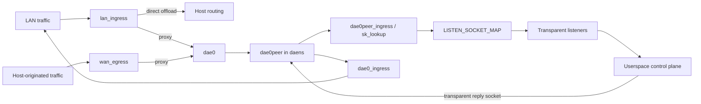

# eBPF kernel datapath

This document covers kernel-side interception; the userspace path is described in [Control plane](./control-plane.md), and held-first-packet UDP is described in [NFQUEUE](./nfqueue.md).

## Namespace and hook architecture

The ordinary proxy path redirects packets through an isolated network namespace instead of relying on a host-side TPROXY rule:

### Namespace lifecycle

A throwaway thread calls `unshare(CLONE_NEWNET)`, opens `/proc/thread-self/ns/net`, and hands the resulting `OwnedFd` to the process. That FD pins `daens` for the process lifetime. `/var/run/netns/daens` is only a best-effort compatibility bind mount; the engine does not use it as the namespace owner.

Rtnetlink creates `dae0`/`dae0peer` as an L2 netkit pair when the kernel supports it, otherwise as a veth pair. It moves `dae0peer` by namespace FD and configures links, addresses, neighbors, policy rules, and routes. Current addressing is:

| Side | IPv4 | IPv6 |
| --- | --- | --- |
| Host `dae0` | `169.254.0.1/32` | `fd00:686f:6e6b::1/64` |
| `daens` `dae0peer` | `169.254.0.11/32` | `fd00:686f:6e6b::2/64` |

The IPv4 endpoints are separate `/32` addresses, not a shared `/30`. Link-scope routes and static neighbors make the peer reachable. In `daens`, fwmark `TPROXY_MARK` selects table `100`, whose IPv4 and IPv6 local default routes deliver packets to local transparent sockets.

The process otherwise remains in the host namespace. `with_daens_netns` serializes each switch with a process-wide mutex, saves `/proc/thread-self/ns/net`, enters `daens`, runs a fully synchronous closure, and restores the saved namespace on every return or panic path. The closure must never cross `.await` because `setns(2)` is per-thread. A failed restore aborts the process rather than leaving a worker to originate later dials from `daens`.

### Interface hook sets

Ethernet interfaces use the `_l2` programs; interfaces without an Ethernet header use `_l3`. Bridge and bond slaves receive equivalent owned hooks because traffic may bypass a master qdisc.

| Topology | LAN-side hooks | WAN-side hooks |
| --- | --- | --- |
| Dual-homed | `lan_ingress` + `lan_egress` on LAN | `wan_ingress` + `wan_egress` on WAN |
| Single-homed, shared LAN/WAN interface | `lan_ingress` | `wan_egress`; `lan_egress` and `wan_ingress` are skipped |
| WAN-only, no configured LAN interface | None | `wan_ingress` + `wan_egress` |

`lan_ingress` classifies forwarded client traffic. `wan_egress` independently classifies traffic created by the host. The reverse-direction ingress/egress hooks refresh connection state where the topology provides separate directions.

### Dynamic interface reconciliation

`auto` resolves to the current default-route interface. If no default route exists, the entry stays unattached rather than falling back to loopback. `IfaceWatcher` subscribes to rtnetlink link, IPv4/IPv6 address, and IPv4/IPv6 route groups; a 60-second reconciliation tick backs up event delivery. Reconciliation re-resolves `auto`, detects interface recreation by ifindex, recalculates single- versus dual-homed roles, and attaches or forgets process-owned hooks.

A changed link/address/route/interface role also republishes generated `direct(must)` rules for every address on configured LAN/WAN interfaces. It clears health-check cooldowns and triggers fresh probes. Dead UDP and multi-leaf outbounds remain fail-closed until a fresh probe succeeds; a sole TCP leaf with no `final` remains a userspace last resort.

## Program inventory

| Program | Hook | Kernel responsibility |
| --- | --- | --- |
| `lan_ingress_l2`, `lan_ingress_l3` | TC ingress on LAN | Admission check, special/local traffic bypass, port-53 fast path, routing, connection state, direct offload, proxy redirect, TX accounting, and optional ambiguous-UDP staging. |
| `wan_ingress_l2`, `wan_ingress_l3` | TC ingress on WAN | Refresh reverse-direction connection state; not attached in a single-homed topology. |
| `lan_egress_l2`, `lan_egress_l3` | TC egress on LAN | Refresh reverse connection state and suppress locally generated ICMPv6 Redirect packets; skipped on the shared interface in a single-homed topology. |
| `wan_egress_l2`, `wan_egress_l3` | TC egress on WAN | Route host-originated TCP/UDP, apply process-name and control-plane bypass data, check outbound connectivity, cache decisions, and redirect proxy traffic. |
| `dae0_ingress` | TC ingress on host `dae0` | Reverse `REDIRECT_TRACK`, restore original MAC/interface delivery, and count RX traffic. |
| `dae0peer_ingress` | TC ingress on `daens` `dae0peer` | Validate redirected packets, apply `TPROXY_MARK`, and use `bpf_sk_assign` for UDP and new TCP listener delivery. |
| `tproxy_sk_lookup` | `sk_lookup` in `daens` | Override ordinary socket lookup with a transparent listener from `LISTEN_SOCKET_MAP`. |
| `tproxy_wan_cg_sock_create`, `tproxy_wan_cg_sock_release` | cgroup `sock_create`, `sock_release` | Create/refresh or remove socket-cookie to PID/`comm` entries. |
| `tproxy_wan_cg_connect4`, `tproxy_wan_cg_connect6` | cgroup `connect4`, `connect6` | Refresh cookie-to-process metadata for connected sockets. |
| `tproxy_wan_cg_sendmsg4`, `tproxy_wan_cg_sendmsg6` | cgroup `sendmsg4`, `sendmsg6` | Refresh cookie-to-process metadata for datagram sends. |

`LISTEN_SOCKET_MAP` keys are fixed: `0` TCP4, `1` TCP6, `2..=5` UDP4, and `6..=9` UDP6. UDP chooses one of four listeners per family with a flow-stable hash. The IPv4 and IPv6 key readers in `tproxy_sk_lookup` remain separate `#[inline(never)]` subprograms. At optimization level 2, inlining lets LLVM turn the family branch into a computed-offset read from the lookup context; the verifier rejects that as a dereference of a modified context pointer.

TC entry points are raw `#[unsafe(no_mangle)] #[unsafe(link_section = "classifier")]` functions taking `*mut __sk_buff`. They do not use Aya's `#[tc]` macro because its structured argument shape triggers a verifier rejection on kernels at or above 7.0. Program bodies return `Verdict = Result<c_long, c_long>`: `Ok` denotes the normal path and `Err` an early exit, but both carry a real `TC_ACT_*` value and `flatten` reduces either variant to the kernel `i32` verdict. Internal sentinel values are not TC verdicts.

## Map inventory

| Map | Shape and role |
| --- | --- |
| `CONN_STATE_MAP` | Non-preallocated plain hash, maximum 524,288 entries. Stores per-flow TCP/UDP state and published routing metadata; userspace owns pressure eviction. |
| `REDIRECT_TRACK` | Non-preallocated 65,536-entry hash. Maps a directional five-tuple to original MAC/interface, outbound, timestamp, and decision identity for reply restoration. |
| `ROUTING_HANDOFF_MAP` | Non-preallocated 65,536-entry hash. Carries tuple-keyed route metadata to userspace. |
| `ROUTING_MAP` | 256-entry array: two banks of 128 `MatchSet` rules. Userspace fills the inactive bank before switching generations. |
| `ROUTING_META_MAP` | 35-entry array containing the active generation selector plus each generation's rule count and four flow-group bitmaps. The selector is the commit point. |
| `ROUTING_GROUP_META_MAP` | Eight packed entries: two generations × TCP4/TCP6/UDP4/UDP6, each with a rule count and 128-bit bitmap. |
| `DEST_LPM_ROUTING_MAP`, `SOURCE_LPM_ROUTING_MAP`, `MAC_LPM_ROUTING_MAP` | LPM tries, each capped at 65,536 entries, for destination CIDR, source CIDR, and MAC prefixes. |
| `DOMAIN_ROUTING_MAP` | Non-preallocated 65,536-entry IP-to-domain-rule bitmap hash populated from DNS outcomes. |
| `OUTBOUND_CONNECTIVITY_MAP` | 1,536-entry array. Six liveness slots per outbound cover TCP/UDP class and IPv4/IPv6; an absent slot is treated as alive. |
| `OUTBOUND_STATS` | 256-entry per-CPU array indexed directly by outbound. Each 32-byte value packs `tx_packets`, `tx_bytes`, `rx_packets`, and `rx_bytes`; the current ABI does not use `outbound * 4 + counter` indexing. |
| `LISTEN_SOCKET_MAP` | 16-slot `SockMap`; keys `0..=9` hold the two TCP and eight UDP transparent listeners. |
| `DATAPATH_STATE_MAP` | One-slot admission array. Zero passes traffic untouched; nonzero enables classification and redirect. |
| `DATAPATH_FLAGS_MAP` | One-slot runtime policy word: Rule/Direct offload properties plus `global.nfqueue_enable` and NFQUEUE ready fencing. New-flow classification reads it; established direct offload uses cached metadata. |
| `COOKIE_PID_MAP` | Non-preallocated 65,536-entry socket-cookie to PID/executable-basename hash for `pname` routing and control-plane recognition; kernel BTF offsets capture argv[0] when verifier-safe, otherwise the cgroup hook captures thread `comm` synchronously. |
| `CONN_STATE_OCCUPANCY` | Two-slot per-CPU cumulative insert/eBPF-delete counters used with userspace delete accounting to estimate occupancy. |
| `BPF_STATS_MAP` | Five counters for UDP/TCP conn-state overflow and redirect, handoff, and cookie-map insertion failures. |
| `EVENT_RINGBUF` | 262,144-byte ring buffer for fixed-layout blocked, conntrack-overflow, and UDP-token-exhaustion events. |
| `UDP_DECISION_SEQUENCE` | One-slot pinned allocator state for NFQUEUE decision identities; protocol details live in [NFQUEUE](./nfqueue.md). |
| `UDP_DECISION_EPOCH` | One-slot grace-period selector for NFQUEUE decision work; see [NFQUEUE](./nfqueue.md). |
| `UDP_DECISION_INFLIGHT` | Two-slot per-CPU reader counts for NFQUEUE decision work; see [NFQUEUE](./nfqueue.md). |
| `UDP_DECISION_RETIRE_FENCE` | 65,536-entry tuple fence map used during NFQUEUE retirement; see [NFQUEUE](./nfqueue.md). |

Kernel/userspace map keys and values are `#[repr(C)]` ABI. IPv4 addresses in shared flow structures are IPv4-mapped IPv6 values in network byte order.

## Marks and mark ownership

| Constant | Value | Meaning |
| --- | --- | --- |
| `TPROXY_MARK` | `0x08000000` | Selects the `daens` table-100 local-delivery route and tags redirected packets for listener delivery. `global.tproxy_mark` must equal this compiled value. |
| `DAE_BYPASS_MARK` | `0x00000100` | Marks honk's own dials, probes, DNS upstreams, QUIC sockets, and transparent listeners so WAN egress does not intercept them. |
| `CLASSIFIED_MARK` | `0x40000000` | Prevents a packet attached at both bridge master and slave from being classified twice; also marks final direct verdicts. |
| `NFQUEUE_PENDING_MARK` | `0x80000000` | Identifies traffic that must be held before conntrack/NAT; a valid staged mark also carries `CLASSIFIED_MARK` and a nonzero token. |
| `NFQUEUE_TOKEN_MASK` | `0x3fffffff` | Selects the low 30 skb-mark bits that carry a decision token on NFQUEUE-staged packets. |

`SKB_MARK_RESERVED_MASK` is `0xc0000000`, the union of `CLASSIFIED_MARK` and `NFQUEUE_PENDING_MARK`. Configuration validation rejects `global.so_mark_from_dae` and routing-rule marks that overlap those bits. NFQUEUE direct completion repeats the same check before accepting a rule mark.

Local-socket probing must distinguish honk's own transparent listeners from ordinary local services. `bpf_sock_is_dae_socket` compares the full socket mark with `PARAM.dae_socket_mark`, which userspace sets to `DAE_BYPASS_MARK`. Equality means “honk listener,” so the probe continues the transparent path; an ordinary unmarked listener may claim the destination. Host-namespace `dns.bind` sockets are deliberately unmarked ordinary listeners.

## Packet behavior and invariants

### DNS and local-listener precedence

LAN TCP and UDP with destination port `53` bypass the routing loop and go directly to the control plane. Port `53` is also exempt from LAN outbound-health drops so userspace DNS can apply its own fallback.

The local-socket probe runs before this fast path and is transport-specific. A specifically bound UDP socket, or a TCP socket in `LISTEN` state, wins for its transport. A wildcard match wins only when a full FIB lookup returns `NOT_FWDED`; socket lookup alone also matches forwarded destinations. The listener-mark check excludes honk's own transparent listener from this precedence rule. Thus a local `dns.bind` listener can own host-local `:53` while remote resolver traffic still follows transparent DNS.

### Special and internal traffic

On LAN ingress/egress and WAN egress, `dst_is_special` passes traffic before routing and conntrack when it sees:

- an L2 destination MAC with the individual/group bit set, covering broadcast and multicast;
- IPv4 `255.255.255.255`, `224.0.0.0/4`, or `0.0.0.0`;
- IPv6 `ff00::/8`.

This keeps DHCP, mDNS, SSDP, LLMNR, and similar link traffic out of the proxy. The internal link address space is `169.254.0.0/16` and `fd00:686f:6e6b::/64`. Control-plane UDP admission rejects proxy initialization when either endpoint is in those ranges, while `dae0`/`dae0peer` hooks handle the engine's own delivery path.

### Outbound liveness

Userspace publishes group-OR health into `OUTBOUND_CONNECTIVITY_MAP`. A new LAN flow routed to a slot explicitly marked dead is dropped with `TC_ACT_SHOT`; this is deliberately fail-closed. One narrow exception keeps the slot open for a TCP group with exactly one unique leaf and no `final`, allowing a real dial through that same proxy to prove recovery without an implicit `direct` fallback. UDP and all-dead multi-leaf groups remain fail-closed, while a group containing a `direct`/`block` builtin never goes dead: the builtins are never marked dead, so the group-OR slot stays alive. TCP and UDP destination port `53` are exempt on LAN ingress. Generated must-direct rules for every current gateway interface address run through the same routing publication path and keep local administration reachable even when proxy outbounds are dead.

### Route-time direct offload

The decision to keep a non-`must` flow in kernel direct routing is made once and cached in `RoutingMeta` bit 57. Established packets test the cached bit instead of rereading `DATAPATH_FLAGS_MAP`.

| Effective mode | Route-time policy |
| --- | --- |
| `Rule` (also no Clash mode override) | A non-`must` `direct` result is offloaded only when SNI cannot change it: no domain-class reevaluation is possible, or DNS learning supplied the flow's domain bitmap. Otherwise userspace re-routes after sniffing. |
| `Direct` | Every non-final, non-`block` flow is normalized to `direct` and offloaded because userspace would choose direct anyway. |
| `Global` | An exact global selection of `direct` uses the same all-direct policy. Other global selections keep non-final flows in userspace for the selected outbound. |

`direct(must)` always stays direct and needs no bit-57 flag. `block` remains final. Full rule evaluation and mode semantics are documented in [Routing](./routing.md).

### Host-originated WAN UDP

`wan_egress` only classifies locally generated traffic; forwarded packets have a real ingress ifindex and pass untouched. Honk-owned marked sockets and matching control-plane cookie/PID metadata also bypass it. For a live non-DNS UDP flow with published connection state, the program uses a lookup-only cached-route path. A miss runs routing once and publishes complete state before subsequent packets use the cache. DNS remains short-lived and does not create this UDP cache entry.

## Admission sequencing

`DATAPATH_STATE_MAP[0]` stays zero while hooks attach. TC programs pass traffic untouched in that state. The control plane binds listeners, atomically publishes the complete TCP/UDP FD set, starts receive loops, establishes any enabled NFQUEUE readiness, and only then writes a nonzero admission value. A partial listener generation therefore cannot redirect traffic to an absent socket.

Shutdown fences new NFQUEUE staging where applicable, closes `DATAPATH_STATE_MAP[0]` before listener teardown, then drains and detaches producers. Admission-map failure is fatal rather than silently continuing with ambiguous ownership.

## Userspace maintenance and accounting

`BpfJanitor` wakes every two seconds. Accepted TCP relays pin their `CONN_STATE_MAP` and `REDIRECT_TRACK` entries for the relay lifetime. Unpinned TCP closing state expires after 10 seconds; unpinned active TCP and UDP state use a 120-second backstop.

Conn-state sweeps normally run every 60 seconds. At 70% occupancy the interval falls to 15 seconds; at 85% it enters pressure mode and sweeps every two-second tick. Growth in kernel overflow counters also activates pressure mode as the fail-closed last resort. `CONN_STATE_OCCUPANCY` combines per-CPU kernel inserts/deletes with userspace delete accounting and exact sweep recalibration. Bounded auxiliary-map scans use the aggressive 8-second cleanup cadence when the latest scan is incomplete or covers at least 85% of the 65,536-entry map.

Per-outbound traffic counters are per CPU. TX packets and bytes are counted at `lan_ingress` when the route lands, for both redirect and direct-offload outcomes. RX packets and bytes are counted at `dae0_ingress` after `REDIRECT_TRACK` identifies the returning outbound. Unclassified pass-through traffic and drops have no outbound counter.

## Related docs

- [Routing design](./routing.md)
- [NFQUEUE held-packet path](./nfqueue.md)
- [Control plane](./control-plane.md)
