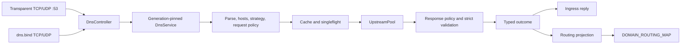

# DNS subsystem

This document describes the userspace DNS architecture shared by transparent port-53 interception and the optional `dns.bind` listener.

Field-level settings, accepted URI forms, and defaults belong in the [DNS configuration reference](../reference/dns.md). The cache is entirely in userspace; `DOMAIN_ROUTING_MAP` stores learned routing projections, not DNS responses.

## Architecture



Both ingress adapters use the same `DnsController`, current `DnsServiceProvider`, forwarder, cache, singleflight set, upstream pools, and routing projection. An adapter owns admission until reply I/O completes; it does not write domain routes directly.

## Ingress paths

| Path | Socket and destination model | Reply model |
| --- | --- | --- |
| Transparent port 53 | The eBPF TCP and UDP fast path redirects port-53 traffic without the full route loop. The adapter preserves the intercepted original destination and ingress transport. | Transparent UDP uses an anyfrom socket bound to the original destination; TCP replies on the intercepted stream. Request action `asis` dials that original destination and preserves TCP/UDP, including UDP `TC` fallback to TCP. |
| Standalone `dns.bind` | Selected TCP/UDP sockets are ordinary unmarked sockets in the host network namespace. They have no intercepted destination. | TCP replies on the accepted socket. UDP uses packet info so a wildcard bind replies from the exact local address and interface that received the query. |

`DnsRequestMeta` carries the logical client source and intercepted destination as one immutable value. Both transparent and standalone adapters set `source_ip` from the socket peer; only transparent interception sets `original_dst`. IPv4-mapped IPv6 peers normalize to IPv4. Flow-associated TCP/UDP lookups use the admitted flow's client address and have no intercepted DNS destination. Internal, bootstrap, prefetch, and Clash API queries have neither value.

The standalone listener has these lifecycle and admission invariants:

- It binds every selected transport synchronously and all-or-nothing before starting a supervisor. One bind failure closes the partial set and fails startup.
- It forwards only complete, structurally valid, single-question requests. Invalid UDP requests receive `FORMERR`; a malformed or partial TCP frame closes the connection.
- Its UDP ingress profile clamps the advertised response size to `512..=1232`. Packet-info provenance preserves wildcard reply source selection.
- TCP uses persistent RFC 7766 two-octet framing. Each length read, body read, and response write has a 30-second bound.
- Standalone TCP may consume at most one quarter of the process-wide connection budget. Each frame on a persistent connection separately enters the DNS query budget.
- `DnsListener` is process-scoped and owned by `ControlPlane::run`. Shutdown stops admission, drains or aborts children, and joins every supervisor before DNS runtime retirement.
- A semantic `dns.bind` change on SIGHUP is restart-required. An unchanged listener continues through the newly published DNS generation.
- Standalone requests pass `original_dst=None`; selecting `asis` therefore produces a DNS failure (`SERVFAIL`) rather than dialing the listener recursively.

A bound local `:53` listener takes precedence over transparent interception independently for TCP and UDP. A specific-address bind wins for that transport. A wildcard bind wins only when the full FIB lookup reports `NOT_FWDED`, preventing remote resolver traffic from bypassing transparent DNS. Leaving `dns.bind` empty preserves transparent TCP and UDP interception.

## DNS ownership state machine

This matrix is for a LAN client and separates the **first receiver**, the **actual answer source**, and the **final reply sender**. `Honk bind` is an ordinary host-network listener; binding `:54` does not claim `:53`. `Transparent Honk` requires the real eBPF datapath and an attached interface hook; it is unavailable in mock mode.

| dnsmasq state | Honk `dns.bind` | Query target | First receiver | Actual answer source | Final reply sender |
| --- | --- | --- | --- | --- | --- |
| Running on `:53`; local/DHCP/cache hit | Any non-conflicting bind | Gateway `:53` | dnsmasq | dnsmasq local data or cache | dnsmasq |
| Running on `:53`; miss forwarded to `127.0.0.1#54` | `:54` running | Gateway `:53` | dnsmasq | Honk cache/hosts/policy or Honk upstream | dnsmasq |
| Running on `:53`; miss has no reachable dnsmasq upstream | Any | Gateway `:53` | dnsmasq | None | dnsmasq returns `SERVFAIL` or times out |
| Running on `:53`; forwarding target `127.0.0.1#54` is stopped | `:54` stopped | Gateway `:53` | dnsmasq | None | dnsmasq returns `SERVFAIL` or times out |
| Running on `:53` | `:54` running | External `:53` (for example `8.8.8.8:53`) | Transparent Honk, when enabled | Honk cache/hosts/policy or Honk upstream | Honk transparent anyfrom/stream path |
| Stopped | `:54` running | Gateway `:54` | Honk bind | Honk cache/hosts/policy or Honk upstream | Honk bind |
| Stopped | `:54` running | Gateway `:53` | Transparent Honk, when enabled | Honk cache/hosts/policy or Honk upstream | Honk transparent anyfrom/stream path |
| Stopped | Bind disabled | Gateway or external `:53` | Transparent Honk, when enabled | Honk cache/hosts/policy or Honk upstream | Honk transparent anyfrom/stream path |
| Stopped or does not own `:53` | `:53` running | Gateway `:53` | Honk bind | Honk cache/hosts/policy or Honk upstream | Honk bind |
| Owns `:53` | Attempts `:53` | Gateway `:53` | Bind conflict during startup | None until one owner remains | No deterministic owner; one service must fail |
| Any | Bind disabled or stopped | Gateway `:54` | No Honk listener | None | Connection refusal or timeout |
| Any | Any | Non-DNS port | Normal routing path | Selected outbound | Normal flow |

The precedence transition for each transport is:

```text
gateway:53 packet
  -> matching host-network listener (dnsmasq or Honk bind)
  -> otherwise Honk transparent port-53 path
  -> otherwise ordinary kernel routing / no DNS service
```

The local-listener check is per TCP/UDP transport. A specifically addressed local `:53` socket wins. A wildcard socket wins only when the complete FIB lookup says `NOT_FWDED`; a forwarded or ambiguous destination remains on the transparent path. Therefore, stopping dnsmasq does not make Honk `:54` automatically own `:53`: the observed takeover is transparent interception. To make Honk the ordinary gateway `:53` service, stop or move dnsmasq and configure `bind` for `tcp+udp://:53`.

The common OpenWrt forwarding state is:

```text
LAN client -> dnsmasq :53 -> 127.0.0.1:54 -> Honk DNS policy/upstream
            <- dnsmasq :53 <- 127.0.0.1:54 <----------------------
```

If Honk's selected upstream is also dnsmasq `127.0.0.1:53` while dnsmasq forwards misses to Honk `:54`, the two services form a recursion loop. Use a genuinely external Honk upstream or let dnsmasq handle that upstream itself.

## Resolution pipeline

The production path is ordered as follows:

| Stage | Invariant |
| --- | --- |
| 1. Admission and generation | `DnsController` takes an owned semaphore permit and a runtime lease. The 2,048-query permit remains held through reply completion; saturation degrades to `REFUSED`. The lease pins one coherent generation for the request. |
| 2. Parse and validate | The adapter requires one complete request. `DnsEngine` parses the wire, rejects zero or multiple usable questions, canonicalizes the qname to lowercase, and records the ingress profile. |
| 3. Family gate and hosts | `ipv4only`/`ipv6only` reject the other address family with NODATA before hosts or upstream work. Otherwise the immutable hosts snapshot runs before request routing, cache, and upstream exchange. |
| 4. Request planning | Source-ordered request rules choose reject, `asis`, or a named upstream from the canonical qname, QTYPE, and logical client source. First match wins. |
| 5. Reuse | Eligible requests look up the exact-identity positive/negative cache, then share one singleflight exchange on a miss. Ineligible requests bypass both. |
| 6. Exchange | The request scope selects the intercepted destination or an `UpstreamPool` transport. |
| 7. Response planning | Every upstream response is strictly matched to the query before policy uses it. Response rules accept, reject, or re-query through a named upstream; traversal is acyclic and contains at most three upstreams. |
| 8. Publication and rendering | Only a strictly validated final wire response can enter the cache or be published to singleflight waiters. Prefer-family suppression is applied to caller rendering after the validated reusable answer is stored. |
| 9. Outcome and projection | The forwarder returns a typed outcome. `DnsController` submits that outcome with the pinned generation's projection snapshot, then the ingress adapter writes the reply. |

There are two independent 2,048 limits: controller query lifecycles and active singleflight keys. One flight accepts at most 256 followers. Saturated flights reject rather than opening unbounded upstream exchanges; the controller renders that overload as `REFUSED`. Dropping a leader removes the flight, wakes followers to retry ownership, and records cancellation.

### Hosts snapshot

Generation construction reads every repeatable `use_host` source once and merges them in declaration order. `true` selects `/etc/hosts`, whose parser indexes exact names and aliases; a path selects an OxiDNS-compatible exact, domain-suffix, regexp, and keyword rule file. Later definitions replace earlier matching definitions. Exact and longest-suffix lookups take precedence over ordered regexp and keyword matches. Query handling performs no file I/O.

Only IN-class A and AAAA queries use the snapshot. A known name with no address in the requested family returns `NOERROR`/NODATA and never leaks to an upstream. A host answer has a 60-second TTL, bypasses positive and negative cache reuse, and still produces the normal routing-projection outcome. The snapshot is immutable for its generation; edit its source and send SIGHUP to publish a replacement. A load or parse failure aborts startup or the reload before publication.

### Address-family strategy

| Strategy | Forwarding and result semantics |
| --- | --- |
| `both` | Internal/application A+AAAA name resolution starts both eligible family queries concurrently and retains usable records from both. A caller's individual DNS query is not suppressed. |
| `preferipv4` | A+AAAA name resolution starts both concurrently but returns IPv4 as the preferred result set. For an ordinary AAAA request, the forwarder issues an A sibling through the normal pipeline; it returns NODATA only when that sibling contains usable IPv4 records. |
| `preferipv6` | Symmetric to `preferipv4`: an A response is suppressed only when the AAAA sibling contains usable IPv6 records. |
| `ipv4only` | Only A is eligible. AAAA is answered NODATA without upstream I/O. |
| `ipv6only` | Only AAAA is eligible. A is answered NODATA without upstream I/O. |

A prefer-family sibling query changes only the first question's QTYPE. Transaction ID, flags, QCLASS, EDNS data, ingress profile, logical client source, original destination, and the rest of the wire profile remain unchanged. Sibling failure or NODATA does not suppress a usable non-preferred response. For internal/application hostname resolution, the bootstrap fallback runs once only when every eligible family is unusable, then filters fallback addresses through the same family eligibility.

The strategy also orders bootstrap-resolved upstream dial targets. `both` uses IPv4-first compatibility order; preference modes put their family first while retaining the other family. Stream and QUIC transports walk the ordered candidates. Direct UDP keeps the existing two-attempt bound: after the first candidate fails, its retry selects the other family before another address of the same family and caches the winner.

### DNS routing

Conditions within one rule are ANDed; arguments inside one condition are ORed; each condition can be negated. The compiled condition model covers qname, qtype, request-only source IP, upstream name, and response IP. Rules are evaluated in source order and stop on the first match. An unknown source makes both `sip(...)` and `!sip(...)` false, and response rules reject `sip` during configuration.

| Phase | Inputs used by policy | Actions |
| --- | --- | --- |
| Request | Canonical qname, QTYPE, and logical client source; `asis` additionally requires an intercepted original destination. | `reject`, `asis`, or `upstream(name)` |
| Response | Canonical qname, QTYPE, current upstream, and extracted answer IPs. | `accept`, `reject`, or `upstream(name)` for re-query |

A response re-query always sends the original request wire to the selected upstream. Cycles are rejected, and the traversal depth is at most three upstreams.

### Cache and singleflight identity

Cache and persistence use this immutable `CacheKey`:

```text
canonical query wire (TXID zeroed)
+ ingress profile
+ logical request scope
+ DNS policy identity
+ operation (resolve or refresh)
```

The wire identity retains flags, exact question encoding, QCLASS, and EDNS material. UDP advertised size remains part of the ingress profile. The logical request scope is materialized after request routing: it distinguishes named upstreams from `asis` destinations, while policy identity prevents reuse across semantic reloads.

Client IP is not part of cache or persistence identity. Different sources selecting the same named upstream share its source-neutral answer; sources selecting different upstreams partition naturally, and `asis` remains partitioned by original destination. A foreground `FlightKey::Resolve` wraps the resolve `CacheKey`, always adds strict/compatibility mode, and adds `DnsRequestMeta` only when a preference-sensitive sibling query can change the published response. Other foreground flights still coalesce across clients. A background `FlightKey::Refresh` contains only the refresh `CacheKey`; its leader captures the initiating metadata and mode. Positive, negative, and stale cache hits rerun preference rendering with the current caller's metadata.

A response chain accepted only by compatibility mode—for example, one ending at a response-routing cycle/depth limit or failing strict response-template validation—is not admitted to shared memory cache or persistence. A later strict lookup therefore cannot inherit compatibility-only acceptance. Because HDNS v2 stores no execution-mode provenance, restored entries remain compatibility-only until a current-process exchange replaces them; the persistence codec stays at v2.

Reuse is limited to a standard single-question QUERY with no answer or authority records and at most one option-free EDNS-v0 OPT. ECS, COOKIE, any other EDNS option, EDNS-v1, multiple OPT records, or unusual flags bypass both cache and singleflight. The request still uses the normal strict exchange path.

Configured ECS is a generation-pinned named-upstream transport policy, not ingress identity. The effective IPv4 prefix is included in `PolicyId`; the original query remains the cache/singleflight key. The upstream pool adds ECS only after admission, preserves any client ECS, validates an echoed generated option, and removes generated EDNS state before response analysis and cache publication. `asis` bypasses this transformation. Automatic inference is refreshed transactionally on startup, reload, and network events, so active queries retain their old generation while a replacement is probed and built.

## Cache and persistence

| Mechanism | Invariant |
| --- | --- |
| Capacity | At most 16 LRU shards divide `max_cache_size` exactly. Each shard is bounded by both entry count and retained key/response wire bytes. The byte target is 4 KiB per configured entry, with at least 65,535 bytes per shard and a 64 MiB global cap. |
| Positive TTL | `fixed_domain_ttl` has first priority; zero disables caching for that domain. Otherwise nonzero `optimistic_cache_ttl` overrides the answer minimum TTL. The selected TTL is also written into cached answer records. |
| Negative TTL | NXDOMAIN and SERVFAIL use the SOA-derived negative TTL, defaulting to 60 seconds, then clamp it to `1..=300` seconds. |
| Stale handling | Expired positive answers remain eligible for serve-stale for one hour. An upstream error or SERVFAIL may return one with wire TTL 30 seconds. Near-expiry hits start a deduplicated stale-while-revalidate refresh. |
| Flush fence | A publication epoch prevents foreground or background work begun before a flush from repopulating memory or persistence after the flush barrier. |

When `store_dns` enables persistence, a bounded actor mirrors retained positive insertions to SQLite. An entry evicted immediately by the shard's wire-byte budget is not queued for persistence. The actor bounds both its command queue and pending set to 4,096 items, batches writes, and fences them by epoch; a flush discards older queued epochs before admitting the current state.

`HDNS` version 2 rows live under `dns:v2:` and encode canonical wire, ingress profile, scope, policy, operation, expiry, and validated response wire. Restore skips expired, corrupt, version-mismatched, collision-mismatched, and policy-mismatched rows. The v2 namespace does not consume or rewrite legacy `dns:` rows. Pre-v2 binaries ignore `dns:v2:` rows, so leaving them in `cache.db` is rollback-safe.

## Upstream transports

| Protocol | Reuse model | Dial-path proxy |
| --- | --- | --- |
| UDP | One connected generation-owned socket and receive task per direct upstream; TCP pool handles `TC` fallback. | A configured proxy intentionally carries the query as pooled TCP-DNS. |
| TCP | Idle RFC 7766 stream pool. | Supported through the selected node or group leaf. |
| DoT | Idle TLS stream pool. | Supported over a proxied TCP base stream. |
| DoH | One long-lived, multiplexed HTTP/2-only TLS session. | Supported over a proxied TCP base stream. |
| DoQ | One long-lived QUIC connection; one bidirectional stream per query. | Direct only. |
| DoH3 | One long-lived QUIC and HTTP/3 session. | Direct only. |

DoQ and DoH3 are direct-only because their clients create a quinn endpoint on a native bypass-marked UDP socket, while the DNS proxy dial path currently provides only a boxed TCP byte stream. QUIC cannot run over that stream. Proxy support requires adapting the selected outbound's `PacketTransport` to quinn's `AsyncUdpSocket` interface while preserving datagram boundaries, address metadata, MTU behavior, generation ownership, reconnects, and shutdown. Until that adapter exists, a proxy-selected DoQ or DoH3 upstream fails before dialing rather than silently bypassing the selected route; use DoT or DoH for proxied encrypted DNS.

`-> node-or-group` forces one generation-pinned dial leaf. Without an explicit target, the upstream endpoint is passed through the pinned traffic router and group snapshot. UDP+proxy deliberately uses TCP-DNS; this policy is separate from the SOCKS5 RFC 1928 UDP transport used by ordinary proxied UDP flows.

Direct upstream sockets carry the bypass mark so their traffic cannot re-enter transparent interception. Hostname endpoints resolve through the generation-captured bootstrap resolver; dials never depend on honk's intercepted resolver path.

Dial/TLS/QUIC/HTTP session setup uses the dial/handshake timeout, while request/response exchange uses the distinct query timeout. A query attempt has one absolute exchange deadline. Every transport retries at most once after failure, resetting an invalid reusable session where required, so aggregate query work remains bounded. Transport slots single-flight concurrent initialization and assign exactly one closer. Pool shutdown first closes admission and waits for admitted exchanges, then closes idle resources and explicitly joins every receive or protocol-driver task.

Direct UDP assigns each query a fresh CSPRNG-selected 16-bit ID, verifies both ID and question on receipt, restores the caller ID, and quarantines retired IDs for three seconds. Delayed packets therefore cannot satisfy a different question after reuse.

## Routing projection

`DnsController` converts resolution outcomes into desired state rather than writing `DOMAIN_ROUTING_MAP` inline:

| Outcome | Projection observation |
| --- | --- |
| Accepted positive | Replace the domain's IP set and expiry using the answer's effective TTL. Multiple domain owners of one IP contribute ORed routing bitmaps. |
| Accepted NODATA or NXDOMAIN | Clear that domain owner. |
| Accepted SERVFAIL or rejected policy result | Retain current state. |

`DOMAIN_ROUTING_MAP` remains global and source-independent. Source-aware request routing isolates DNS exchange scopes and answers; it does not partition eBPF domain observations or ordinary traffic routing.

The worker reconciles generation-tagged desired state in batches of at most 256 sets/removes. Failed writes remain dirty and retry with bounded backoff. Before a batch mutates the backend, the worker acquires the backend lock and rechecks the generation while holding the publication fence. Reload installs the replacement projection snapshot under the same backend lock. An old batch can therefore neither enter nor continue mutating the map after a replacement generation is published.

## Generations and reload

One `DnsRuntime` contains the forwarder and policy, immutable hosts table, routing and group snapshots, transport manager, routing projection, bootstrap resolver capture, and pinned outbound runtime. `DnsServiceProvider` publishes that object as one unit. A query lease keeps every component from the same generation, including lazily initialized transport and outbound session state.

Publication makes the replacement immediately available to new leases and moves the old runtime to draining. The old runtime waits for leases, closes prefetch and DNS transports, then drains its pinned outbound session pools. Lease drain waits at most 30 seconds before closure begins. At most four retired runtimes remain retained; exceeding the cap cancels and force-closes the oldest generation. Provider-owned retirement supervisors are bounded, reaped, and joined during shutdown, so no transport or forced-close task is detached.

SIGHUP builds policy, `/etc/hosts`, groups, routing, upstream transports, projection data, and the outbound runtime before the commit point. Publication occurs with the control-plane routing/config locks; failed preparation leaves the current generation intact. A semantic `dns.bind` change is the exception: listener ownership is process-scoped and the reload is rejected as restart-required.

## Observability

DNS diagnostics use independent monotonic atomic counters. Categories cover cache hit/miss/stale, singleflight saturation/cancel/retry/amplification avoided, persistence drop/flush failure, runtime retirement/forced close, transport initialization/reset, projection stale-generation/write failure/retry, and positive/NODATA/NXDOMAIN/SERVFAIL/rejected/error outcomes.

Recording does not take a shared metrics gate. The internal scrape loads counters independently with relaxed ordering; it is best-effort, not a coherent instant, so cross-counter equations are invalid.

Structured DNS failure events reduce errors to bounded `error_kind` classes: forwarder (`engine`, `exchange`, `response`, `internal`, `rejected_plan`, `overloaded`), persistence (`worker_closed`, `ack_dropped`, `worker_failed`, `database`), projection (`map_full`, `backend_write`), and transport (`exchange_failed` plus a bounded transport label). These event fields contain no query names, upstream addresses, or free-form error payloads.

The snapshot is internal. honk exposes no public DNS metrics endpoint, configuration switch, or DNS telemetry API.

## Related docs

- [Control-plane design](./control-plane.md)
- [Routing design](./routing.md)
- [DNS configuration reference](../reference/dns.md)
- [DNS rollout operations](../operations/dns-rollout.md)
