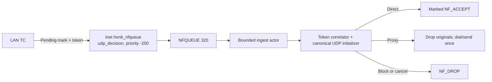

# NFQUEUE held-first-packet UDP

This document explains the fail-closed path that holds ambiguous LAN-forwarded UDP originals until userspace reaches a terminal direct, proxy, or block decision.

## Activation and scope

The path is enabled by default through `global.nfqueue_enable`. Set that key to `false` to disable it:

```dae
global {
    nfqueue_enable: false
}
```

Changing the setting requires a process restart; reload rejects the change. Startup treats NFQUEUE as best-effort: mock mode, a build without `ebpf`, a failed fixed-queue preflight, or a queue/rules/health failure before datapath admission logs a warning and disables staging for that process without rewriting the config file. Persistent token-generation recovery failures remain fatal because allocator state is ambiguous. Real mode acquires the singleton instance lock before that preflight, so a normal handoff waits for the old queue owner instead of degrading spuriously. The reserved nftables table is reclaimed during installation after queue binding. Once the service is admitted, listener, queue, watchdog, verdict, cleanup, and retirement failures remain fatal. See the [global configuration reference](../reference/global.md) for the process-scoped knob.

The hook is deliberately narrow:

| Traffic or state | Behavior |
| --- | --- |
| New, ambiguous LAN-forwarded UDP after LAN TC | Stage a unique token and hold the original skb in NFQUEUE when enabled and ready |
| Host-originated WAN UDP | Keep the canonical TPROXY path; host egress does not cross this `inet prerouting` hook |
| UDP port `53` | Keep the dedicated DNS fast path; never stage |
| Internal/special or reverse-direction traffic | Never stage |
| A `must` or `block` routing result | Treat as final; never stage |
| A direct result already safe at route time | Pass through the kernel direct path; never stage |
| Staging candidate while enabled but not ready | Drop the new flow; unrelated, non-staged UDP keeps its normal path |

“Ambiguous” means the preliminary route can still change after userspace routing, mode/group selection, or domain/QUIC inspection. The path avoids redirecting such a packet through a userspace relay merely because the preliminary result was incomplete.

## Packet-hold mechanism



| Mechanism | Current contract |
| --- | --- |
| Queue transport | `honk-nfqueue` uses raw `NETLINK_NETFILTER`; it does not shell out to firewall tools or use a netfilter helper library |
| Queue parameters | Fixed queue `320`, kernel maxlen `4096`, packet-copy range `65535`, and requested socket receive buffer `8 MiB` |
| Verdict ownership | A non-`Clone`, exactly-once `VerdictGuard`; dropping an uncommitted guard sends `NF_DROP` |
| Ingest ownership | One actor bounded to `256` entries and `8 MiB` of queued payload; a UDP slow-path permit is attempted only when the actor dequeues an entry |
| nftables ownership | One atomic transaction owns exact `inet honk_nfqueue` / `udp_decision`, an `inet prerouting` filter chain at priority `-250`; only UDP carrying the pending signature reaches the queue |
| Failure policy | No queue bypass, fanout, or fail-open flag. Malformed or truncated input, `ENOBUFS`, unexpected listener exit, and verdict-socket failure are fatal |

The service binds queue `320` before publishing the nftables transaction. Installation reclaims the stale reserved table under the singleton process lock; on an orderly final shutdown it drains every dispatched guard, closes the queue, and deletes the owned table last. Same-network-namespace firewall managers must not mutate either reserved nftables object while honk runs.

## Decision-token protocol

`UDP_DECISION_SEQUENCE` is a pinned, persistent one-slot spin-locked allocator. Its legacy value is exactly 12 bytes: lock, full raw token in `next`, and `exhausted`. Startup validates this ABI and value but never rewrites it. Ordinary restart and cleanup preserve the pin so an older binary can resume at the same raw-token boundary after rollback.

| Bits or field | Meaning |
| --- | --- |
| skb mark bits `31..30` | `CLASSIFIED_MARK | NFQUEUE_PENDING_MARK` = `0xc0000000`, the staging signature selected by the nftables rule |
| Token mask | `NFQUEUE_TOKEN_MASK` = `0x3fffffff`; the token occupies the remaining mark bits |
| Token bits `29..28` | Two-bit generation `0..=3` |
| Token bits `27..0` | 28-bit monotonic sequence within the generation |

A token is ownership, not merely correlation metadata. It must agree across the skb mark, `CONN_STATE_MAP`, `ROUTING_HANDOFF_MAP`, `REDIRECT_TRACK`, the userspace verdict cell, `UdpInitLease`, endpoint or retirement tombstone, and the backend terminal transition. No terminal operation may act on tuple identity alone.

## Terminal transitions

| Decision | Ordered transition |
| --- | --- |
| Direct | Token-check `ArmDirect` → issue marked `NF_ACCEPT` for every held original skb in FIFO order → token-check `ActivateDirect` |
| Proxy | Commit token-bound final outbound and mark → transfer the one retained payload into the canonical UDP initializer → issue `NF_DROP` for the originals → dial and send once |
| Block | Commit token-bound `Block` → drop every original skb → retire the initializer as a kernel handoff |
| Cancel or expiry | Abort only the matching pending incarnation → drop every original skb and retire its lease identity |

Direct creates no userspace UDP socket, payload copy or replay, endpoint, or `/connections` entry. Its final verdict mark retains classification and removes the pending/token carrier. If another packet for the flow arrives after Arm, the correlator appends only its verdict guard, discards its payload and slow permit, and returns to the FIFO accept loop before activation.

Proxy does not create a second routing path. It reuses the same `UdpInitLease` and `UdpEndpointPool` initializer used by ordinary transparent UDP. Publishing final kernel state before dial/send prevents a reply race; transferring only the retained payload and dropping the originals gives one send, with no replay fallback.

## Deadline and fatality

Every packet has one absolute three-second deadline measured from raw-netlink listener receipt. Actor delay and every backend-lock wait consume that same budget, including the second lock acquisition between Direct Arm and Activate. Queue, correlator, slow-path, or deadline saturation drops fail closed rather than extending ownership or memory growth.

A watchdog checks held cells independently and enforces the hard hold bound. Stale token, endpoint-generation, or backend-state mismatches drop without mutating a newer incarnation. A verdict failure or any failure after Direct has armed is process-fatal because userspace can no longer safely infer which originals the kernel accepted.

## Fences and lifecycle

### Reload and shutdown

Reload and shutdown share the same producer fence:

1. Publish `DATAPATH_FLAG_NFQ_READY=false`. New flows that require staging now fail closed.
2. Flip `UDP_DECISION_EPOCH`, wait for the old per-CPU `UDP_DECISION_INFLIGHT` slot to reach zero, then remove residual `Preparing` and `Pending` conn states. A delayed queue delivery subsequently fails token lookup.
3. Close correlator admission and drain or cancel verdict guards, initializer leases, scheduled token cleanups, endpoint tombstones, and retirement work before changing runtime ownership.
4. A successful reload publishes the replacement runtime generation and reopens correlator admission and readiness last. Shutdown detaches producers, closes queue ownership, and deletes `inet honk_nfqueue` last.

Failure or ambiguity in listener, queue, watchdog, cleanup, verdict, or retirement lifecycle is fatal; the runtime never reopens staging on uncertain ownership.

### Exact tuple retirement

Retirement inserts `UDP_DECISION_RETIRE_FENCE[tuple] = token` with `BPF_NOEXIST`, so a concurrent newer owner cannot replace the fence. It then flips the epoch, waits out pre-fence readers, and revalidates conn state, token, handoff, and redirect track. Only matching auxiliaries and conn state are deleted; the exact fence is released afterward. A mismatch retains the newer tuple incarnation and fails closed.

## Sequence exhaustion and rotation

Exhaustion uses the lifecycle fence rather than resetting a live allocator:

1. Fence readiness, quiesce kernel stagers, cancel and drain userspace cells, and hard-rebind the fixed queue so old held skbs and guards cannot survive rotation.
2. Inspect all four live token-bearing maps: `CONN_STATE_MAP`, `UDP_DECISION_RETIRE_FENCE`, `ROUTING_HANDOFF_MAP`, and `REDIRECT_TRACK`.
3. Reset only when the candidate generation **and every numerically higher generation through `3`** are absent from all four maps. A rolled-back legacy allocator starting at the candidate can advance through exactly that suffix, so checking only the candidate would permit token reuse.
4. Reopen admission and readiness only after the locked allocator reset succeeds.

When batch lookup is available, a short successful map batch is not proof of completion; an absence scan continues until terminal `ENOENT`. If no rollback-safe suffix is clear, staging stays fenced and retries after `1`, `2`, `5`, then `30` seconds, remaining at `30` seconds for subsequent failures. Non-staged UDP continues; only new flows requiring staging fail closed.

## Capacity bounds

| Owner | Bound |
| --- | --- |
| Kernel NFQUEUE | `4096` queued packets |
| Userspace ingest actor | `256` entries and `8 MiB` retained queued payload |
| Verdict correlator | `4096` live flow cells |
| One flow cell | `64` held verdict guards, including the first packet |
| UDP slow path | Effective startup budget capped at `256`; a permit is acquired only at actor dequeue |

The effective slow-path, endpoint, dial, and file-descriptor budgets derive from the process startup `RLIMIT_NOFILE` plan, so `256` is a ceiling rather than a guaranteed permit count. See [Control plane](./control-plane.md) for budget derivation and ownership.

## Observability

With the API enabled, `GET /stats` exposes `udp.nfqueue` (the documented dotted path `/stats.udp.nfqueue`): listener/correlator counts, actor depth/bytes/oldest age, kernel queue/drop/read state, held/peak guards and effective receive buffer, terminal verdict and token counters, verdict errors, and receipt-to-successful-verdict latency. See the [API reference](../reference/api.md) for the field inventory.

`EVENT_RINGBUF` emits a rate-limited `udp_decision_token_exhausted` warning as the immediate exhaustion prompt. Recovery does not depend on that lossy channel: the supervisor periodically performs a locked read of `UDP_DECISION_SEQUENCE`, which detects exhaustion even if the event was dropped; failure of this backstop is fatal.

## Related docs

- [eBPF datapath](./datapath.md)
- [Control plane](./control-plane.md)
- [Global configuration reference](../reference/global.md)
