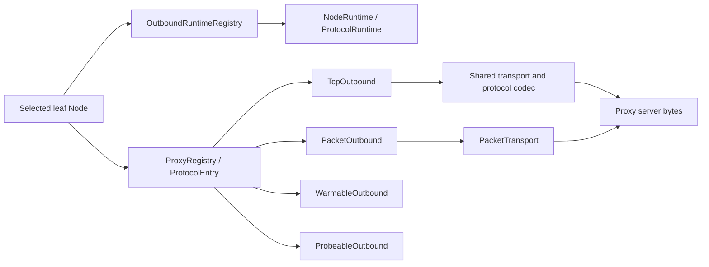

# Outbound and proxy stack

This document describes the path from a selected leaf node to protocol bytes sent to the proxy server or target.

## Scope

The outbound stack begins after routing and group selection have produced one leaf
`Node`. It owns capability dispatch, reusable protocol state, transport setup,
TLS and REALITY, proxy framing, and the TCP or UDP-facing object returned to the
control plane.

It does not define the node configuration surface; see
[Node reference](../reference/nodes.md). It also does not choose a group
member or define health policy; see [Group design](./groups.md).

The boundary returned to the caller is one of:

- `ProxyStream`, an established target-bound TCP byte stream; or
- `Arc<dyn PacketTransport>`, an established framed packet path for one UDP
  target.

`direct` reaches the target without a proxy protocol. `block` terminates the
request. Every other handler turns the selected node into bytes understood by
its proxy server.

## Registry and capability model



`ProxyRegistry` is a protocol dispatcher, not a session owner. Each
`ProtocolEntry` contains a `ProtocolDescriptor`, the mandatory TCP handler, and
optional packet, warm, and probe capability slots. A `None` slot means that the
protocol does not implement that capability; dispatch is refused rather than
silently substituted.

### Capability traits

| Trait | Operations | Contract |
| --- | --- | --- |
| `TcpOutbound` | `dial`, `dial_with_tcp`, `dial_runtime` | Opens a target-bound `ProxyStream`. `dial_with_tcp` may consume an already connected bare server socket. `dial_runtime` pins session-owning work to the captured generation. |
| `PacketOutbound` | `dial_udp_transport`, `dial_udp_transport_runtime`, `dial_udp_transport_speculative_runtime` | Opens the only production UDP contract, `PacketTransport`. Runtime and speculative variants prevent reload or cold-race work from consulting mutable current state. |
| `WarmableOutbound` | `warm(runtime, timeout, WarmRequirement)` | Establishes reusable state for `WarmRequirement::Session` or `WarmRequirement::Udp`. Hysteria2 alone distinguishes `Udp` to verify that the server admitted UDP. |
| `ProbeableOutbound` | `test_connectivity` | Tests raw proxy-server reachability. Protocols may override the default marked TCP connect. |

`PacketTransport` exposes the relay target, `send_packet`,
`send_packet_confirmed`, and `recv_packet`. `send_packet_confirmed` is the
stronger first-packet admission point for queue-backed tunnels. Full-cone
protocols can additionally declare that server metadata authoritatively names
the reply source.

No production UDP handler returns a raw socket or a loopback bridge. Direct and
SOCKS5 wrap native sockets behind `PacketTransport`; tunnel protocols implement
framing on their actual transport.

### Protocol descriptors

`ProtocolDescriptor` is the single per-protocol facts table. Predicates accept
the concrete node because VLESS mode, `network`, and Trojan transport affect
capability or pooling.

| Protocol | `supports_udp` | `pool_ready_streams` | `pool_bare_tcp` | Generation runtime | Share-link schemes |
| --- | --- | --- | --- | --- | --- |
| Shadowsocks, including 2022 | yes | no | yes | `None` | `ss` |
| Trojan | when `network` is absent or contains `udp` | only `tcp`/empty transport | yes | `None` | `trojan` |
| VMess | no | no | yes | `None` | `vmess` |
| VLESS | non-`legacy` mode and UDP allowed by `network` | no | `legacy`, `uot-v2`, `xudp` only | H2MUX, Mux.Cool, or `None`, by mode | `vless` |
| SOCKS5 | yes | yes | yes | `None` | `socks5`, `socks4`, `socks4a` |
| Hysteria2 | yes | no | no | `Quic` | `hysteria2`, `hysteria` |
| TUIC | yes | no | no | `Quic` | `tuic` |
| Juicity | yes | no | no | `Quic` | `juicity` |
| AnyTLS | when `network` is absent or contains `udp` | no | no | `AnyTls` | `anytls` |
| Direct | yes | no | yes | `None` | none |
| Block | no | no | yes | `None` | none |

Ready-stream pooling stores a completed target-bound handshake. Bare-TCP
pooling stores only a connected proxy-server socket and lets `dial_with_tcp`
perform the per-target protocol handshake. Multiplexed and QUIC protocols
exclude both because their generation runtime is the sole reusable-state owner.

Registry assembly checks that descriptor capabilities and populated slots agree.
Node-dependent entries may carry a packet slot even when the default node lacks
UDP. `block` is the explicit exception: its descriptor says no UDP capability,
but its packet slot is allowed through dispatch so the selected block decision
can reject the flow terminally.

### Protocol and UDP inventory

| Handler | TCP behavior | `dial_udp_transport` |
| --- | --- | --- |
| `direct` | Native marked target connect | Native marked UDP behind `PacketTransport` |
| `block` | Rejects | Explicit reject-path exemption; carries no UDP |
| `socks5` | SOCKS CONNECT | RFC 1928 UDP association |
| `ss` / Shadowsocks 2022 | Shadowsocks stream | Shadowsocks packet framing |
| `trojan` | Trojan stream over shared transport | Trojan UDP framing when `network` allows UDP |
| `vmess` | VMess stream | Unimplemented |
| `vless` | Mode-dependent | Available only when `vless_mode != legacy` and `network` allows UDP |
| `hysteria2` | QUIC stream | Hysteria2 QUIC datagrams |
| `anytls` | AnyTLS logical stream | UoT v2 logical stream |
| `tuic` | TUIC v5 QUIC stream | QUIC datagrams or uni-stream fallback |
| `juicity` | Juicity QUIC stream | One length-framed QUIC bi stream |

VMess and VLESS entries are compiled only with the `rprx` feature. The default
`honk-core` feature set enables it. Without `rprx`, these node forms still parse,
but the registry contains no entry and dials fail with the ordinary
`No handler for protocol` refusal.

## Runtime ownership and reload

`OutboundRuntimeRegistry` is the control plane's single owner of reusable
outbound state for one immutable configuration generation. It maps `Node.id` to
`NodeRuntime`:

- immutable `Arc<Node>` configuration;
- the node-aware `udp_capable` result; and
- one `ProtocolRuntime` selected by the descriptor.

`ProtocolRuntime` is `None`, an AnyTLS `SessionPool`, a VLESS H2MUX or Mux.Cool
`SessionPool`, or one type-erased QUIC client slot. Handlers remain stateless
with respect to generation-owned sessions.

### Generation lifecycle

Startup builds and validates the full runtime registry before publication.
Reload builds a replacement registry against the previous one. A runtime is
eligible for transfer only when the full node configuration is equal, ignoring
parse-time `created_at` and `updated_at` metadata.

Transfer occurs at the reload commit point. The old generation records moved
`Node.id` values only after the replacement is published, then skips those
runtimes during drain and shutdown. Consequently, unchanged nodes keep:

- TUIC, Juicity, and Hysteria2 QUIC clients and connections;
- AnyTLS physical sessions;
- VLESS H2MUX carriers; and
- VLESS Mux.Cool carriers.

A retiring generation first becomes terminal to new work. Non-transferred
AnyTLS and VLESS pools enter draining: no new logical streams are admitted, but
existing streams retain their carriers until completion. QUIC flows own
connection clones, so terminal generation checks reject new work while current
flows finish naturally. Process shutdown force-closes remaining pools and QUIC
clients only after the process-level flow drain.

Generation-free callers such as standalone probes use
`EphemeralRuntimeGuard`. AnyTLS or VLESS streams and packet transports retain
the guard for their whole lifetime. Normal completion can await `close`; drop
also starts deterministic teardown, so a throwaway pool cannot survive an
aborted caller. Single XUDP has no generation runtime.

### Dial admission

Physical outbound connects—including direct TCP and proxy TCP/QUIC attempts—and their protocol handshakes acquire two permits:

1. the captured generation's configured dial gate; then
2. the immutable process-wide startup ceiling shared by overlapping reload
   generations.

Acquiring the generation gate first prevents a low-limit generation from
hoarding process capacity. A replacement can apply a new generation-local
limit immediately, while old in-flight work continues to occupy the shared
process gate. Logical streams on already warm sessions do not perform another
physical dial.

## Shared stream, socket, and bootstrap layers

### Stream transport

`proxy/transport.rs` is shared by Trojan, VMess, and VLESS. The order is fixed:

```text
TCP -> optional TLS or REALITY -> optional WebSocket or gRPC -> protocol header
```

`maybe_tls_wrap_concrete` preserves the concrete TCP/TLS type needed by Vision.
When REALITY parameters are present, it dispatches to `reality_connect` instead
of ordinary TLS. The same shared path therefore gives Trojan, VMess, and VLESS
consistent TLS, REALITY, WS, and gRPC setup.

The gRPC transport is a hand-written minimal gRPC-over-HTTP/2 client. The
opening HEADERS frame does not set `END_STREAM`, and TLS requests use
`:scheme: https`. DATA carries gRPC length prefixes and the protobuf
single-bytes-field envelope expected by gun-style servers.

### Marked sockets and name resolution

`util.rs` centralizes outbound socket creation:

- `connect_marked` resolves then connects TCP with timeout, nodelay,
  keepalive, and optional `SO_MARK`;
- `connect_outbound` applies the bypass mark for proxy-server TCP; and
- `udp_marked_bind` and `marked_udp_socket` create bypass-marked UDP sockets.

Every control-plane-originated non-loopback socket must carry
`DAE_BYPASS_MARK` (`0x100`). Without it, WAN egress classification can redirect
honk's own proxy, DNS, or probe traffic back into `daens` and create a loop.
Mark application is best-effort only for unprivileged `EPERM` environments
without the production datapath; other errors propagate.

Marked UDP sockets request 8 MiB each for `SO_RCVBUF` and `SO_SNDBUF`. Linux
may clamp and reports twice the configured sysctl accounting value; the core
raises the corresponding maxima at startup.

`bootstrap.rs` prevents proxy-hostname resolution from depending on honk's own
intercepted DNS path. Node dial sites use `bootstrap::resolve` through
`connect_marked` or the QUIC setup and never call bare `lookup_host` directly.
The configured bootstrap resolver is queried over bypass-marked UDP/TCP; failure
falls back to the system resolver. `query_ech_config` uses the same raw path for
DNS HTTPS records (`qtype 65`) and extracts the SVCB `ech` parameter.

After resolution, proxy-server TCP and shared QUIC clients stably interleave
address families and race at most two addresses. The first starts immediately;
the fallback starts after 250 ms. An earlier failure advances the fallback,
while keeping physical attempts at least 10 ms apart. Every in-flight address
attempt holds its own generation and process dial permits, so
at the configured ceiling a fallback waits for an earlier attempt to finish;
`max_concurrent_dials: 1` serializes addresses. The race stays inside the
already selected node: socket marks and security settings are identical, and
QUIC protocol authentication runs only for the winner.

## TLS, fingerprinting, ECH, and pins

All production TLS in the outbound and DNS transport stacks uses BoringSSL. TCP uses `boring` and
`tokio-boring`; QUIC uses the custom `quinn-proto` crypto backend. The trust
store is built from `webpki-root-certs`. Explicit no-verify connectors exist for
configured insecure operation and for REALITY, whose own post-handshake check
replaces PKI.

### Process-wide TLS profile

`tls_implementation = "utls"` enables the one implemented impersonation profile,
Chrome, process-wide. The profile configures:

- GREASE and per-connection extension permutation;
- `X25519MLKEM768` followed by `X25519` key shares;
- Chrome signature algorithms, curves, cipher set, and ALPN;
- brotli certificate compression;
- ALPS for h2, pinned to Chrome's old `0x4469` codepoint rather than
  BoringSSL's newer `0x44cd`; and
- ECH GREASE when no real ECHConfigList is available.

Other `utls_imitate` names warn and use Chrome. `tls_implementation = "tls"`
keeps the ordinary BoringSSL ClientHello.

### ECH and certificate pins

A node can provide a static ECHConfigList inline or by file. Invalid explicit
configuration fails registry construction. A server-side `ECH_REJECTED` is
fail-closed; offered retry configs are logged but not persisted.

When only ECH discovery is enabled, the connector queries DNS HTTPS records at
connect time through the bootstrap path. Positive results follow a bounded
record TTL and negative results cache for five minutes. Discovery is
best-effort and fail-open: a lookup failure means no real ECH for that
connection, while Chrome mode can still send ECH GREASE.

`pinSHA256` compares the SHA-256 digest of the leaf certificate and replaces
both PKI chain validation and hostname validation. An invalid pin fails closed.
The same rule is implemented in TCP TLS and the QUIC crypto backend.

## REALITY client

REALITY is a specialized BoringSSL handshake, byte-compatible with Xray
`reality.go`. The workspace's patched `boring-sys` supplies two client hooks:

- `SSL_set1_client_x25519_private_key` places honk's ephemeral private key into
  the serialized X25519 `key_share`; and
- `SSL_set_client_hello_fixup_cb` rewrites the serialized ClientHello before it
  enters the handshake transcript.

### ClientHello authentication

REALITY forces X25519-only groups and key shares. The fixup callback zeros the
32-byte legacy `session_id` slot in the complete ClientHello and computes:

```text
shared  = X25519(client_ephemeral_private, server_public_key)
authKey = HKDF-SHA256(shared, salt=clientRandom[0:20], info="REALITY")
nonce   = clientRandom[20:32]
plain   = [version: 1,3,3][reserved: 0][timestamp: u32 BE][shortId: 8]
session_id = AES-256-GCM(authKey).Seal(nonce, plain, AAD=zeroed ClientHello)
```

The 16-byte encrypted plaintext plus 16-byte GCM tag exactly fills the legacy
32-byte session ID. An empty short ID is eight zero bytes; a configured value is
even-length hex of at most eight bytes and is right-zero-padded. Parse or fixup
failure aborts the handshake; no unauthenticated ClientHello is sent.

### Server authentication and fingerprint constraints

REALITY disables ordinary certificate verification only because it replaces
it. The peer leaf must be an ephemeral ed25519 certificate whose signature is
exactly:

```text
HMAC-SHA512(authKey, raw_ed25519_public_key)
```

A relayed mask-target certificate, wrong key, redirection, or MITM fails closed.
There is no fallback to PKI and no session resumption.

The REALITY profile adds ed25519 to the Chrome signature-algorithm list because
BoringSSL otherwise rejects the ephemeral leaf before the custom check. It also
uses X25519-only key shares. The widened signature list is the one known
`JA4_c` difference from Chrome; the verified REALITY Chrome JA4 is
`t13d1516h2_8daaf6152771_01adaf6b9c20`.

The REALITY `dest` must return a TLS Certificate message smaller than 8 KiB,
because compatible sing-box servers buffer 8192 bytes. A larger certificate
flight cannot complete this handshake.

## VLESS wire contracts

`WireMode` selects one of six explicit contracts. It is configuration, not
negotiation.

| Mode | TCP path | UDP path | Reusable shape |
| --- | --- | --- | --- |
| `legacy` | Ordinary VLESS stream | none | No generation runtime; bare proxy TCP may be pooled |
| `uot-v2` | Ordinary VLESS stream | One connected direct UoT v2 stream per packet transport | No generation runtime; bare proxy TCP may be pooled |
| `h2mux` | H2MUX logical TCP stream | Native connected H2MUX UDP using UoT length framing | Node-owned H2MUX pool, at most 2 reusable/dialing carriers × 128 streams |
| `h2mux-padded` | H2MUX logical TCP stream with sing-mux v1 padding | Same native connected UDP with padding | Same node-owned 2 × 128 H2MUX pool |
| `xudp` | Ordinary VLESS stream | Single XUDP on a dedicated mux-command carrier, reserved ID 0 | Unpooled; bare proxy TCP may be pooled |
| `mux-cool` | Mux.Cool logical TCP stream | Pooled XUDP | Node-owned Mux.Cool pool, at most 2 active carriers × 128 children |

The client never probes the server for a mode, falls back to another mode, or
replays a first UDP packet. A mismatch is a protocol failure. This keeps packet
admission and side effects single-commit.

### H2MUX

H2MUX sends the physical VLESS request to
`sp.mux.sing-box.arpa:444`, selects backend `2`, then runs HTTP/2 over that
carrier. Logical streams carry either TCP or native connected UDP. UDP uses the
shared UoT length codec rather than a loopback bridge.

`h2mux-padded` adds the sing-mux v1 randomized preface and record framing for
the first 16 records in each direction. Each carrier admits at most 128 logical
streams. At most two reusable or currently dialing carriers count toward the
pool cap; a draining carrier may overlap its replacement until its final live
stream exits.

HTTP/2 flow control drives backpressure. GOAWAY makes the carrier draining and
rolls new work to a replacement. Driver failure fans out to its children;
half-close, reset, receive-window release, and lazy response errors remain
per-stream.

Receive credit is fixed at 2 MiB per stream. Connection credit covers one
maximum UoT response frame for each of the 128 admitted streams
(8 MiB + 256 bytes). The larger stream window removes the old
one-datagram-per-RTT ceiling on long-fat TCP paths. The per-stream cap prevents
one unread child from consuming all connection credit, while the aggregate
bound lets interleaved maximum UDP frames always complete.

### Mux.Cool and XUDP

Mux.Cool sends the Xray VLESS mux command and multiplexes child TCP and XUDP
records. One ordered writer serializes every child frame. Session IDs increase
monotonically and are not reused; an exhausted carrier drains while a
replacement accepts new children.

The pool admits no more than two active carriers and 128 children per carrier.
Draining carriers do not consume the active cap but remain alive for existing
children. Saturation waits for capacity instead of bypassing the pool.

Receive payloads share an 8 MiB carrier budget. TCP delivery allows 100 ms for
transient budget or queue pressure before resetting only the stalled child;
UDP remains drop-on-full. This tolerates line-rate scheduler bursts without
letting an unread child pin the carrier indefinitely.

XUDP reply metadata can change the logical peer and therefore enables full-cone
reply sources. Pooled Mux.Cool packets are capped at 8 KiB. Single XUDP reuses
the codec on a dedicated unpooled carrier with global ID `0` and a 7,526-byte
packet cap.

### Vision

`xtls-rprx-vision` carries the flow in the VLESS addons. The response header is
stripped lazily on the first read because servers commonly send it with the
target's first downstream bytes; eager reading can deadlock a request whose
target waits for client data.

Vision removes response padding. Command `2` is direct-copy: the server abandons
the outer TLS session and the read side switches to the raw TCP socket. The
write side remains on the outer stream unless the client itself sends a direct
command, which honk does not.

The supported carrier is TCP with TLS or REALITY, and the supported wire modes
are `legacy` and Single `xudp`. H2MUX, padded H2MUX, Mux.Cool, and UoT own
incompatible inner framing.

### VLESS Encryption

VLESS Encryption wraps the selected stream transport before the ordinary VLESS
request. The only implemented protocol name is `mlkem768x25519plus`, with
`native`, `xorpub`, and `random` wire modes.

The prologue accepts X25519 or ML-KEM-768 server authentication keys, including
chained relay keys. Every new 1-RTT connection performs ML-KEM-768 plus X25519
forward secrecy. Payload records use AES-256-GCM when hardware acceleration is
available and ChaCha20-Poly1305 otherwise.

A `0rtt` configuration caches the server ticket and PFS key in the handler's
node-ID-keyed client config. A cold or expired cache takes the 1-RTT path. Any
record-authentication failure while using a ticket invalidates it, so the next
connection cannot repeat a rejected cached path.

VLESS Encryption is legacy-only. Configuration rejects it with Vision and with
every non-`legacy` wire mode because each combination would give two layers
ownership of the same inner framing.

## QUIC stack

TUIC, Juicity, and Hysteria2 use quinn 0.11. `quic.rs` owns transport tuning,
marked endpoints, connection single-flight, rotation, stream wrappers, and
shared fragmentation support. Protocol handlers translate node settings into
`QuicClientOptions`; the shared layer does not inspect protocol-specific fields.

### BoringSSL crypto backend

`quic_boring.rs` implements the client side of `quinn_proto::crypto::Session`
over BoringSSL's QUIC callbacks. It provides:

- TLS 1.3 handshake bytes and traffic-secret delivery;
- RFC 9001 initial, handshake, and 1-RTT packet keys;
- AES-GCM and ChaCha20-Poly1305 packet protection;
- AES or ChaCha20 header protection;
- key update and Retry integrity; and
- QUIC transport-parameter exchange.

Header protection is packet-number-length aware. The first byte is unmasked
before deriving a received packet's one-to-four-byte packet-number length; only
that many bytes are masked or unmasked. Treating every number as four bytes
corrupts the following payload for short packet numbers.

A process-wide, bounded `SESSION_TICKETS` cache stores BoringSSL TLS 1.3
sessions by server identity. BoringSSL requires explicit `SSL_set_session` for
resumption. `pinSHA256` nodes never resume because a PSK handshake would bypass
the certificate pin. Rejected cached sessions are evicted without deleting a
newer concurrent ticket.

The backend can carry real ECH and the Chrome QUIC ClientHello. Proxy outbounds
do not expose early packet keys to quinn, so they send no 0-RTT early payload;
no supported official TUIC, Juicity, or Hysteria2 server has accepted such early
data in interoperability checks.

### Shared client ownership

Each generation-owned QUIC runtime has one type-erased protocol client slot.
`QuicClient` single-flights connection construction, so concurrent first dials
share one handshake. It retains at most one reusable active connection.

Rotation overlaps naturally: each flow owns its `(Connection, protocol state)`
pair. When the holder replaces a closed or invalidated connection, new work
uses the replacement while existing flows can finish on their old clones.
Dropping final warm ownership removes future reuse without cutting active flows.

### Protocol contracts

| Protocol | Authentication and TCP | UDP | Transport policy |
| --- | --- | --- | --- |
| TUIC v5 | TLS-exporter authentication on a uni stream; one TCP bi stream per flow | QUIC datagrams, fragmentation, and uni-stream fallback when datagrams are unavailable | 10 s heartbeat; default 8 MiB stream and 8 MiB connection receive windows, with node overrides |
| Juicity | ALPN `h3`; TLS-exporter auth; bi-stream header `[network][trojanc metadata]` | One bi stream with `[metadata][u16 length][payload]` records | BBR by default; 8 MiB stream and 8 MiB connection receive windows |
| Hysteria2 | ALPN `h3`; minimal HTTP/3/QPACK `POST https://hysteria/auth`, success status `233` | Native Hysteria2 QUIC datagrams and fragmentation | Upload Mbps selects the Brutal fixed-rate sender, otherwise BBR; receive bandwidth is sent in bytes/s through `Hysteria-CC-RX`; same 8/8 MiB default receive windows |

Hysteria2's HTTP/3 layer is deliberately local and minimal: control/QPACK
unidirectional streams, static-table QPACK, and enough HEADERS handling for
authentication. It must not advertise `SETTINGS_H3_DATAGRAM`; doing so starts a
competing quic-go datagram reader that can consume Hysteria2 UDP packets.

Hysteria2 follows sing-quic's lazy TCP setup: the first write merges the request and payload, and the first read strips the response, saving one RTT.

Salamander obfuscation prefixes each wire datagram with an 8-byte random salt
and XORs the payload with repeated `BLAKE2b-256(password || salt)`. Client-side
port hopping selects a configured destination port from the first send onward.
The server must DNAT the range to its listener. Receive metadata rewrites the
reply source port to the nominal remote port so QUIC sees one stable peer.

## AnyTLS session engine

AnyTLS handlers are stateless. Each generation's `NodeRuntime::AnyTls` owns one
`SessionPool<AnyTlsSession>` and lazily materialized BoringSSL connector.
Generation-free calls use a guarded ephemeral equivalent.

### Pool and session lifecycle

The generic `SessionPool` enforces `Active`, `Draining`, and `Closed` states,
atomic stream permits, event-driven capacity waits, least-loaded selection, and
pool-owned single-flight physical dials. Draining sessions are excluded from
the reusable cap and can overlap replacements while live streams finish.

AnyTLS configures two reusable physical sessions and 128 streams per session.
It spreads work: after the first session becomes busy, the pool establishes the
second before adding more load, then schedules least-loaded. Consecutive dial
failures use bounded backoff instead of one physical connect per proxied flow.

After v2 server-settings negotiation, every reused logical stream (SID 2 and
later) must receive a SYNACK within three seconds. Each new open replaces the
previous deadline and any SYNACK clears it, matching sing-anytls. Expiry retires
the physical session so the pool redials instead of reusing a silent carrier.

Sessions enter age-based drain at 30 minutes with per-session jitter. The
configured `min_idle` floor and idle timeout feed one node-local janitor.
Selector or UDP warm ownership independently raises effective retention; the
last owner release drains future reuse without terminating live streams.

### Ordered write path

Every frame crosses one `WriterQueue` and one physical writer task. Data uses
bounded permits, control frames retain reserved headroom, and the whole queue is
capped at 1,024 frames. Queue exhaustion makes the session terminal instead of
growing memory. A stream's SYN and first PSH are inserted as one atomic batch,
so another stream cannot interleave between them.

After one blocking pop, the writer gathers only frames already queued, up to 64
frames or 256 KiB, into one `write_all` and one `flush`. It never waits to fill
a batch. Data permits and confirmed-write completions are released only after
the physical batch succeeds or the session becomes terminal.

`AnyTlsStream::poll_write` is cancellation-safe through an owned outbound slot.
It returns `Ok(n)` only after exactly those `n` bytes have entered the ordered
queue; cancellation cannot lose a pending chunk or enqueue it twice.

### Non-blocking demultiplexing

Each TCP child has a bounded delivery queue. When it fills, the demultiplexer
parks frames in a per-SID ordered overflow instead of waiting, preserving
sibling progress and exact frame/byte accounting.

Soft limits are:

- 512 parked frames and 8 MiB per session; and
- 2 MiB per stream.

Crossing a soft limit does not kill the stream. The first parked frame starts a
watchdog ticking every 250 ms. Only a stream with no successful overflow flush
for a full 3 seconds is reset; queued bytes alone are not evidence of a stall.

Emergency hard limits are 768 frames or 12 MiB per session. If a stream is
already past the 3-second grace, admission reaps that stream immediately.
Otherwise the demultiplexer waits in bounded 100 ms
`OVERFLOW_EMERGENCY_WAIT` rounds, shortened to the nearest grace expiry, and
re-evaluates after reader progress.

FIN and error events bypass the data-frame quota so termination cannot be
hidden behind a full queue, but at most two terminal events park per SID.
Admitted data drains before the resulting reset. A session failure becomes
`ConnectionAborted`; a per-stream refusal or slow-consumer reap becomes
`ConnectionReset`.

UoT delivery uses nonblocking `try_send`. A full UoT sink is removed and that
SID is retired rather than blocking the session demux or dropping an arbitrary
chunk and continuing a corrupted length-delimited byte stream.

### Lazy UoT creation

Opening an AnyTLS UDP transport reserves a stream but defers its UoT connect
request. When the first datagram fits the AnyTLS frame-size bound, the connect
request and encoded datagram are emitted together as one ordered PSH. An
oversized combination sends a confirmed setup first, then the datagram. This
avoids an otherwise empty setup round trip without permitting first-packet
replay.

## Cold URLTest speculative preparation

Cold URLTest is the only selection path that prepares more than one leaf. The
selection policy and staggering rules live in [Group design](./groups.md);
the outbound layer only makes preparation side-effect safe.

Session pools atomically return either a permit on an existing shared session
or a caller-owned provisional physical-dial slot counted against the pool cap.
A detached AnyTLS or VLESS mux session remains outside the reusable pool until
winner commit. Dropping a loser removes its generation-safe slot and closes the
attached session synchronously.

QUIC candidates build detached clients. Losers are force-closed. Winner commit
publishes its client only if the generation slot is still empty. If ordinary
traffic populated the slot meanwhile, the incumbent remains; the winning flow
continues using the detached connection and protocol-state clones it already
owns.

Promotion completes before the `PacketTransport` is exposed. Commit failure is
fail-closed and drops the transport. QUIC slot arbitration performs no await
after mutating the slot, so cancellation cannot leave a published but
uncommitted winner.

## Related docs

- [Group design](./groups.md)
- [Control-plane design](./control-plane.md)
- [Node reference](../reference/nodes.md)
