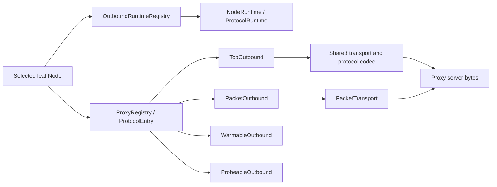

# Outbound and proxy stack

This document describes the path from a selected leaf node to protocol bytes sent to the proxy server or target.

## Scope

The outbound stack begins after routing and group selection have produced one leaf
`Node`. It owns capability dispatch, reusable protocol state, transport setup,
TLS and REALITY, proxy framing, and the TCP or UDP-facing object returned to the
control plane.

It does not define the node configuration surface; see
[Node reference](../reference/nodes.md). It also does not choose a group
member or define health policy; see [Group design](./groups.md).

The boundary returned to an ordinary caller is one of:

- `ProxyStream`, an established target-bound TCP byte stream; or
- `Arc<dyn PacketTransport>`, an established framed packet path for one UDP target.

Speculative UDP dialing first returns `PreparedUdpTransport<T>`. Commit is fallible and returns the selected `Arc<T>`; dropping an unselected preparation rolls it back. The source-shared VLESS path commits the typed `VlessXudpTransport` into a core-owned source attachment so several five-tuple endpoints can share its receiver.

`direct` reaches the target without a proxy protocol. `block` terminates the
request. Every other handler turns the selected node into bytes understood by
its proxy server.

Outbound dialing, groups, and health checking. Re-exported by `honk-core` as `honk_core::{proxy, group, outbound}`.

## Implementation ownership

Public `proxy::*`, `quic::*`, and `quic_boring::*` imports remain supported.
Implementation owners are smaller ordinary Rust modules:

| Area | Implementation owners |
| --- | --- |
| Proxy contracts | `proxy/{error,packet,outbound,registry}.rs` |
| Protocol families | `proxy/shadowsocks/{mod,aead2022,stream}.rs`; `proxy/vless/{mod,handler,mux,cool,encryption}.rs` |
| QUIC | `quic/{path_health,flow_control,metrics,endpoint,client,stream,boring}.rs` |
| AnyTLS | `proxy/anytls/{padding,writer,overflow}.rs` |
| Score and health | `group/score/{evidence,ranking,feedback}.rs`; `alive/{health,urltest}.rs` |
| Session pool | `session/{maintenance,speculative}.rs` |

Common state remains at the shared ancestor; child implementations do not make
its fields public. REALITY, TLS, stream transport and UoT remain shared rather
than VLESS-owned. Existing test-topic names stay intact within their owning
family. Physical file/line and defining-module metadata change with ownership:
public reexports do not preserve `type_name` or default tracing targets. Log
filters for the former `quic_boring`, `vless_mux` and `shadowsocks_2022` targets
must use `quic::boring`, `proxy::vless::mux` and `proxy::shadowsocks::aead2022`
under the `honk_outbound::` prefix.

## Registry and capability model



`ProxyRegistry` is a protocol dispatcher, not a session owner. Each
`ProtocolEntry` contains a `ProtocolDescriptor`, the mandatory TCP handler, and
optional packet, warm, and probe capability slots. A `None` slot means that the
protocol does not implement that capability; dispatch is refused rather than
silently substituted.

- `src/proxy/mod.rs`: `ProxyStream::into_tcp_stream` preserves the zero-copy splice downcast invariant. `PreparedUdpTransport<T>` keeps speculative publication behind one consuming commit and returns the exact selected `Arc<T>`. `WarmAttempt` holds the retention lock across establishment; failure or cancellation rolls back only its inserted bit.

### Capability traits

`WarmRequirement::Session|Udp` selects the reusable state to establish. VLESS
resolves the two requirements independently from its TCP and UDP paths; a
UDP-only Xray pool therefore does not make Selector warming open that pool.

| Trait | Operations | Contract |
| --- | --- | --- |
| `TcpOutbound` | `dial`, `dial_with_tcp`, `dial_runtime` | Opens a target-bound `ProxyStream`. `dial_with_tcp` may consume an already connected bare server socket. `dial_runtime` pins session-owning work to the captured generation. |
| `PacketOutbound` | `dial_udp_transport`, `dial_udp_transport_runtime`, `dial_udp_transport_speculative_runtime` | Opens or prepares the ordinary `PacketTransport` contract. Runtime and speculative variants prevent reload or cold-race work from consulting mutable current state. |
| `WarmableOutbound` | `warm(runtime, timeout, WarmRequirement)` | Establishes only the reusable state named by the requirement. Hysteria2 uses `Udp` to verify server admission; VLESS may map `Session` and `Udp` to different pools. |
| `ProbeableOutbound` | `test_connectivity` | Tests raw proxy-server reachability. Protocols may override the default marked TCP connect. |

`PacketTransport` exposes the relay target, `send_packet`,
`send_packet_confirmed`, and `recv_packet`. `send_packet_confirmed` is the
stronger first-packet admission point for queue-backed tunnels. Full-cone
protocols can additionally declare that server metadata authoritatively names
the reply source. Source-shared VLESS uses the same framing transport internally,
but core serializes sends from endpoint views and owns its single receive loop.

No production UDP handler returns a raw socket or a loopback bridge. Direct and
SOCKS5 wrap native sockets behind `PacketTransport`; tunnel protocols implement
framing on their actual transport.

### Protocol descriptors

`src/descriptor.rs` owns `ProtocolDescriptor`, the single per-protocol facts table.
Predicates accept the concrete node because VLESS `network` and TCP path, and
Trojan transport, affect capability or pooling. Trojan and AnyTLS share
`network_allows_udp`; VLESS uses canonical `VlessConfig::udp_enabled()`.

| Protocol | `supports_udp` | `pool_ready_streams` | `pool_bare_tcp` | Generation runtime | Share-link schemes |
| --- | --- | --- | --- | --- | --- |
| Shadowsocks, including 2022 | yes | no | yes | `None` | `ss` |
| Trojan | when `network` is absent or contains `udp` | only `tcp`/empty transport | yes | `None` | `trojan` |
| VMess | no | no | yes | `None` | `vmess` |
| VLESS | when `network` allows UDP | no | when the TCP path is direct | `Vless` | `vless` |
| SOCKS5 | yes | yes | yes | `None` | `socks5`, `socks4`, `socks4a` |
| Hysteria2 | yes | no | no | `Quic` | `hysteria2`, `hysteria` |
| TUIC | yes | no | no | `Quic` | `tuic` |
| Juicity | yes | no | no | `Quic` | `juicity` |
| AnyTLS | when `network` is absent or contains `udp` | no | no | `AnyTls` | `anytls` |
| Direct | yes | no | yes | `None` | none |
| Block | no | no | yes | `None` | none |

Ready-stream pooling stores a completed target-bound handshake. Bare-TCP
pooling stores only a connected proxy-server socket and lets `dial_with_tcp`
perform the per-target protocol handshake. TCP-multiplexed and QUIC protocols
exclude both because their generation runtime owns reuse. VLESS with direct TCP
remains bare-poolable even when an independent UDP-only Xray pool exists.

Ready streams are keyed by runtime generation, node identity, and target; only
flows using the generation that dialed them may acquire them. After a reload
publishes its successor, retiring the old generation removes its ready streams,
target counts, warm claims, and hotness under the pool lock and refuses late
ready deposits, hotness updates, and warm claims for it. The successor starts
with an empty ready namespace. A rejected reload keeps the active pool state.
Bare-TCP keys remain proxy-server addresses; health purges remove that address's
bare entries and only the current generation's matching identity's ready entries.

A bare entry has completed only the proxy-server TCP connect. Before reuse,
the pool rejects any queued inbound byte—including a fatal TLS alert—because
protocol/TLS setup has not started and no server byte can be valid yet. There is
no SNI/alert special case and no handshake retry on that socket. A Ready entry
has completed its target-bound protocol handshake, so already buffered target
data remains valid and does not make it stale.

Registry assembly checks that descriptor capabilities, populated slots, and runtime kinds agree.
Node-dependent entries may carry a packet slot even when the default node lacks
UDP. `block` is the explicit exception: its descriptor says no UDP capability,
but its packet slot is allowed through dispatch so the selected block decision
can reject the flow terminally.
UDP-disabled nodes produce an ordinary capability refusal, allowing configured
cold-candidate fallback. Explicit target policy remains a terminal, health-neutral
refusal; it is not interchangeable with missing UDP support.

### Protocol and UDP inventory

| Handler | TCP behavior | `dial_udp_transport` |
| --- | --- | --- |
| `direct` | Native marked target connect | Native marked UDP behind `PacketTransport` |
| `block` | Rejects | Explicit reject-path exemption; carries no UDP |
| `socks5` | SOCKS CONNECT | RFC 1928 UDP association; greeting/authentication and the ASSOCIATE request/reply (including relay DNS resolution) each have a five-second timeout |
| `ss` / Shadowsocks 2022 | Shadowsocks stream | Shadowsocks packet framing |
| `trojan` | Trojan stream over shared transport | Trojan UDP framing when `network` allows UDP |
| `vmess` | VMess stream | Unimplemented |
| `vless` | Direct, H2, or Mux.Cool from the independent multiplex policy | Available when `network` allows UDP; encoding and optional UDP multiplexing select the path |
| `hysteria2` | QUIC stream | Hysteria2 QUIC datagrams |
| `anytls` | AnyTLS logical stream | UoT v2 logical stream |
| `tuic` | TUIC v5 QUIC stream | QUIC datagrams or uni-stream fallback |
| `juicity` | Juicity QUIC stream | One length-framed QUIC bi stream |

VMess and VLESS entries are compiled only with the `rprx` feature. The default
`honk-core` and `honk-tool` feature sets enable it. Without `rprx`, these node
forms still parse, but the registry contains no entry and dials fail with the
ordinary `No handler for protocol` refusal. Normal feature-off builds allocate
no VLESS runtime pools or carrier semaphores. Unit builds retain backend-only
coverage through `cfg(test)`; the feature-boundary integration test links the
normal library to verify that distinction.

Unknown transports, invalid pins/REALITY keys, and reserved built-in names/protocols fail closed.

## Runtime ownership and reload

`src/runtime.rs` defines `OutboundRuntimeRegistry`, the control plane's single owner of reusable
outbound state for one immutable configuration generation. It maps `Node.id` to
`NodeRuntime`:

- immutable `Arc<Node>` configuration;
- the node-aware `udp_capable` result; and
- one `ProtocolRuntime` selected by the descriptor.

`ProtocolRuntime` is `None`, AnyTLS state, `VlessRuntime`, or one type-erased
QUIC client slot. Every VLESS node owns a `VlessRuntime`; it contains only the
H2/shared-Cool/separate-Cool pools selected by configuration plus the lazy
private source-ID key. Handlers remain stateless with respect to these
generation-owned resources.

- Structured/imported raw TCP TLS ALPN lives in `TlsOptions.alpn` (flat serde `tls_alpn`, omitted when empty). `Node::validate_protocol` requires enabled ordinary TLS on AnyTLS or TCP Trojan/VMess/VLESS, rejects REALITY/WS/gRPC/QUIC overrides, and bounds names to 1–255 bytes plus the encoded list to 65,533 bytes. Nonempty ALPN derives a child UUID v5 using the base ID as namespace and the JSON tuple `["tls-alpn", <ordered list>]` as name, separating it from arbitrary credential text; empty lists retain that base ID, including VLESS's re-derived identity. URI/v2rayN ALPN compatibility and TUIC's separate `tuic_alpn` remain unchanged.

Admission-scoped TCP feedback starts once at the first admitted physical attempt or before logical open on a reused session/QUIC connection; cold admission waiting remains unstarted, while completed paths without either boundary retain the completion fallback.

### Generation lifecycle

Startup builds and validates the full runtime registry before publication.
Reload builds a replacement registry against the previous one. A runtime is
eligible for transfer only when the full node configuration is equal, ignoring
parse-time `created_at` and `updated_at` metadata.

Transfer occurs at the reload commit point. The old generation records moved
`Node.id` values only after the replacement is published, then skips those
runtimes during drain and shutdown. Consequently, unchanged nodes keep:

- TUIC, Juicity, and Hysteria2 QUIC clients and connections;
- AnyTLS physical sessions; and
- the complete VLESS runtime, including H2/Mux.Cool carriers and its source-ID key.

A retiring generation first becomes terminal to new work. Non-transferred
AnyTLS and VLESS pools enter draining: no new logical streams are admitted, but
existing streams retain their carriers until completion. QUIC flows own
connection clones, so terminal generation checks reject new work while current
flows finish naturally. Process shutdown force-closes remaining pools and QUIC
clients only after the process-level flow drain.

Generation-free callers such as standalone probes use
`EphemeralRuntimeGuard`. AnyTLS or VLESS streams and packet transports retain
the guard for their whole lifetime. Normal completion can await `close`; drop
also starts deterministic teardown, so a throwaway pool cannot survive an
aborted caller. Single XUDP also uses its VLESS runtime for the per-source key,
even though its private carrier is not in a reusable session pool.

### Dial admission

Physical outbound connects—including direct TCP and proxy TCP/QUIC attempts—and their protocol handshakes acquire two permits:

1. the captured generation's configured dial gate; then
2. the immutable process-wide startup ceiling shared by overlapping reload
   generations.

Acquiring the generation gate first prevents a low-limit generation from
hoarding process capacity. A replacement can apply a new generation-local
limit immediately, while old in-flight work continues to occupy the shared
process gate. Logical streams on already warm sessions do not perform another
physical dial.

Session pools bind autonomous replacement dials only to the published owner's
admission. Reload publication atomically rebinds transferred pools before
predecessor retirement; a late speculative commit cannot restore its predecessor's
gate. Retirement clears the stored admission immediately, and an uncommitted
`PreparedUdpTransport` retains neither generation nor process dial-admission permit.

Pool waiters register for capacity changes before checking availability. Every
pool-owned stream permit, including the first detached permit, notifies waiters
when released. Carrier publication wakes all eligible waiters; a non-reserving
warm offer must not consume the only notification and strand a stream checkout.
The initiating caller subscribes before its dial task starts and consumes that
attempt's result directly. A completed local refusal remains terminal even when
a warm session could serve an ordinary failed spread attempt.
Pool-owned tasks recheck terminal state before polling the dial. An in-flight
normal dial reserves a reusable slot; an overlapping detached commit goes
drain-only when that reservation fills the cap, preserving its existing child.
Releasing warm retention also wakes capacity waiters as excess live carriers
enter Draining, without waiting for their existing children to finish.
Maintenance likewise publishes capacity released by max-age drains or closed
session pruning, even when no idle carrier is closed and no prewarm runs.
Backend close and Active-to-Draining transitions notify that same owning pool,
including H2 driver termination while child permits remain held. Sessions bind
the pool notification before publication or detached attachment; manual pruning
also broadcasts when it removes an already-closed carrier.

VLESS physical carriers additionally hold one permit from the immutable
process-wide VLESS-carrier gate. The startup resource budget computes
`min(after_dials / 8, 8192)` before sizing UDP endpoints; zero remains zero.
Reloaded traffic and DNS runtime forks share the same gate. A permit stays with
actual carrier I/O through provisional, active, draining, and idle task
teardown, so it—not a sum of node-local pool caps—is the authoritative descriptor bound.

## Shared stream, socket, and bootstrap layers

### Stream transport

`src/proxy/transport.rs` is shared by Trojan, VMess, and VLESS, driven by `node.transport`/`ws_path`/`ws_host`/`grpc_service`. The order is fixed:

```text
TCP -> optional TLS or REALITY -> optional WebSocket or gRPC -> protocol header
```

`maybe_tls_wrap_concrete` preserves the concrete TCP/TLS type needed by VLESS Vision direct-copy.
When REALITY parameters are present, its [bounded authenticated setup](#server-authentication-and-fingerprint-constraints)
replaces ordinary TLS. The same shared path therefore gives Trojan, VMess, and VLESS
consistent TLS, REALITY, WS, and gRPC setup.

Cold and pooled-bare Trojan streams use that same complete transport stack.
TLS batching returns bytes already read before surfacing a later I/O error on
the next non-empty read; it never converts that error into EOF.

The gRPC transport is a hand-written minimal gRPC-over-HTTP/2 client that interoperates with official sing-box Trojan+gRPC. The
opening HEADERS frame does not set `END_STREAM`, and TLS requests use
`:scheme: https`. DATA carries gRPC length prefixes and the protobuf
single-bytes-field envelope expected by gun-style servers.
gRPC over TLS always negotiates `h2`, independent of the fingerprint profile.
Its bounded write queue reports bytes once it owns them; cancellation cannot
attribute those bytes to a later caller buffer. Positive HTTP/2 windows are
usable whenever one payload byte and its envelope fit.

### Marked sockets and name resolution

`util.rs` centralizes outbound socket creation:

- `connect_marked` resolves then connects TCP with timeout, nodelay,
  keepalive, and optional `SO_MARK`;
- `connect_outbound` applies the bypass mark for proxy-server TCP; and
- `udp_marked_bind` and `marked_udp_socket` create bypass-marked UDP sockets.

Every control-plane-originated non-loopback socket must carry
`DAE_BYPASS_MARK` (`0x100`). Without it, WAN egress classification can redirect
honk's own proxy, DNS, or probe traffic back into `daens` and create a loop.
Mark application is best-effort only for unprivileged `EPERM` environments
without the production datapath; other errors propagate.

Marked UDP sockets request 8 MiB each for `SO_RCVBUF` and `SO_SNDBUF`. Linux
may clamp and reports twice the configured sysctl accounting value; the core
raises the corresponding maxima at startup.

`bootstrap.rs` prevents proxy-hostname resolution from depending on honk's own
intercepted DNS path. Node dial sites use `bootstrap::resolve` through
`connect_marked` or the QUIC setup and never call bare `lookup_host` directly.
The configured bootstrap resolver is queried over bypass-marked UDP/TCP; failure
falls back to the system resolver. `query_ech_config` uses the same raw path for
DNS HTTPS records (`qtype 65`) and extracts the SVCB `ech` parameter.

After resolution, `src/address_race.rs` schedules proxy-server TCP `connect_marked`
and shared QUIC `QuicClient` attempts with stable IPv4/IPv6 interleaving and at most
two addresses in flight. The first starts immediately;
the fallback starts after 250 ms. An earlier failure advances the fallback,
while keeping physical attempts at least 10 ms apart. Every in-flight address
attempt holds its own generation and process dial permits, so
at the configured ceiling a fallback waits for an earlier attempt to finish;
`max_concurrent_dials: 1` serializes addresses. The race stays inside the
already selected node: socket marks and security settings are identical, and
TLS and QUIC protocol setup run only on the winning transport, including QUIC
protocol authentication. Errors are reported deterministically in original address order.

`crates/honk-outbound/src/bootstrap.rs` provides bootstrap DNS resolution for proxy-server hostnames (dae `bootstrap_resolver` parity): process-wide resolver querying over bypass-marked UDP/TCP with a hand-rolled wire codec, falling back to the system resolver. Node dials must use it (wired into `util::connect_marked` and `quic.rs`), never bare `lookup_host` — otherwise resolution deadlocks against honk's own intercepted DNS path. Also carries the raw-query path behind ECH discovery: `query_ech_config` (HTTPS RR qtype 65, SVCB `ech` param parsing) used by `tls::discover_ech_config`.
`crates/honk-outbound/src/util.rs` holds `connect_marked` / `connect_outbound` (TCP `SO_MARK`, keepalive, timeout), `udp_marked_bind`. `marked_udp_socket` requests 8 MiB `SO_RCVBUF`/`SO_SNDBUF`; the kernel clamps to 2×`rmem_max`. honk-core raises `net.core.rmem_max`/`wmem_max` to 16 MiB at startup: the 208 KiB default caps QUIC at ~2 Gbps/ms RTT. Follow the runtime **Bypass mark** invariant; otherwise `wan_egress` loops sockets into `daens`.

## TLS, fingerprinting, ECH, and pins

All production TLS in the outbound and DNS transport stacks uses BoringSSL. TCP uses `boring` and
`tokio-boring`; QUIC uses the custom `quinn-proto` crypto backend. The trust
store is built from `webpki-root-certs`. Explicit no-verify connectors exist for
configured insecure operation and for REALITY, whose own post-handshake check
replaces PKI.

- `src/tls.rs` — **BoringSSL TLS client** with webpki/no-verify stores. Process-wide `set_tls_mode` (`tls_implementation = "utls"`) selects a Chrome-oriented ClientHello profile: GREASE, permuted extensions, hybrid then classic X25519 shares, Chrome-derived sigalgs/curves/ciphers, brotli certificate compression, ALPS-h2, and ECH GREASE. This is protocol emulation, not a claim of complete Chrome identity. Per-node **ECH** uses `ech_config` / `ech_config_path`; discovery uses DNS HTTPS records and remains best-effort/fail-open, while an explicit server ECH rejection fails closed.
  `build_reality_connector(chrome)` replaces PKI with post-handshake ed25519 authentication in `reality.rs`, permits TLS 1.3 only, and never offers REALITY resumption. REALITY necessarily adds ed25519 to the signature list, another reason not to describe it as a full browser fingerprint.
  Explicit structured TCP ALPN reaches `build_connector` in both tls/utls modes; empty lists retain existing profile defaults. Chrome ALPS follows exact `h2` membership. Registry publication and direct connector construction validate nonempty overrides; shared stream dispatch validates before choosing plaintext or REALITY, and direct QUIC configuration rejects TCP ALPN rather than ignoring it.

### Process-wide TLS profile

`tls_implementation = "utls"` enables the one implemented Chrome-oriented
emulation profile process-wide. It configures:

- GREASE and per-connection extension permutation;
- `X25519MLKEM768` followed by `X25519` key shares;
- Chrome-derived signature algorithms, curves, cipher set, and ALPN;
- brotli certificate compression;
- ALPS for h2 using the historical `0x4469` codepoint; the reviewed
  [uTLS Chrome_133 profile](https://github.com/refraction-networking/utls/blob/aa6edf4b11af/u_parrots.go)
  uses `0x44cd`; and
- ECH GREASE when no real ECHConfigList is available.

Other `utls_imitate` names warn and use this profile. `tls_implementation = "tls"`
keeps the ordinary BoringSSL ClientHello. Neither setting promises complete
browser identity.

### ECH and certificate pins

A node can provide a static ECHConfigList inline or by file. Invalid explicit
configuration fails registry construction. A server-side `ECH_REJECTED` is
fail-closed; offered retry configs are logged but not persisted.

When only ECH discovery is enabled, the connector queries DNS HTTPS records at
connect time through the bootstrap path. Positive results follow a bounded
record TTL and negative results cache for five minutes. Discovery is
best-effort and fail-open: a lookup failure means no real ECH for that
connection, while Chrome mode can still send ECH GREASE.

`pinSHA256` (`tls_pin_sha256`) compares the SHA-256 digest of the leaf certificate and replaces
both PKI chain validation and hostname validation. An invalid pin fails closed.
The same rule is implemented in TCP `tls.rs` and the QUIC crypto backend.

## REALITY client

`src/reality.rs` implements the specialized TLS-1.3-only REALITY BoringSSL
handshake through `RealityConfig`, `parse_reality_config`, and
`reality_connect`. The workspace's patched `boring-sys` supplies two client
hooks ([Technology stack](../../../AGENTS.md#technology-stack)):

- `SSL_set1_client_x25519_private_key` presets honk's ephemeral private key for
  the standalone X25519 share; and
- `SSL_set_client_hello_fixup_cb` rewrites the serialized ClientHello before it
  enters the handshake transcript.

### ClientHello authentication

The first ClientHello advertises `X25519MLKEM768` first and standalone `X25519`
second. REALITY authentication deliberately derives from the preset classic
X25519 private key/share even when the peer negotiates the hybrid share. The
fixup callback zeros the 32-byte legacy `session_id` slot and computes:

- `authKey = HKDF-SHA256(X25519(eph, pbk), salt=clientRandom[:20], "REALITY")`;
- nonce `clientRandom[20:32]`; and
- `AES-256-GCM(authKey).Seal([ver:3][0][ts:4][shortId:8])`, with unchanged
  version bytes `1,3,3`, reserved byte `0`, a big-endian u32 timestamp, and an
  eight-byte short ID. The AAD is the whole zero-session-ID ClientHello.

The 16-byte encrypted plaintext and 16-byte tag fill the session ID. An empty
short ID is eight zero bytes; a configured value is even-length hex of at most
eight bytes and is right-zero-padded. Parse or fixup failure aborts before an
unauthenticated ClientHello is sent. The callback seals exactly once: a second
invocation, including an HRR second ClientHello, aborts before GCM key/nonce
reuse. The client therefore does not claim HRR support.

### Server authentication and fingerprint constraints

REALITY replaces ordinary certificate verification: the peer leaf must be an
ephemeral ed25519 certificate whose signature is exactly
`HMAC-SHA512(authKey, raw ed25519 public key)`. A mismatch, an ordinary
mask-target certificate, or any other authentication failure is fail-closed;
the client does not infer a unique remote cause. There is no PKI fallback or
session resumption.

The shared VLESS/Trojan/VMess transport permits one compatibility attempt only
when the first completed TLS handshake presents a non-ed25519 leaf. It drops
that connection, then opens a fresh bypass-marked TCP socket to the same peer
address and offers only X25519. SNI, server public key and short ID are unchanged;
the SSL state, client random and ephemeral key are new. The replacement must
pass the same REALITY HMAC authentication before any proxy header or application
data is sent. An invalid ed25519 HMAC, missing certificate, TLS/IO error or HRR
does not trigger this attempt; every second-attempt failure is terminal.

This certificate outcome is unauthenticated, not proof of a legacy server:
wrong credentials or an active attacker can induce the classical attempt, but
cannot bypass its authentication. There is no cached profile or new setting.
Both attempts, admission waits and connections share one setup deadline of
`3 × connect_timeout`; outer caller deadlines can expire sooner. Cold replacement
holds the failed socket's admission credit through authentication; supplied or
pooled sockets acquire fresh credit rather than borrowing a sibling's permit.
Direct callers of the low-level `reality_connect` helper remain single-attempt.

The profile prepends ed25519 to the Chrome-derived signature list so BoringSSL
can verify the server's TLS CertificateVerify with that leaf key. This differs
from the reviewed uTLS Chrome_133 profile; no full Chrome-identity or specific
JA4 value is promised.

Target buffering is a server-version constraint, not a universal honk client
certificate limit. The documented sing-box 1.12 / MetaCubeX-uTLS 1.8.0 peer uses
an [8192-byte buffer for target TLS records](https://github.com/MetaCubeX/utls/blob/v1.8.0/reality.go),
including record framing; this is not simply a DER certificate-length limit.
The reviewed [XTLS/REALITY implementation](https://github.com/XTLS/REALITY/blob/8cdf7bf9c7f0/tls.go)
uses a 17-KiB buffer. Choose a target compatible with the deployed server version.

## VLESS wire contracts

Canonical configuration is `VlessConfig` in `honk-config/src/node/vless.rs`.
UDP permission, protocol packet encoding, and multiplexing are independent axes:

| Axis | Values | Path effect |
| --- | --- | --- |
| `network` | TCP-only or UDP-enabled | Sole UDP capability gate; disabling UDP does not select an encoding. |
| `udp_encoding` | `auto`, `native`, `xudp`, `uot-v2` | Selects the non-multiplexed packet protocol. `auto` uses native command-UDP on 53/443 without Vision and Single XUDP otherwise. |
| `multiplex` | `off`, H2, Xray | Independently selects direct/H2/Mux.Cool TCP and protocol/H2/Mux.Cool UDP paths. H2 alone owns its padding flag. |

Xray TCP concurrency zero means 8 and a negative value disables TCP mux. XUDP
concurrency zero follows the TCP pool, negative returns UDP to its protocol
encoding, and a positive value creates a separate UDP pool. Positive values
normalize to `1..=128`. Its UDP/443 policy defaults to `allow`: use the configured
UDP pool, or the protocol encoding when no pool is enabled. An explicit `reject`
remains terminal even with both pools disabled. `skip` selects the protocol
encoding instead of the pool. Vision adds no implicit port-443 restriction.

The client never probes the server for another path, retries with another
framing, or replays a first UDP packet. Native VLESS uses u16-framed connected
command-UDP without the UoT magic destination or setup preamble. Sends accept
1–8190 bytes; received zero-length frames are datagrams, not EOF. The writer is
flush-confirmed and a cancelled ambiguous write is not replayed.

Typed policy, size, and carrier-capacity refusals are terminal local results,
distinct from congestion or transport failure. They do not demote health or
Score. Candidate admission checks policy before committing protocol state;
DNS, health, and CLI callers preserve the rejection rather than selecting a
fallback or reporting the path as not applicable.

### H2MUX

`src/proxy/uot.rs` and `src/proxy/vless/mux.rs` implement shared UoT v2 framing
and sing-box H2MUX. H2MUX sends the physical VLESS request to
`sp.mux.sing-box.arpa:444`, selects backend `2`, then runs HTTP/2 over that
carrier. Logical streams carry TCP or native connected UDP. UDP uses the shared
UoT length codec rather than a loopback bridge.

Optional H2 padding adds the sing-mux v1 randomized preface and record framing
for the first 16 records in each direction. A node has at most two reusable or
dialing H2 carriers, and each carrier admits at most 128 concurrent streams; a
draining carrier may overlap its replacement. The 128 value is a concurrency
limit, not a carrier-lifetime/open-count rollover.

HTTP/2 flow control drives backpressure. GOAWAY makes the carrier draining and
rolls new work to a replacement. Driver failure fans out to its children;
half-close, reset, receive-window release, and lazy response errors remain
per-stream. Receive credit stays 2 MiB per stream and connection credit remains
large enough for one maximum UoT response frame for each admitted stream.

### Mux.Cool and XUDP

`src/proxy/vless/cool.rs` and its `codec`/`child` modules implement the Xray mux
command, child TCP, and XUDP records. One ordered writer serializes every child
frame. Each carrier's effective concurrency is the configured positive limit
capped at 128. Session IDs increase monotonically and are not reused; issuing
ID 128 drains the carrier and a replacement takes new work. There is no
per-node two-carrier cap: the process VLESS-carrier FD gate is authoritative.

Receive payloads share an 8 MiB carrier budget. TCP delivery allows 100 ms for
transient budget or queue pressure before resetting only the stalled child;
UDP remains drop-on-full. Pooled Mux.Cool packets retain their 8 KiB cap;
Single XUDP retains its 7,526-byte cap.

### Source/session ownership and capacity

For Single XUDP and shared/separate Mux.Cool, `honk-core` indexes a source owner
by reused `NodeRuntime` identity, normalized client address, selected UDP path,
and reply projection (`ActualPeer` or `RewriteTo(original destination)`). One
owner holds one XUDP session and one receiver while multiple canonical
five-tuple endpoint entries expose serialized send views. Single XUDP uses one
private unpooled SID 0 per scope; Mux.Cool gives scopes separate child SIDs that
may share physical pools.

The full `(client, destination)` endpoint map remains authoritative for route,
decision token, and per-flow Score. A reply for a Ready entry is delivered only
when that endpoint belongs to the source owner. A wrong owner or an
`Initializing`/`Retiring` entry is dropped, never reclassified as foreign. Only
an absent key in an `ActualPeer` scope is eligible for a foreign full-cone reply,
which updates source transport accounting but has no flow Score owner. Domain
routes use `RewriteTo(original)` and never become foreign replies.

The runtime lazily creates a private keyed source-ID hash from this scope.
Carrier replacement under a reused runtime preserves the ID; runtime
replacement or process restart creates a new key. This intentionally preserves
honk's per-source behavior, not Xray's source-only global identity and not a
collision-free NAT guarantee. Late callbacks recheck source owner and endpoint
token/generation before acting; ambiguous sends are never automatically replayed.

For comparison, the [reviewed Xray implementation](https://github.com/XTLS/Xray-core/blob/c412e77a9b712082ac9ebf27fa793951cb5a7d85/common/xudp/xudp.go)
uses a process-wide random base key by default. Keeping `XRAY_XUDP_BASEKEY`
across client restarts is an explicit opt-in, not Xray's default. Honk has no
persistent-base-key option and also separates runtime, path and reply projection.
Neither stable ID bytes nor a reused carrier guarantee that remote NAT state
survives expiry or server restart.

The source owner reports shared DataUdp transport health. Each bound endpoint
retains its own Score reporter; matched replies and a shared terminal outcome
settle those flows separately. Foreign replies have no per-flow Score. Source
capacity exhaustion is `PacketRejection::Capacity`, terminal for that candidate
but health- and Score-neutral.

Source admission closure also publishes its neutral or failure settlement. The
common endpoint Score finalizer uses it even if driver cleanup wins the reporter
race. Never-bound views and views retired before that closure retain their local
result; shutdown remains neutral.
The last bound view retires its source only after pending attachments are also
gone; an attachment can still commit while a sibling view retires.

Intentional endpoint retirement after queue admission ends the ambiguous source
without replay or negative transport health. Later senders and the receiver
retain the same cancellation cause, so a sibling send cannot reinterpret it as
a carrier failure.
Send start/completion and retirement intent share the source-state critical
section. It publishes both endpoint and source-view retirement flags after the
matching sender's intent, before either send or receive can classify cancellation.

Selector and UDP warm retention resolve independently: the TCP-selected pool
answers `WarmRequirement::Session`, while the UDP-selected pool answers
`WarmRequirement::Udp`. A UDP-only Xray pool therefore remains eligible for UDP
warming while direct TCP remains bare-poolable. The existing outbound
maintenance pass reaps unretained idle VLESS sessions; there is no VLESS-only
timer. Active, provisional, draining, and idle carriers all hold the process
carrier permit until their actual I/O task tears down.
Synchronizing unchanged retention does not drain either pool. Only an actual
unpin drains that pool's excess carriers; existing children continue to finish.
Only Active carriers count toward the reusable warm/standby floor. Draining
carriers with live children remain independently and cannot displace the idle
replacement; idle reaping and unpin removal traverse the pool linearly.

The descriptor partition is fixed at process startup and shared across reloads
and DNS forks. With `rprx`, it reserves `min(after_dials / 8, 8192)` carrier slots
before sizing UDP endpoints, even when the initial configuration has no VLESS
nodes; native VLESS UDP, UoT, and Single XUDP consume this gate too. Without
`rprx`, no carrier slots are reserved and UDP endpoints retain that headroom.
Exhaustion returns an immediate typed Capacity refusal, not a wait queue.

| Effective `nofile` | UDP endpoints without carrier reserve | UDP endpoints with carrier reserve | Reduction |
| ---: | ---: | ---: | ---: |
| 1,024 | 50 | 44 | 12.00% |
| 4,096 | 216 | 189 | 12.50% |
| 65,536 | 4,588 | 4,015 | 12.49% |
| 1,048,576 | 8,192 | 8,192 | 0% (endpoint cap) |

These are descriptor-derived limits, not preallocated endpoint memory. Reload
does not recompute or enlarge the startup partition.

### Vision and VLESS Encryption

`xtls-rprx-vision` is carried in the VLESS addons. The response header is
stripped lazily on first read because it may arrive with target bytes. Vision
removes response padding. Without VLESS Encryption it requires raw TCP with
TLS 1.3 or REALITY; TCP multiplexing is always invalid, even when Encryption is
enabled. UDP-only Xray multiplexing is legal. Vision rejects native, UoT, and H2
UDP paths. Base `xtls-rprx-vision` allows UDP/443 over Single XUDP, including
with `mux=off`; users can block QUIC with routing rules. The input spelling
`xtls-rprx-vision-udp443` normalizes to base Vision before identity and runtime
reuse decisions. An explicit Xray `reject` remains terminal; `skip` uses the
protocol fallback. The wire addon remains the base Vision flow.

**Current limitation: Vision is downstream-only.** Honk removes response
padding and honors downstream Direct commands, but does not add client-uplink
Vision padding or perform uplink Direct cutover. Uploads keep the selected
outer stack even after a downstream Direct command. Inner TLS traffic therefore
retains TLS-in-TLS upload overhead on a TLS/REALITY carrier; plaintext and
non-TLS Encryption compositions are not two TLS sessions. Do not infer Xray's
uplink shaping, camouflage or upload-performance guarantees from a successful
interop echo.

`src/proxy/vless/encryption.rs` wraps the selected transport before the VLESS
request. The implemented protocol is `mlkem768x25519plus`, with `native`,
`xorpub`, and `random` wire modes. It accepts X25519 or ML-KEM-768 server keys,
including chained relay keys; new 1-RTT connections combine ML-KEM-768 and
X25519, and authenticated records use the selected AEAD. The optional 0-RTT
cache remains keyed by normalized node identity and invalidates a rejected
ticket path.

Encryption can wrap direct and Xray/Mux.Cool paths, including supported Vision
combinations, but not H2 or UoT framing. On a Vision direct-copy response, only
the AEAD read layer is removed; the outer transport and random-XOR layer remain.
The write side retains its existing outer stack. This is not a raw-socket
cutover claim for encrypted Vision.

## QUIC stack

TUIC, Juicity, and Hysteria2 use quinn 0.11. `src/quic.rs` owns transport tuning,
marked endpoints, connection single-flight, rotation, stream wrappers, and
shared fragmentation support. Protocol handlers translate node settings into
`QuicClientOptions`; the shared layer does not inspect protocol-specific fields.

Async `client_config(node, alpn, QuicClientOptions)` may discover ECH and builds
a quinn ClientConfig over the BoringSSL crypto backend. Options include
`congestion_factory` for cubic/new_reno/bbr or hy2 fixed-rate `BrutalConfig`,
keep-alive, stream/conn receive windows, and MTU discovery. Client `Endpoint`
uses `SO_MARK`'ed UDP sockets. The module also owns `QuicBiStream` and
`#[cfg(test)] testutil` rustls in-process interop servers.

### BoringSSL crypto backend

`src/quic/boring.rs` implements the client side of `quinn_proto::crypto::Session`
over BoringSSL's QUIC APIs (`SSL_set_quic_method`, `SSL_provide_quic_data`,
`SSL_export_keying_material`). It provides:

- TLS 1.3 handshake bytes and traffic-secret delivery;
- RFC 9001 initial, handshake, and 1-RTT packet keys via HKDF;
- AES-GCM and ChaCha20-Poly1305 packet protection via `boring::aead`;
- AES or ChaCha20 header protection via `aes` and `chacha20`;
- key update and Retry integrity; and
- QUIC transport-parameter exchange.

Header protection is packet-number-length aware. The first byte is unmasked
before deriving a received packet's one-to-four-byte packet-number length; only
that many bytes are masked or unmasked. Treating every number as four bytes
corrupts the following payload for short packet numbers and self-cancels against same-bug peers.

A process-wide, bounded `SESSION_TICKETS` cache stores BoringSSL TLS 1.3
sessions by server hostname. BoringSSL has no implicit client cache and requires
explicit `SSL_set_session` for resumption. `pinSHA256` nodes never resume because a PSK handshake would bypass
the certificate pin. Rejected cached sessions are evicted without deleting a
newer concurrent ticket.

The backend can carry real ECH for hy2/juicity/tuic/DoQ/DoH3 and the Chrome QUIC ClientHello. Proxy outbounds
do not expose early packet keys to quinn, so they send no 0-RTT early payload;
no supported official TUIC, Juicity, or Hysteria2 server has accepted such early
data in interoperability checks.

Server probing (`rtt_probe`) found that quic-go resumes and official tuic-server issues no tickets. rustls lacks client ECH; quiche lacks per-connection ECH hooks.

### Shared client ownership

Each generation-owned `QuicRuntime` has one type-erased protocol client slot
(`QuicRuntimeClient`). `QuicClient<C>` single-flights connection construction, so concurrent first dials
share one handshake. It retains at most one reusable active connection.

Rotation overlaps naturally: each flow owns its `(Connection, protocol state)`
pair, typed `(Connection, Arc<C>)`. When the holder replaces a closed or invalidated connection, new work
uses the replacement while existing flows can finish on their old clones.
Dropping final warm ownership removes future reuse without cutting active flows.
The two bounded IPv4/IPv6 flow-control profiles, including adaptive receive/send
floors and cooldowns, belong to the runtime, not the optional client slot, so warm
release, rebuild, and speculative clients reuse the same learned path profile.

Each pooled QUIC connection samples Quinn path and UDP I/O counters once per
second for the aggregate `quic` section of `/stats`. Temporary URL/health probe
connections are intentionally excluded.
The same sample drives per-address-family flow-control profiles using honk Quinn's application-delivered/peer-acknowledged stream counters, connection-credit gauges, and stream-blocked frames. Ten-second
receive and send goodput EWMAs require three consecutive high-BDP samples at
SRTT >= 80 ms before raising the connection receive or send floor toward
`2 x BDP`. A peer `DATA_BLOCKED` or `STREAM_DATA_BLOCKED` frame makes its sample
qualify without the RTT gate and sets that floor's target to twice the current
window, because a `2 x BDP` target derived from the throttled rate would be a
no-op; the three-sample requirement and the cooldown below still apply. The
stream floor takes `STREAM_DATA_BLOCKED` alone, since aggregate connection
goodput cannot identify one stream's demand. Each floor is capped at 32 MiB, has its own five-minute promotion
cooldown, never shrinks automatically, and applies to the live connection and
active/future streams without reconnecting. Zero-progress samples preserve a pending
promotion only while the corresponding connection credit remains pressured.
Native TUIC and Hysteria2 UDP
endpoints use a per-send deadline of `clamp(4 × SRTT, 1 s, 5 s)`. Three
consecutive send deadlines, or no newly acknowledged QUIC packet is observed for
`max(8 × SRTT, 10 s)`, retires the endpoint and closes that connection so the
next flow redials. A successful send resets the send streak; observed delivery
progress resets both clocks. Attempted UDP packets are never replayed. TUIC
also enables Quinn PING keepalive, including its UDP-over-stream fallback where
protocol heartbeat datagrams are unavailable.

### Protocol contracts

| Protocol | Authentication and TCP | UDP | Transport policy |
| --- | --- | --- | --- |
| TUIC v5 (`src/proxy/tuic.rs`) | TLS-exporter authentication on a uni stream; one TCP bi stream per flow | QUIC datagrams, fragmentation, and uni-stream fallback when datagrams are unavailable | 10 s heartbeat; default 8 MiB stream and 8 MiB connection receive windows, with node overrides |
| Juicity (`src/proxy/juicity.rs`, verified juicity-rs server interop) | ALPN `h3`; TLS-exporter auth; bi-stream header `[network][trojanc metadata]` | One bi stream with `[metadata][u16 length][payload]` records (`[metadata][len u16][payload]`) | Upstream juicity/juicity-rs default BBR; 8 MiB stream and 8 MiB connection receive windows |
| Hysteria2 (`src/proxy/hysteria2/`, `mod.rs`) | ALPN `h3`; minimal `h3.rs` HTTP/3/QPACK `POST https://hysteria/auth`, success status `233` | Native Hysteria2 QUIC datagrams and fragmentation | `hy2_up_mbps` selects `quic::BrutalConfig` (window = rate×RTT, ignores loss), otherwise BBR; `hy2_down_mbps` is sent in bytes/s through `Hysteria-CC-RX`; same 8/8 MiB default receive windows |

The Go `juicity-server` v0.4.3 has an implementation-specific UDP relay limit:
its 1,500-byte requested buffer is rounded to 2,048 bytes, and oversized framed
packets are truncated by the server. Interop observed 8,192-byte payloads returning
2,048 bytes; 2,048-byte echoes passed. This is not a Juicity wire limit, so honk
does not impose an arbitrary 2,048-byte cap on other servers.

Hysteria2's HTTP/3 layer is deliberately local and minimal: control/QPACK
unidirectional streams, static-table QPACK, and enough HEADERS handling for
authentication. It must not advertise `SETTINGS_H3_DATAGRAM`; doing so starts a
competing quic-go datagram reader that deterministically consumes the first Hysteria2 UDP datagram.

Hysteria2 follows sing-quic's lazy TCP setup: dial returns after opening the bi stream, the first write merges the request and payload, and the first read validates/strips the response, saving one RTT.

`salamander.rs` implements self-contained Salamander obfuscation: it prefixes
each wire datagram with an 8-byte random salt and XORs the payload with repeated
`BLAKE2b-256(password || salt)`. Client-side port hopping
(`hy2_port_hopping`/`hy2_hop_interval`) selects a configured destination port from
the first send onward.
The server must DNAT the range to its listener. Receive metadata rewrites the
reply source port to the nominal remote port so QUIC sees one stable peer.

quinn's 1.25 MiB limits streams to ~12.5MB/s per 100ms RTT. The connection window
also budgets memory; slow consumers buffer ~3× it. Reducing 32→8 MiB was
throughput-neutral on a 75ms/15%-loss link. Overrides:
`tuic_init_stream_recv_window`/`tuic_init_conn_recv_window`, hy2 `hy2_init_*`.

## AnyTLS session engine

`src/proxy/anytls/mod.rs` implements sing-anytls multiplexing with stateless handlers. Each generation's `NodeRuntime::AnyTls` owns one
`SessionPool<AnyTlsSession>` and lazily materialized BoringSSL connector.
Generation-free calls use a guarded ephemeral equivalent.

### Pool and session lifecycle

`src/session.rs` defines the generic node-owned `SessionPool` for AnyTLS, VLESS
H2MUX, and VLESS Mux.Cool (QUIC keeps `quic::QuicClient`). It enforces `Active`,
`Draining`, and `Closed` states, atomic stream permits, event-driven capacity
waits, least-loaded selection, and pool-owned single-flight physical dials.
Draining sessions are excluded from the reusable cap and can overlap
replacements while live streams finish. The pool also owns bounded retry
classification, backoff, retirement, and idempotent force shutdown.
Initialization waiters receive one `SharedError`, which clones the original
`anyhow::Error` through an `Arc` and preserves its source chain. The pool never
flattens a builder failure to display text before broadcasting it.

AnyTLS configures two reusable physical sessions and 128 streams per session.
It spreads work: after the first session becomes busy, the pool establishes the
second before adding more load, then schedules least-loaded. Consecutive dial
failures use bounded backoff instead of one physical connect per proxied flow.
H2MUX and Mux.Cool instead fill the least-loaded carrier within their caps.

After v2 server-settings negotiation (`CMD_SERVER_SETTINGS`, `v=2`), every reused logical stream (SID 2 and
later) joins a per-SID pending set once its SYN is on the wire, and a SYNACK
settles only its own SID — an unrelated acknowledgement never clears another
stream's deadline, and local stream teardown cancels it. An open still pending
three seconds after its SYN was written is reset at stream level when the
session kept receiving frames during the window (the server was alive but
never acknowledged that open); a fully silent window retires the physical
session so the pool redials instead of reusing a dead carrier.

Sessions enter age-based drain at 30 minutes with per-session jitter. The
configured `min_idle` floor (`anytls_min_idle_session`) and `anytls_idle_session_timeout` feed one node-local janitor.
Selector or UDP warm ownership independently raises effective retention; the
last owner release drains future reuse without terminating live streams.

### Ordered write path

Every frame crosses one `WriterQueue` and one physical writer task. Data uses
bounded permits in two units — 896 frames and 8 MiB of queued or in-flight
payload per session, whichever fills first; a full budget backpressures the
writing stream — control frames retain reserved headroom, and the whole queue
is capped at 1,024 commands. The byte budget is what bounds queued payload: a
frame carries up to 65,535 bytes, so frames alone allowed 56 MiB per session,
which a line-rate upload fills. It does not count a stream's unqueued slot,
a UoT packet before its permit, or the encoded batch buffer. Exhausting the
1,024-command queue or a push after close makes the session terminal instead
of growing memory. The relay reads at most 65,535 bytes at a time, so one
nonempty read is at most one AnyTLS frame; a 64 KiB read became a
65,535-byte frame and a 1-byte frame. A stream's SYN and first PSH are inserted as one atomic batch,
so another stream cannot interleave between them.
Abandoned mid-open registrations send FIN rather than killing the session.

After one blocking pop, the writer gathers only frames already queued, up to 63
frames or 256 KiB on top of the first frame, into one `write_all` and one `flush`. It never waits to fill
a batch. Data permits and confirmed-write completions are released only after
the physical batch succeeds or the session becomes terminal.

Control-only batches have a 5-second deadline (`writeControlFrame` sing-anytls
parity); expiry fails the session. Data-containing batches have no deadline:
congestion backpressures the cap without killing siblings.

`AnyTlsStream::poll_write` is cancellation-safe through an owned outbound slot.
It returns `Ok(n)` only after exactly those `n` bytes have entered the ordered
queue; cancellation cannot lose a pending chunk or enqueue it twice.

### Non-blocking demultiplexing

Each TCP child has a bounded delivery queue, demultiplexed by `sid`. When it fills, the demultiplexer
parks frames in a per-SID ordered overflow instead of waiting, preserving
sibling progress and exact frame/byte accounting.

The first parked frame starts a watchdog ticking every 250 ms; it retires on
overflow drain and is aborted on close. Only a stream with no successful overflow flush
for a full 3 seconds is reset; queued bytes alone are not evidence of a stall.

The emergency hard limit is 768 parked frames per session. Retained payload bytes
are bounded separately by the pool-wide budgets below. If a stream is
already past the 3-second grace, admission reaps that stream immediately.
Otherwise the demultiplexer waits in bounded 100 ms
`OVERFLOW_EMERGENCY_WAIT` rounds, shortened to the nearest grace expiry, and
re-evaluates after reader progress. This covers the measured 12–16 ms reader
startup at 9.4 Gbps; a healthy reader's first flush wakes the wait via
`overflow_notify`. Every removal returns its overflow counters to zero.

All current and draining sessions in one node pool use separate 12 MiB
pool-wide byte budgets for TCP and UoT retained payloads, for a 24 MiB
aggregate ceiling. Keeping the drop-on-full UoT class separate prevents a
stalled datagram consumer from starving TCP recovery. The TCP budget covers
primary delivery queues and overflow. Saturation waits in the same 100 ms
rounds. Once the oldest retained TCP payload has seen no application-read
progress for the full 3-second grace, only that stream is reset and its
retained payloads are discarded. A progressing reader renews the grace.

This prevents one abandoned primary queue from pinning every sibling session
in the pool.

FIN and error events bypass the data-frame quota so termination cannot be
hidden behind a full queue, but at most two terminal events park per SID; extras are dropped.
Ordinary overflow reaps drain admitted data before reset; pool-budget recovery
is the fail-safe exception and discards only the stalled stream's retained
payloads. A session failure becomes `ConnectionAborted`; a per-stream refusal
or slow-consumer reap becomes `ConnectionReset`, as does SYNACK-with-data.

Non-empty server ALERTs fail the session; empty ALERTs remain ignored.
ALERT and SYNACK diagnostics retain at most 1 KiB of source bytes before
lossy UTF-8 decoding and mark truncation, bounding each deferred error.
TCP streams release their capacity permit on delivery of a terminal read
result, including a deferred error after buffered data, or on stream drop.

UoT delivery uses nonblocking `try_send`. A full UoT sink is removed and that
SID is retired rather than blocking the session demux or dropping an arbitrary
chunk and continuing a corrupted length-delimited byte stream.

### Lazy UoT creation

Opening an AnyTLS UDP transport through `open_uot_stream` reserves a stream but defers its UoT connect
request. The connect request and first encoded datagram are emitted together as
one ordered PSH. Payloads are limited to 16 KiB, matching anytls-go 0.0.13's
sing v0.5.1 relay buffer; larger inputs fail before consuming the lazy setup or
poisoning the logical stream. This avoids an otherwise empty setup round trip
without permitting first-packet replay.

## Cold URLTest speculative preparation

Cold URLTest is the only selection path that prepares more than one leaf. The
selection policy and staggering rules live in [Group design](./groups.md);
the outbound layer only makes preparation side-effect safe.

Session pools atomically return either a permit on an existing shared session
or a caller-owned provisional physical-dial slot counted against the pool cap.
A detached AnyTLS or VLESS mux session remains outside the reusable pool until
winner commit publishes it and starts its janitor. Dropping a loser cancels any
physical dial, removes its generation-safe slot and SID, and closes the attached
session synchronously.

QUIC candidates build detached clients. Losers are force-closed. Winner commit
publishes its client only if the generation slot is still empty. If ordinary
traffic populated the slot meanwhile, the incumbent remains; the winning flow
continues using the detached connection and protocol-state clones it already
owns.

Async `PreparedUdpTransport::commit` completes protocol-specific promotion before
the `PacketTransport` is exposed. Commit failure is fail-closed and drops the transport. QUIC slot arbitration performs no await
after mutating the slot, so cancellation cannot leave a published but
uncommitted winner.

## Related docs

- [Group design](./groups.md)
- [Control-plane design](./control-plane.md)
- [Node reference](../reference/nodes.md)


