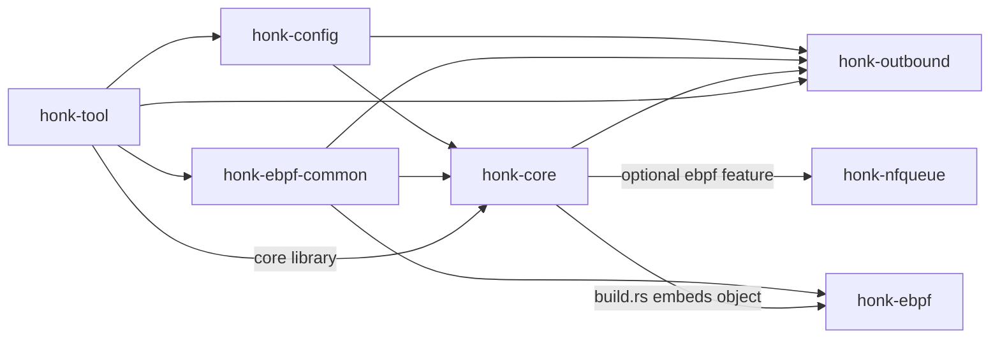
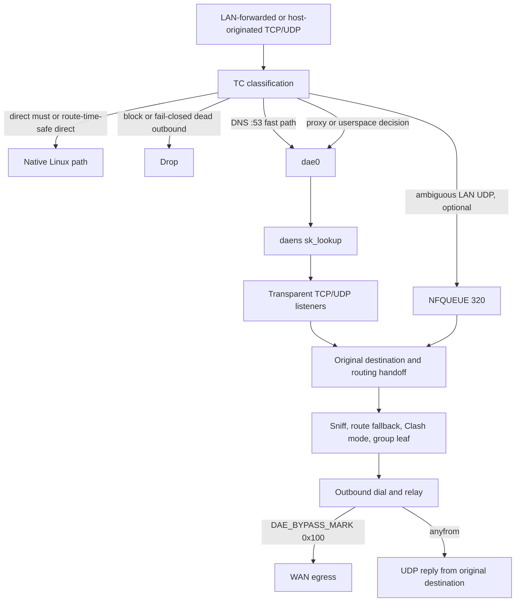

# Architecture overview

`honk` is a Linux eBPF transparent-proxy engine for gateway and host traffic; this page summarizes its architecture and load-bearing runtime rules. The project is experimental alpha `v0.0.1-alpha`, licensed `GPL-3.0-only`, and developed in `Glassyiris/honk`.

Its configuration syntax and TC datapath have dae lineage and remain dae-compatible where documented. Its outbound handlers, groups, and Clash API are shaped by sing-box designs. `honk` is an independent implementation and has diverged substantially from both.

## Goals and non-goals

### Goals

- Intercept Linux LAN-forwarded and host-originated traffic with an eBPF transparent-proxy datapath.
- Keep the native `.dae` configuration syntax as the primary and only documented configuration format.
- Provide multi-protocol outbounds, Selector/URLTest/LoadBalance/Fallback/Score groups, health checks, and a Clash-compatible control API.
- Ship an engine-only `honk-core` binary rather than a separate GraphQL service or bundled dashboard application.

### Non-goals

- Full Clash Meta/mihomo parity. In particular, honk has no FakeIP engine or remote rule-provider/rule-set parity.
- Transparent proxying on Windows or macOS; the datapath is Linux-only.

## Crate map

The root workspace contains six crates. `honk-ebpf` is a separate Cargo project because it targets `bpfel-unknown-none`; it is excluded from the workspace and keeps its own `Cargo.lock`.

| Crate | Workspace | Responsibility |
| --- | --- | --- |
| `honk-config` | member | Shared configuration model, dae-syntax parser, include handling, share-link parsing, and subscription decoding. |
| `honk-ebpf-common` | member | `no_std`, `#[repr(C)]` constants and ABI types shared by kernel programs and userspace map writers. |
| `honk-nfqueue` | member | Raw `NETLINK_NETFILTER` queue `320`, verdict ownership, and the owned nftables transaction. |
| `honk-outbound` | member | Protocol handlers, per-node runtimes, outbound groups, health state, URLTest probing, and the always-compiled Score scorer. |
| `honk-core` | member | Engine library and binary: eBPF/NFQUEUE runtime, control plane, DNS, routing, relay, and Clash API. |
| `honk-tool` | member | CLI toolbox for subscription/node probing, datapath diagnostics, pinned-map inspection, and geo-asset queries. |
| `honk-ebpf` | excluded | TC, `sk_lookup`, and cgroup eBPF programs; built separately and embedded into `honk-core` when real eBPF is enabled. |

Changes to shared map keys, values, constants, or layouts must move together across `honk-ebpf-common`, `honk-ebpf`, and the `honk-core` map writers.

## High-level data path

### Packet walk

1. The [datapath](./datapath.md) classifies LAN-forwarded traffic at LAN TC and host-originated TCP/UDP at WAN TC. `direct(must)` and route-time-safe direct decisions remain on the native Linux path; decisions that still need userspace are not offloaded.
2. The [DNS path](./dns.md) sends TCP and UDP destination port `53` through a fast path that skips the general match loop and redirects to the control plane.
3. The [datapath](./datapath.md) redirects ordinary proxy and userspace decisions through `dae0`; inside `daens`, `sk_lookup` assigns them to the [control plane's](./control-plane.md) transparent TCP or UDP listener.
4. The [NFQUEUE staging](./nfqueue.md) path is enabled by default through `global.nfqueue_enable` when startup prerequisites pass; it holds only ambiguous LAN-forwarded UDP after LAN TC and before conntrack/NAT. Each staged flow carries a unique decision token in fixed queue `320`; host-originated WAN traffic stays on the ordinary transparent path.
5. The [control plane](./control-plane.md) recovers the original destination and consumes the eBPF routing handoff. A missing handoff or `ControlPlaneRouting` outcome enters userspace routing.
6. The [routing path](./routing.md) may sniff TLS SNI, HTTP Host, or QUIC Initial SNI, then runs the userspace `Router` when the kernel result is not final.
7. The [group layer](./groups.md) applies the Clash mode override without changing final `must`/`block` results, then resolves the authoritative group policy pick to a leaf node. When explicitly selected, Score ranks only health-eligible members from per-target TCP/UDP and target-family transport-quality scores; service-specific semantic unlock is instead modeled by routing or geosite selection of a dedicated Score group.
8. The [outbound layer](./outbound.md) dials that leaf and relays TCP or datagrams. Sniffed TCP bytes are forwarded before the remaining stream.
9. Control-plane egress leaves with `DAE_BYPASS_MARK` (`0x100`) so WAN TC does not intercept it again. Proxied UDP and transparent port-53 replies use [anyfrom sockets](./control-plane.md) bound to the original destination so the [return datapath](./datapath.md) preserves the source address.

## Runtime invariants

- **Bypass-mark discipline:** dials, probes, DNS upstreams, QUIC endpoints, and transparent listeners carry `DAE_BYPASS_MARK` (`0x100`) or use loopback. Accepted TCP sockets have the listener mark cleared; ordinary host-netns `dns.bind` ingress sockets are deliberately unmarked.
- **Anyfrom UDP replies:** proxied UDP and transparent port-53 DNS replies use transparent sockets created inside `daens` and bound to the flow's original destination. Replying from the TPROXY listener exposes the `dae0` source and fails on the return path.
- **DNS source boundary:** transparent and `dns.bind` adapters derive the logical client source from the socket peer; flow-associated lookups use the admitted flow's source. Cache reuse starts only after routing materializes the selected source-neutral scope, while `DOMAIN_ROUTING_MAP` projection remains global and source-independent.
- **Network-namespace discipline:** the process remains in the host netns. It enters `daens` only through scoped, fully synchronous `with_daens_netns` calls; no `.await` may occur across `setns`, and failure to restore the original namespace aborts the process.
- **Datapath admission:** `DATAPATH_STATE_MAP[0]` stays closed until every listener FD is published and every receive loop is running, and closes before listener teardown. TC passes traffic unchanged while the gate is closed.
- **NFQUEUE readiness and ownership:** enabled-but-not-ready staging drops only new flows that require staging. honk exclusively owns queue `320` and nftables `inet honk_nfqueue` / `udp_decision`; readiness changes are fenced, lifecycle ambiguity is fatal, and same-netns firewall managers must not mutate those objects.
- **Token-checked terminal state:** a staged UDP token must agree across the skb mark, kernel state, handoff, redirect track, userspace verdict state, lease/endpoint, and backend transition. Direct follows Arm → all marked verdicts → Activate; proxy publishes final state before its one canonical dial/send path.
- **`must`/`block` finality:** Clash mode overrides never replace a `block` result or a dae `(must)` result.
- **Fail-closed dead outbounds:** `lan_ingress` drops new flows routed to a dead outbound. A TCP group with one unique leaf and no `final` keeps that same proxy as a userspace last resort; UDP and all-dead multi-leaf groups remain fail-closed. TCP and UDP port `53` are exempt, and `honk-core` injects `dip(<each LAN/WAN interface address>) -> direct(must)` at startup, reload, and interface-topology changes so local administration does not depend on proxy health.
- **Group-OR connectivity:** the eBPF alive slot for a group is the OR of all leaf-member states, plus the sole-TCP-leaf last-resort exception above. A single dead member in a multi-leaf group must not make the whole group fail closed.
<<<<<<< HEAD
- **Score isolation and reasons:** Score uses the business target family for scoring but the proxy server family for health filtering. Its authoritative pick cannot revive a dead member. Periodic exploration is scoped to `(group, TCP/UDP, target IP family or none)` and chooses the non-incumbent with the highest Beta reliability upper bound; consecutive failures back a leaf out of exploration exponentially (5 minutes doubling to a 6-hour cap, outside the decaying evidence) with successes stepping the streak down one at a time; only real-flow outcomes move the streak (probes are streak-neutral); three consecutive fresh failures also exclude a leaf from the reliability band while any healthier candidate exists; relative latency/throughput only fine-tunes the close-reliability band, and incumbent margin grows with effective completion evidence. Global, family, and exact-target fresh-failure envelopes combine by maximum rather than addition. Each authorized applied multi-candidate rank records one final reason in precedence order—`coldExplore`, `periodicExplore`, `incumbentHeld`, `freshFailureBypass`, `reliabilityWinner`, then `performanceWinner`—while `deadFiltered` counts unique dead leaves and `switchFlap` counts a committed return to the prior winner within eight selections of the same target scope. Exact target keys and aggregate priors remain in two 4,096-entry LRUs in process memory, survive successful in-process reload through shared state, reset on process restart, and are never logged or persisted. Authenticated `/stats.score` exports only group names and these aggregate TCP/UDP counters, never cells, nodes, targets, cadence, or authority; existing `/proxies`, `/stats.outbounds`, and `/connections` metadata contracts remain unchanged.
=======
- **Score isolation and reasons:** Score uses the business target family for scoring but the proxy server family for health filtering. Its authoritative pick cannot revive a dead member. Periodic exploration is scoped to `(group, TCP/UDP, target IP family or none)` and chooses the non-incumbent with the highest Beta reliability upper bound; consecutive failures back a leaf out of exploration exponentially (5 minutes doubling to a 6-hour cap, outside the decaying evidence) with successes stepping the streak down one at a time; relative latency/throughput only fine-tunes the close-reliability band, and incumbent margin grows with effective completion evidence. Global, family, and exact-target fresh-failure envelopes combine by maximum rather than addition. Each authorized applied multi-candidate rank records one final reason in precedence order—`coldExplore`, `periodicExplore`, `incumbentHeld`, `freshFailureBypass`, `reliabilityWinner`, then `performanceWinner`—while `deadFiltered` counts unique dead leaves and `switchFlap` counts a committed return to the prior winner within eight selections of the same target scope. Exact target keys and aggregate priors remain in two 4,096-entry LRUs in process memory, survive successful in-process reload through shared state, reset on process restart, and are never logged or persisted. Authenticated `/stats.score` exports only group names and these aggregate TCP/UDP counters, never cells, nodes, targets, cadence, or authority; existing `/proxies`, `/stats.outbounds`, and `/connections` metadata contracts remain unchanged.
>>>>>>> origin/main
- **Demand-driven Score feedback:** Instrumentation is always compiled but creates `ScoreFeedback`/`ScoreReporter` state only for attempts associated with Score groups; non-Score paths allocate no reporter or score cell. Reports cover setup, first response, bidirectional bytes, and one compact terminal outcome across transparent TCP/UDP, supported DNS transports, health and delay probes, preconnect/session/UDP warm-up, and direct or proxied UI downloads; work without a business target updates aggregate setup evidence only.
- **Internal and special traffic:** honk's link-internal ranges `169.254.0.0/16` and `fd00:686f:6e6b::/64` are never proxied. L2 broadcast/multicast, IPv4 broadcast/multicast/unspecified destinations, and IPv6 multicast pass through before routing or conntrack.

## Build features and mock mode

`honk-core` defaults to `clash-api`, `mimalloc`, and `rprx`; real eBPF is opt-in.

| Feature | Default | Effect |
| --- | --- | --- |
| `ebpf` | no | Pulls in `aya`, `aya-obj`, `aya-log`, and optional `honk-nfqueue`; `build.rs` embeds the `honk-ebpf` object. Requires Linux kernel 5.8+ at runtime. |
| `clash-api` | yes | Pulls in optional `axum` and `tower-http` for the Clash-compatible REST/WebSocket service. |
| `mimalloc` | yes | Pulls in `mimalloc` and `libmimalloc-sys` and installs mimalloc as the `honk-core` binary allocator. On Linux, startup disables transparent huge pages for the process before starting Tokio. |
| `rprx` | yes | Enables `honk-outbound/rprx`, which registers the VLESS and VMess handlers, including the supported VLESS Encryption and `xtls-rprx-vision` paths. |

`mock-ebpf` is not a Cargo feature. A build without `ebpf` uses `MockEbpfBackend`, and `--mock-ebpf` selects the unprivileged development path explicitly. If `global.nfqueue_enable = true` is requested, startup logs a warning and disables NFQUEUE staging for that process; the config file is unchanged.

## Authorship disclosure

- The eBPF datapath—`honk-ebpf`, `honk-ebpf-common`, and the attach/map path in `honk-core`—is the project maintainer's primary human design, implementation-review, and verification focus.
- Most remaining userspace subsystems—configuration parsers, outbound handlers, groups and health checks, userspace DNS, Clash API, and much of the control-plane glue—were largely authored with AI assistance. The maintainer performed partial code review rather than line-by-line ownership.

## Related docs

- [Configuration guide](../configuration.md)
- [Datapath design](./datapath.md)
- [Global configuration reference](../reference/global.md)
