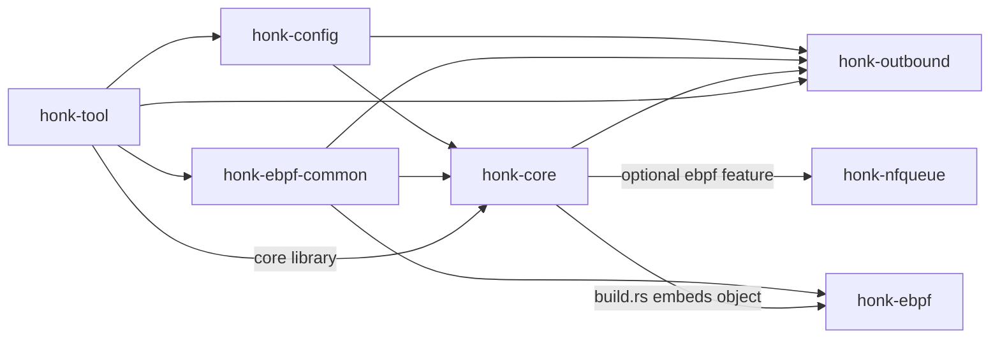
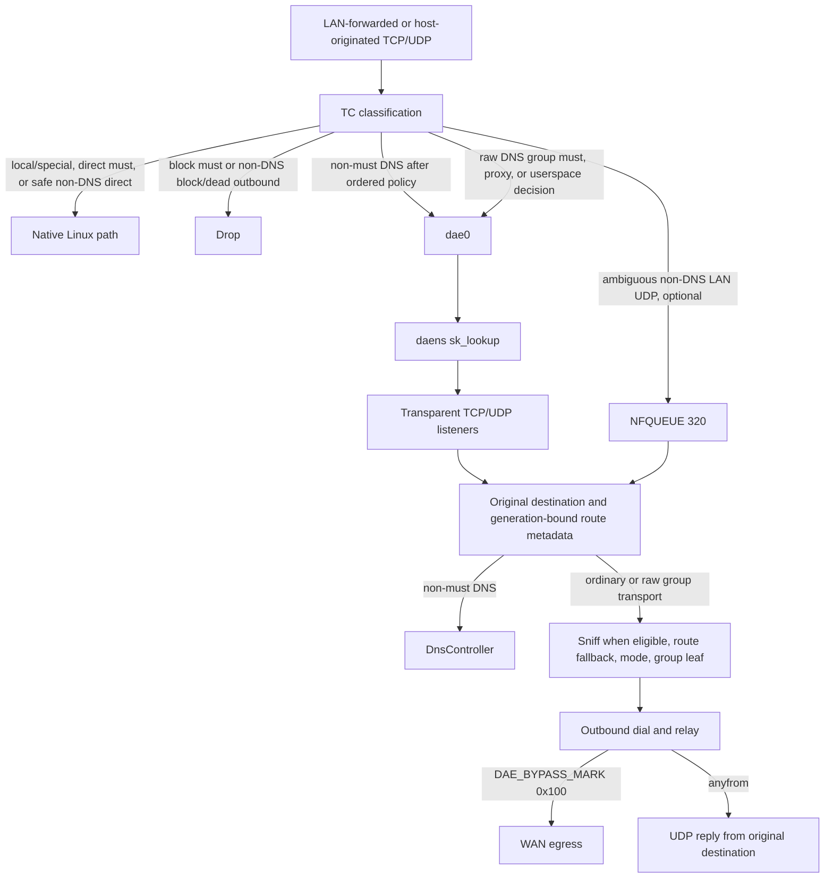

# Architecture overview

`honk` is a Linux eBPF transparent-proxy engine for gateway and host traffic; this page summarizes its architecture and load-bearing runtime rules. The project is experimental alpha `v0.0.1-alpha`, licensed `GPL-3.0-only`, and developed in `daeuniverse/honk`.

Its configuration syntax and TC datapath have dae lineage and remain dae-compatible where documented. Its outbound handlers, groups, and Clash API are shaped by sing-box designs. `honk` is an independent implementation and has diverged substantially from both.

## Goals and non-goals

### Goals

- Intercept Linux LAN-forwarded and host-originated traffic with an eBPF transparent-proxy datapath.
- Keep the native `.dae` configuration syntax as the primary and only documented configuration format.
- Provide multi-protocol outbounds, Selector/URLTest/LoadBalance/Fallback/Score groups, health checks, and a Clash-compatible control API.
- Ship an engine-only `honk-core` binary rather than a separate GraphQL service or bundled dashboard application.

### Non-goals

- Full Clash Meta/mihomo parity. In particular, honk has no FakeIP engine or remote rule-provider/rule-set parity.
- Transparent proxying on Windows or macOS; the datapath is Linux-only.

## Crate map

The root workspace contains six crates. `honk-ebpf` is a separate Cargo project because it targets `bpfel-unknown-none`; it is excluded from the workspace and keeps its own `Cargo.lock`.

| Crate | Workspace | Responsibility |
| --- | --- | --- |
| `honk-config` | member | Shared configuration model, dae-syntax parser, include handling, share-link parsing, and subscription decoding. |
| `honk-ebpf-common` | member | `no_std`, `#[repr(C)]` constants and ABI types shared by kernel programs and userspace map writers. |
| `honk-nfqueue` | member | Raw `NETLINK_NETFILTER` queue `320`, verdict ownership, and the owned nftables transaction. |
| `honk-outbound` | member | Protocol handlers, per-node runtimes, outbound groups, health state, URLTest probing, and the always-compiled Score scorer. |
| `honk-core` | member | Engine library and binary: eBPF/NFQUEUE runtime, control plane, DNS, routing, relay, and Clash API. |
| `honk-tool` | member | CLI toolbox for subscription/node probing, datapath diagnostics, pinned-map inspection, and geo-asset queries. |
| `honk-ebpf` | excluded | TC, `sk_lookup`, and cgroup eBPF programs; built separately and embedded into `honk-core` when real eBPF is enabled. |

Changes to shared map keys, values, constants, or layouts must move together across `honk-ebpf-common`, `honk-ebpf`, and the `honk-core` map writers.

Shared configuration schema/parsers. Pure-Rust deps: serde, regex, url, base64, chrono, uuid; `libc` getifaddrs enumerates interface addresses without an `ip` subprocess.

- `from_file` selects by extension. Recognized `.json`/`.yaml`/`.toml` try that format, then only TOML/YAML/JSON fallbacks—never dae. Unknown/missing extensions try file-aware dae (including `include`) → TOML → YAML → JSON. These serde loaders are undocumented compatibility; dae is primary.
- Standalone Node serde reports ignored protocol-incompatible fields once, even when later conversion fails. Diagnostics contain schema field names, not node names or values. `node::NodeSeed` returns the same warnings through a caller-owned sink without logging; `FlatNode` remains the only flat wire adapter.
- `ConfigSeed` uses the Node seed for every original array element. Structured failures retain original node, group and subscription indices in map or declaration-order sequence input, safe schema paths and decoder-provided line/column, never decoder error prose. Detailed file/JSON loaders preserve the caller's diagnostic prefix on failure; a successful format fallback removes only abandoned attempts. When every format fails, attempted diagnostics remain ordered with one terminal cause. A dae semantic failure is final unless the complete document decodes as a YAML, TOML or JSON mapping with at least one known Config root key; then the structured loaders report their own outcome. Include and unsupported-policy errors remain final.
- Parser and share-link data entrypoints retain safe diagnostics without logging. Scalar values, names, links and raw error payloads are withheld; static failure causes and migration guidance remain available, including replacing `dns.hosts_file` with `dns.use_host`. Group/filter/subscription/entry positions use original ordinals. Detailed dae diagnostics share a metadata-only source table with include-parent links and available physical line numbers. Only the outer attempt appends a terminal cause.
- `src/node/validation.rs` owns collection admission and shared checks; `src/node/vless.rs` exclusively owns canonical `VlessConfig` normalization, path selection, and combination validation. `src/node/protocol.rs` owns the other protocol configs and shared TLS/stream/QUIC options. Detailed loaders retain typed causes and original one-based node coordinates.
- `src/parser/` — `mod.rs` owns file-aware `include` and ordered root dispatch. `lexer.rs` and `cursor.rs` retain source-backed tokens, comment spans and bounded segments; `read.rs` shares scalar and expression access. Section readers live in `scalars.rs`, `entries.rs`, `groups.rs`, `dns.rs` and `routing.rs`. Includes resolve entry-relative globs inside the canonical entry directory and reject duplicates/cycles. Permissive readers skip unknown nested blocks without applying descendants; node/subscription compatibility wrappers still traverse, while outer experimental and NFQUEUE errors remain fatal.
  Readers propagate typed errors; only the outer attempt publishes a terminal diagnostic. Notice ordering is finalized per attempt with source-local prefix-maxima indexes, preserving legacy append order and the caller's prefix without repeated vector insertion.
  Segments distinguish accepted/ignored statements and compact/braced blocks; readers do not infer structure from a trailing token. Statement admission precedes compact splitting and continuation updates. Dynamic group headers remain distinct from entry values, which stop early declaration splitting once populated. Structural comment-brace notices use the live cursor scope and are emitted once before EOF checks. Filter diagnostics retain original-token error provenance; sibling node, subscription and group traversal resets semantic notice ownership.
  Body syntax separates line-local entries from multiline expressions; parenthesis shielding follows returned expression statements across same-source roots and resets at source boundaries. Indexed openers keep their existing header/subtree ownership. Subscription raw fields retain complete opening-token bytes independently of the structural header view.
- `src/share_link.rs` is the sole `Node::from_share_link` parser. `src/share_link/options.rs` maps URI packet encoding and independent mux controls into the canonical protocol model, then normalization/validation precedes identity derivation. It does not retain a second VLESS mode model.
- `src/node/wire.rs` is the sole flat serde adapter. It rejects the removed VLESS legacy field by raw presence, including `null`; the same field on non-VLESS input remains only a compatibility artifact. `VlessConfig.network`, `udp_encoding`, and `multiplex` determine identity, so a canonical cutover can change a VLESS `Node.id` without changing VMess behavior or identity.
- Canonical VLESS behavior is summarized in [Outbound design](./outbound.md#vless-wire-contracts); field-level syntax and URI values belong in the [node reference](../reference/nodes.md).
- `src/experimental.rs` — `ExperimentalConfig` { `clash_api: ClashApiConfig`, `cache_file: CacheFileConfig` }. The dae parser explicitly whitelists both current nested sections and accepts the deprecated `udp_nfqueue` section only as a migration input; it copies `enabled` to `GlobalConfig::nfqueue_enable` with a warning.
- `src/subscription.rs`, `src/types.rs` (`NodeProtocol` 11 variants (Direct/Block reserved for the built-ins), `DialMode` ip/domain/domain+/domain++, `SubscriptionType`, `DnsProtocol`, plus the shared `default_true`/`parse_duration_secs` helpers), `src/error.rs` (`ConfigError`).

## High-level data path

### Packet walk

1. The [datapath](./datapath.md) classifies LAN-forwarded traffic at LAN TC and host-originated TCP/UDP at WAN TC. Actual local-socket and special exclusions run first. `direct(must)` and route-time-safe non-DNS direct decisions remain on the native Linux path; decisions that still need userspace are not offloaded.
2. [Traffic-rule ownership](../reference/routing.md#outbound-targets-and-must) determines which port-53 queries enter the [DNS pipeline](./dns.md). Admitted transparent queries, optional host-netns `dns.bind`, and flow-associated reality/target lookups share generation-pinned DNS policy, cache/singleflight, upstream pools, and routing projection.
3. The [datapath](./datapath.md) redirects ordinary proxy and userspace decisions through `dae0`; inside `daens`, `sk_lookup` assigns them to the [control plane's](./control-plane.md) transparent TCP or UDP listener.
4. The [NFQUEUE staging](./nfqueue.md) path is enabled by default through `global.nfqueue_enable` when startup prerequisites pass ([Configuration](../configuration.md)); it holds only ambiguous LAN-forwarded UDP after LAN TC and before conntrack/NAT. Each staged flow allocates a persistent unique decision token and publishes token-bound Pending before fixed queue `320`; host-originated WAN traffic stays on canonical TPROXY. Direct/proxy/block completion follows `honk-core`'s `control/nfqueue.rs`; direct creates no userspace socket/copy/retransmission/endpoint/connection entry.
5. The [control plane](./control-plane.md) recovers the original destination (`SO_ORIGINAL_DST` / `IP6T_SO_ORIGINAL_DST` for TCP with transparent-`local_addr` fallback; `IP_RECVORIGDSTADDR` cmsg for UDP). Ordinary flows consume tuple routing handoffs and may fall back to `Router::route_with_must`; port-53 flows use the distinct [TCP handoff and UDP per-packet admission rules](./control-plane.md#transparent-ingress).
6. The [routing path](./routing.md) may sniff TCP TLS SNI / HTTP Host or decrypt UDP QUIC Initial SNI, then runs the userspace `Router` when the kernel result is not final. Sniffing skips must-rules, `dial_mode: ip`, and negative-cache hits; `dial_mode: domain` runs a DNS reality check.
7. The [group layer](./groups.md) applies the Clash mode override without changing final `must`/`block` results, then `SharedGroupManager` resolves the authoritative policy pick to a leaf. Score ranks only health-eligible members with per-target TCP/UDP evidence. TCP/UDP normally use one authoritative leaf; only cold top-level URLTest initially staggers contenders, and only its winner commits an endpoint or source transport.
8. The [outbound layer](./outbound.md) dials that leaf through `TcpOutbound` or a fallible prepared UDP commit. Ordinary packet paths bind one `PacketTransport` to the endpoint; XUDP/Mux.Cool may instead commit a core-owned source session shared by several canonical five-tuple endpoint views. Sniffed TCP bytes are forwarded first, then plain TCP uses splice and wrapped streams use copy.
9. Control-plane egress leaves with `DAE_BYPASS_MARK` (`0x100`) so WAN TC does not intercept it again. Proxied UDP and transparent port-53 replies use [anyfrom sockets](./control-plane.md) bound to the original destination so the [return datapath](./datapath.md) preserves the source address.

## Runtime invariants

- **Bypass-mark discipline:** dials, probes, DNS upstreams, QUIC endpoints, and transparent listeners carry `DAE_BYPASS_MARK` (`0x100`) or use loopback. Accepted TCP sockets have the listener mark cleared; ordinary host-netns `dns.bind` ingress sockets are deliberately unmarked.
- **Anyfrom UDP replies:** proxied UDP and transparent port-53 DNS replies use transparent sockets created inside `daens` and bound to the flow's original destination. Replying from the TPROXY listener exposes the `dae0` source and fails on the return path.
- **DNS source boundary:** transparent and `dns.bind` adapters derive the logical client source from the socket peer; flow-associated lookups use the admitted flow's source. Cache reuse starts only after routing materializes the selected source-neutral scope, while each policy generation's domain-predicate projection remains global and source-independent.
- **VLESS source boundary:** shared XUDP/Mux.Cool reuse is indexed by reused runtime, normalized client, UDP path, and actual-peer/original-destination reply projection. The full five-tuple endpoint map still owns routing, token/generation, and per-flow Score; the source session owns its one receiver and transport health.
- **Network-namespace discipline:** the process remains in the host netns. It enters `daens` only through scoped, fully synchronous `with_daens_netns` calls; no `.await` may occur across `setns`, and failure to restore the original namespace aborts the process.
- **Datapath admission:** `DATAPATH_STATE_MAP[0]` stays closed until every listener FD is published and every receive loop is running, and closes before listener teardown. TC passes traffic unchanged while the gate is closed.
- **NFQUEUE readiness and ownership:** enabled-but-not-ready staging drops only new flows that require staging. honk exclusively owns queue `320` and nftables `inet honk_nfqueue` / `udp_decision`; readiness changes are fenced, lifecycle ambiguity is fatal, and same-netns firewall managers must not mutate those objects.
- **Token-checked terminal state:** a staged UDP token must agree across the skb mark, kernel state, handoff, redirect track, userspace verdict state, lease/endpoint, and backend transition. Direct follows Arm → all marked verdicts → Activate; proxy publishes final state before its one canonical dial/send path.
- **`must`/`block` finality:** Clash mode overrides never replace a `block` result or a dae `(must)` result.
- **Fail-closed dead outbounds:** `lan_ingress` drops new flows routed to a dead outbound. A TCP group with one unique leaf and no `final` keeps that same proxy as a userspace last resort; UDP and all-dead multi-leaf groups remain fail-closed, while a group containing a `direct`/`block` builtin never goes dead: the builtins are never marked dead, so the group-OR slot stays alive. TCP and UDP port `53` are exempt from LAN health drops, not from terminal user `must` ownership. Gateway management follows [explicit local rules](../reference/routing.md#explicit-local-rules), not synthesized interface rules.
- **Group-OR connectivity:** the eBPF alive slot for a group is the OR of all leaf-member states, plus the sole-TCP-leaf last-resort exception above. A single dead member in a multi-leaf group must not make the whole group fail closed.
- **Score isolation and reasons:** Score uses the business target family for scoring but the proxy server family for health filtering. Its authoritative pick cannot revive a dead member. Periodic exploration is scoped to `(group, TCP/UDP, target IP family or none)` and chooses the non-incumbent with the highest Beta reliability upper bound; consecutive failures back a leaf out of exploration exponentially (5 minutes doubling to a 6-hour cap, outside the decaying evidence) with successes stepping the streak down one at a time; only real-flow outcomes move the streak (probes are streak-neutral); three consecutive fresh failures also exclude a leaf from the reliability band while any healthier candidate exists; relative latency/throughput only fine-tunes the close-reliability band, and incumbent margin grows with effective completion evidence. Global, family, and exact-target fresh-failure envelopes combine by maximum rather than addition. Each authorized applied multi-candidate rank records one final reason in precedence order—`coldExplore`, `periodicExplore`, `incumbentHeld`, `freshFailureBypass`, `reliabilityWinner`, then `performanceWinner`—while `deadFiltered` counts unique dead leaves, `switchFlap` counts a committed return to the prior winner within eight selections of the same target scope, `failStreakExcluded` sums the candidates dropped by the fresh-failure gate, and `exploreBackedOff` sums the candidates currently in exploration backoff. Exact target keys and aggregate priors remain in two 4,096-entry LRUs in process memory, survive successful in-process reload through shared state, reset on process restart, and are never logged or persisted. Authenticated `/stats.score` exports only group names and these aggregate TCP/UDP counters, never cells, nodes, targets, cadence, or authority; `/stats.score.cache` additionally exports each evidence LRU's cell count and cumulative evictions, and existing `/proxies`, `/stats.outbounds`, and `/connections` metadata contracts remain unchanged.
- **Demand-driven Score feedback:** Instrumentation is always compiled but creates `ScoreFeedback`/`ScoreReporter` state only for attempts associated with Score groups; non-Score paths allocate no reporter or score cell. Reports cover setup, first response, bidirectional bytes, and one compact terminal outcome across transparent TCP/UDP, supported DNS transports, health and delay probes, preconnect/session/UDP warm-up, and direct or proxied UI downloads; work without a business target updates aggregate setup evidence only.
- **Internal and special traffic:** honk's link-internal ranges `169.254.0.0/16` and `fd00:686f:6e6b::/64` are never proxied. L2 broadcast/multicast, IPv4 broadcast/multicast/unspecified destinations, and IPv6 multicast pass through before routing or conntrack.

## Build features and mock mode

`honk-core` defaults to `clash-api`, `mimalloc`, and `rprx`; real eBPF is opt-in.

| Feature | Default | Effect |
| --- | --- | --- |
| `ebpf` | no | Pulls in `aya`, `aya-obj`, `aya-log`, and optional `honk-nfqueue`; `build.rs` embeds the static `honk-ebpf` object, and userspace compiles policy extensions at runtime. Requires Linux kernel 6.12+ at runtime. |
| `clash-api` | yes | Pulls in optional `axum` and `tower-http` for the Clash-compatible REST/WebSocket service. |
| `mimalloc` | yes | Pulls in `mimalloc` and `libmimalloc-sys` and installs mimalloc as the `honk-core` binary allocator. On Linux, startup disables transparent huge pages for the process before starting Tokio. |
| `rprx` | yes | Enables `honk-outbound/rprx`, which registers the VLESS and VMess handlers, including the supported VLESS Encryption and `xtls-rprx-vision` paths. |

`mock-ebpf` is not a Cargo feature. A build without `ebpf` uses `MockEbpfBackend`, and `--mock-ebpf` selects the unprivileged development path explicitly. If `global.nfqueue_enable = true` is requested, startup logs a warning and disables NFQUEUE staging for that process; the config file is unchanged.

## Authorship disclosure

- The eBPF datapath—`honk-ebpf`, `honk-ebpf-common`, and the attach/map path in `honk-core`—is the project maintainer's primary human design, implementation-review, and verification focus.
- Most remaining userspace subsystems—configuration parsers, outbound handlers, groups and health checks, userspace DNS, Clash API, and much of the control-plane glue—were largely authored with AI assistance. The maintainer performed partial code review rather than line-by-line ownership.

## Related docs

- [Configuration guide](../configuration.md)
- [Datapath design](./datapath.md)
- [Global configuration reference](../reference/global.md)
