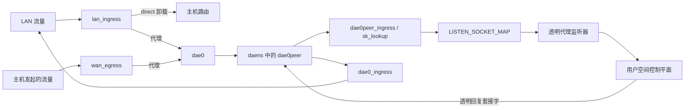

# eBPF 内核数据路径

本文涵盖内核侧拦截；用户空间路径见[控制平面](./control-plane.md)，持有首包的 UDP 路径见 [NFQUEUE](./nfqueue.md)。

## 网络命名空间与挂钩架构

普通代理路径通过隔离的网络命名空间重定向数据包，而不依赖主机侧 TPROXY 规则：

### 网络命名空间生命周期

一个临时线程调用 `unshare(CLONE_NEWNET)`，打开 `/proc/thread-self/ns/net`，再把得到的 `OwnedFd` 交给进程。该 FD 在进程生命周期内固定 `daens`。`/var/run/netns/daens` 只是尽力创建的兼容性 bind mount；引擎不依赖它持有网络命名空间。

内核支持时，rtnetlink 以 L2 netkit pair 创建 `dae0`/`dae0peer`；否则回退到 veth pair。随后通过网络命名空间 FD 移动 `dae0peer`，并配置链路、地址、邻居、策略规则与路由。当前地址为：

| 一侧 | IPv4 | IPv6 |
| --- | --- | --- |
| 主机 `dae0` | `169.254.0.1/32` | `fd00:686f:6e6b::1/64` |
| `daens` 的 `dae0peer` | `169.254.0.11/32` | `fd00:686f:6e6b::2/64` |

两个 IPv4 端点是独立的 `/32` 地址，并不共享 `/30`。链路作用域路由与静态邻居使对端可达。在 `daens` 中，fwmark `TPROXY_MARK` 选择表 `100`，其中的 IPv4 和 IPv6 local 默认路由把数据包交给本地透明套接字。

进程在其余时间都留在主机网络命名空间。`with_daens_netns` 用进程级 mutex 串行化每次切换，保存 `/proc/thread-self/ns/net`，进入 `daens`，执行完全同步的闭包，并在正常返回或 panic 的所有路径上恢复原网络命名空间。闭包绝不能跨越 `.await`，因为 `setns(2)` 作用于线程。若恢复失败，进程直接 abort，避免某个 worker 留在 `daens` 中并从那里发起后续拨号。

### 接口挂钩集合

以太网接口使用 `_l2` 程序；没有以太网头的接口使用 `_l3`。流量可能绕过 master qdisc，因此 bridge 和 bond slave 也安装等价且由进程持有的挂钩。

| 拓扑 | LAN 侧挂钩 | WAN 侧挂钩 |
| --- | --- | --- |
| 双网卡 | LAN 上的 `lan_ingress` + `lan_egress` | WAN 上的 `wan_ingress` + `wan_egress` |
| LAN/WAN 共用接口的单网卡 | `lan_ingress` | `wan_egress`；跳过 `lan_egress` 和 `wan_ingress` |
| 未配置 LAN 接口的纯 WAN | 无 | `wan_ingress` + `wan_egress` |

`lan_ingress` 对转发的客户端流量分类。`wan_egress` 独立地对主机创建的流量分类。拓扑提供独立方向时，反向 ingress/egress 挂钩刷新连接状态。

### 动态接口协调

`auto` 解析为当前默认路由接口。没有默认路由时，该项保持未挂载，而不会回退到 loopback。`IfaceWatcher` 订阅 rtnetlink 的链路、IPv4/IPv6 地址和 IPv4/IPv6 路由组；每 60 秒一次的协调 tick 作为事件交付的后备。协调过程重新解析 `auto`，通过 ifindex 识别接口重建，重新计算单网卡或双网卡角色，并安装或忘记进程持有的挂钩。

链路、地址、路由或接口角色变化时，系统还会为已配置 LAN/WAN 接口上的每个地址重新发布生成的 `direct(must)` 规则。它清除健康检查 cooldown 并触发新探测。在新探测成功前，失效 UDP 和多叶节点出站仍保持 fail-closed；未配置 `final` 的单叶节点 TCP 组仍可作为用户态最后尝试。

## 程序清单

| 程序 | 挂钩 | 内核职责 |
| --- | --- | --- |
| `lan_ingress_l2`, `lan_ingress_l3` | LAN TC ingress | 检查准入，绕过特殊/本地流量，执行端口 53 快速路径、路由、连接状态、direct 卸载、代理重定向、TX 计数，以及可选的歧义 UDP 暂存。 |
| `wan_ingress_l2`, `wan_ingress_l3` | WAN TC ingress | 刷新反向连接状态；单网卡拓扑不挂载。 |
| `lan_egress_l2`, `lan_egress_l3` | LAN TC egress | 刷新反向连接状态并抑制本机生成的 ICMPv6 Redirect 数据包；单网卡拓扑在共用接口上跳过。 |
| `wan_egress_l2`, `wan_egress_l3` | WAN TC egress | 路由主机发起的 TCP/UDP，使用进程名与控制平面 bypass 数据，检查出站连通性，缓存决策并重定向代理流量。 |
| `dae0_ingress` | 主机 `dae0` 的 TC ingress | 反查 `REDIRECT_TRACK`，恢复原始 MAC/接口交付，并统计 RX 流量。 |
| `dae0peer_ingress` | `daens` `dae0peer` 的 TC ingress | 校验重定向数据包，应用 `TPROXY_MARK`，并用 `bpf_sk_assign` 把 UDP 和新 TCP 交给监听器。 |
| `tproxy_sk_lookup` | `daens` 中的 `sk_lookup` | 用 `LISTEN_SOCKET_MAP` 中的透明监听器覆盖普通套接字查找。 |
| `tproxy_wan_cg_sock_create`, `tproxy_wan_cg_sock_release` | cgroup `sock_create`, `sock_release` | 创建/刷新或删除套接字 cookie 到 PID/`comm` 的条目。 |
| `tproxy_wan_cg_connect4`, `tproxy_wan_cg_connect6` | cgroup `connect4`, `connect6` | 刷新已连接套接字的 cookie 到进程元数据。 |
| `tproxy_wan_cg_sendmsg4`, `tproxy_wan_cg_sendmsg6` | cgroup `sendmsg4`, `sendmsg6` | 刷新数据报发送的 cookie 到进程元数据。 |

`LISTEN_SOCKET_MAP` 的 key 固定为：`0` TCP4、`1` TCP6、`2..=5` UDP4、`6..=9` UDP6。UDP 用流稳定 hash 在每个地址族的四个监听器中选择一个。`tproxy_sk_lookup` 中读取 IPv4 和 IPv6 key 的函数保持为分离的 `#[inline(never)]` 子程序。在优化级别 2 下，内联会让 LLVM 把地址族分支变为从 lookup context 进行的计算偏移读取；verifier 会以解引用已修改 context 指针为由拒绝它。

TC 入口点是接受 `*mut __sk_buff` 的原始 `#[unsafe(no_mangle)] #[unsafe(link_section = "classifier")]` 函数。它们不用 Aya 的 `#[tc]` 宏，因为该宏的结构化参数形状在 7.0 及更高版本内核上触发 verifier 拒绝。程序主体返回 `Verdict = Result<c_long, c_long>`：`Ok` 表示正常路径，`Err` 表示提前退出，但两者都携带真实的 `TC_ACT_*` 值，`flatten` 把任一变体归约为内核的 `i32` verdict。内部 sentinel 值不是 TC verdict。

## Map 清单

| Map | 形状与职责 |
| --- | --- |
| `CONN_STATE_MAP` | 不预分配的普通 hash，最多 524,288 项。保存每流 TCP/UDP 状态和已发布路由元数据；用户空间负责压力驱逐。 |
| `REDIRECT_TRACK` | 不预分配的 65,536 项 hash。把有方向的五元组映射到原始 MAC/接口、出站、时间戳和决策身份，用于恢复回复路径。 |
| `ROUTING_HANDOFF_MAP` | 不预分配的 65,536 项 hash。向用户空间传递以 tuple 为 key 的路由元数据。 |
| `ROUTING_MAP` | 256 项数组：两个各含 128 个 `MatchSet` 规则的 bank。用户空间在切换 generation 前填满 inactive bank。 |
| `ROUTING_META_MAP` | 35 项数组，包含 active generation selector，以及每个 generation 的规则数和四个流量组 bitmap。selector 是提交点。 |
| `ROUTING_GROUP_META_MAP` | 八个紧凑条目：两个 generation × TCP4/TCP6/UDP4/UDP6；每项包含规则数和 128-bit bitmap。 |
| `DEST_LPM_ROUTING_MAP`, `SOURCE_LPM_ROUTING_MAP`, `MAC_LPM_ROUTING_MAP` | LPM trie，每个上限 65,536 项，分别匹配目的 CIDR、源 CIDR 和 MAC 前缀。 |
| `DOMAIN_ROUTING_MAP` | 不预分配的 65,536 项 IP 到域名规则 bitmap hash，由 DNS 结果填充。 |
| `OUTBOUND_CONNECTIVITY_MAP` | 1,536 项数组。每个出站有六个存活槽，覆盖 TCP/UDP 类别与 IPv4/IPv6；缺失槽按存活处理。 |
| `OUTBOUND_STATS` | 直接以出站编号为索引的 256 项 per-CPU 数组。每个 32-byte 值紧凑保存 `tx_packets`、`tx_bytes`、`rx_packets`、`rx_bytes`；当前 ABI 不使用 `outbound * 4 + counter` 索引。 |
| `LISTEN_SOCKET_MAP` | 16 槽 `SockMap`；key `0..=9` 保存两个 TCP 和八个 UDP 透明监听器。 |
| `DATAPATH_STATE_MAP` | 单槽准入数组。零值不改动地放行流量；非零值启用分类与重定向。 |
| `DATAPATH_FLAGS_MAP` | 单槽运行时策略字：Rule/Direct 卸载属性、`global.nfqueue_enable` 及 NFQUEUE ready 栅栏。新流分类读取它；已建立流的 direct 卸载使用缓存元数据。 |
| `COOKIE_PID_MAP` | 不预分配的 65,536 项套接字 cookie 到 PID/可执行文件 basename 的 hash，用于 `pname` 路由和识别控制平面；verifier 允许时内核通过 BTF 偏移读取 argv[0]，否则由 cgroup hook 同步记录线程 `comm`。 |
| `CONN_STATE_OCCUPANCY` | 两槽 per-CPU 累计插入/eBPF 删除计数；结合用户空间删除计数估算占用率。 |
| `BPF_STATS_MAP` | 五个计数器：UDP/TCP conn-state overflow，以及 redirect、handoff 和 cookie map 插入失败。 |
| `EVENT_RINGBUF` | 262,144-byte ring buffer，承载固定布局的 blocked、conntrack overflow 和 UDP token exhausted 事件。 |
| `UDP_DECISION_SEQUENCE` | NFQUEUE 决策身份的单槽 pinned allocator 状态；协议细节见 [NFQUEUE](./nfqueue.md)。 |
| `UDP_DECISION_EPOCH` | NFQUEUE 决策工作的单槽 grace-period selector；见 [NFQUEUE](./nfqueue.md)。 |
| `UDP_DECISION_INFLIGHT` | NFQUEUE 决策工作的两槽 per-CPU reader 计数；见 [NFQUEUE](./nfqueue.md)。 |
| `UDP_DECISION_RETIRE_FENCE` | NFQUEUE retirement 使用的 65,536 项 tuple fence map；见 [NFQUEUE](./nfqueue.md)。 |

内核/用户空间共用的 map key 和 value 是 `#[repr(C)]` ABI。共享流结构中的 IPv4 地址都以网络字节序的 IPv4-mapped IPv6 值保存。

## Mark 及其所有权

| 常量 | 值 | 含义 |
| --- | --- | --- |
| `TPROXY_MARK` | `0x08000000` | 选择 `daens` 表 100 的 local-delivery 路由，并标记要交给监听器的重定向数据包。`global.tproxy_mark` 必须等于这个编译期值。 |
| `DAE_BYPASS_MARK` | `0x00000100` | 标记 honk 自身的拨号、探测、DNS 上游、QUIC 套接字和透明监听器，使 WAN egress 不拦截它们。 |
| `CLASSIFIED_MARK` | `0x40000000` | 防止同时挂在 bridge master 和 slave 上的数据包被重复分类；也标记最终 direct verdict。 |
| `NFQUEUE_PENDING_MARK` | `0x80000000` | 标识必须在 conntrack/NAT 前持有的流量；有效的暂存 mark 还携带 `CLASSIFIED_MARK` 和非零 token。 |
| `NFQUEUE_TOKEN_MASK` | `0x3fffffff` | 选取 NFQUEUE 暂存数据包中承载决策 token 的 skb mark 低 30 bit。 |

`SKB_MARK_RESERVED_MASK` 为 `0xc0000000`，即 `CLASSIFIED_MARK` 与 `NFQUEUE_PENDING_MARK` 的并集。配置校验拒绝与这些 bit 重叠的 `global.so_mark_from_dae` 和路由规则 mark。NFQUEUE direct 完成路径在接受规则 mark 前重复相同检查。

本地套接字探测必须区分 honk 自身的透明监听器和普通本地服务。`bpf_sock_is_dae_socket` 把完整套接字 mark 与 `PARAM.dae_socket_mark` 比较，后者由用户空间设为 `DAE_BYPASS_MARK`。相等表示“honk 监听器”，探测继续透明路径；普通未标记监听器可以取得该目的地址。主机网络命名空间中的 `dns.bind` 套接字有意保持为普通未标记监听器。

## 数据包行为与不变量

### DNS 与本地监听器优先级

LAN TCP 和 UDP 的目的端口为 `53` 时跳过路由循环，直接进入控制平面。LAN 出站健康检查导致的丢包也豁免端口 `53`，让用户空间 DNS 自行执行 fallback。

本地套接字探测先于该快速路径运行，并按传输协议分别判断。绑定到具体地址的 UDP 套接字，或处于 `LISTEN` 状态的 TCP 套接字，对其传输协议优先。wildcard 匹配仅在完整 FIB 查找返回 `NOT_FWDED` 时优先；单独的套接字查找也会匹配转发目的地址。监听器 mark 检查把 honk 自身的透明监听器排除在该优先规则之外。因此，本地 `dns.bind` 监听器可拥有主机本地 `:53`，而远端解析器流量仍走透明 DNS。

### 特殊与内部流量

在 LAN ingress/egress 和 WAN egress 上，`dst_is_special` 遇到以下目的地址时，会在路由和 conntrack 前放行流量：

- L2 目的 MAC 的 individual/group bit 已设置，覆盖 broadcast 和 multicast；
- IPv4 `255.255.255.255`、`224.0.0.0/4` 或 `0.0.0.0`；
- IPv6 `ff00::/8`。

这使 DHCP、mDNS、SSDP、LLMNR 等链路流量不进入代理。内部链路地址空间为 `169.254.0.0/16` 和 `fd00:686f:6e6b::/64`。当任一端点位于这些范围时，控制平面 UDP 准入拒绝初始化代理；引擎自身的交付路径由 `dae0`/`dae0peer` 挂钩处理。

### 出站存活状态

用户空间把 group-OR 健康状态发布到 `OUTBOUND_CONNECTIVITY_MAP`。若新 LAN 流被路由到显式标为失效的槽，内核以 `TC_ACT_SHOT` 丢弃；这是有意的 fail-closed 行为。唯一的窄例外是：未配置 `final` 且只有一个唯一叶节点的 TCP 组保持槽开放，使真实流量可经同一代理尝试并证明恢复，而不会隐式回退到 `direct`。UDP 和全部叶节点失活的多叶节点组仍保持 fail-closed；但含有 `direct`/`block` 内建成员的组永不失活：内建节点永远不会被判定死亡，因此 group-OR 槽保持开放。LAN ingress 上的 TCP 和 UDP 目的端口 `53` 均获豁免。为当前每个网关接口地址生成的 must-direct 规则通过同一路由发布路径下发，即使代理出站失效也能保持本地管理可达。

### 路由时 direct 卸载

是否让非 `must` 流留在内核 direct 路由，只在路由时决定一次，并缓存到 `RoutingMeta` bit 57。已建立流检查该缓存 bit，而不再读取 `DATAPATH_FLAGS_MAP`。

| 有效模式 | 路由时策略 |
| --- | --- |
| `Rule`（也包括没有 Clash 模式覆盖） | 仅当 SNI 不可能改变结果时，才卸载非 `must` 的 `direct` 结果：不存在域名类重新求值，或 DNS 学习已提供该流的域名 bitmap。否则用户空间在 sniff 后重新路由。 |
| `Direct` | 每个非 final、非 `block` 流都归一化为 `direct` 并卸载，因为用户空间最终也会选择 direct。 |
| `Global` | 全局选择恰为 `direct` 时使用相同的全 direct 策略。其他全局选择让非 final 流留在用户空间，以应用所选出站。 |

`direct(must)` 始终保持 direct，不需要 bit 57 标志。`block` 保持 final。完整规则求值与模式语义见[路由设计](./routing.md)。

### 主机发起的 WAN UDP

`wan_egress` 只分类本机生成的流量；转发数据包具有真实 ingress ifindex，因此原样放行。带有 honk 自有 mark 的套接字以及匹配控制平面 cookie/PID 元数据的流量也会 bypass。对于具有已发布连接状态的存活非 DNS UDP 流，程序使用只查询的缓存路由路径。miss 时只运行一次路由，并发布完整状态，后续数据包再使用缓存。DNS 保持短生命周期，不创建该 UDP 缓存项。

## 准入顺序

挂钩安装期间，`DATAPATH_STATE_MAP[0]` 保持为零。此状态下 TC 程序原样放行流量。控制平面绑定监听器，原子发布完整 TCP/UDP FD 集合，启动接收循环，建立所有已启用的 NFQUEUE readiness，之后才写入非零准入值。因此，不完整的监听器 generation 无法把流量重定向到不存在的套接字。

关闭时，系统先在适用时阻止新的 NFQUEUE 暂存，在拆除监听器前关闭 `DATAPATH_STATE_MAP[0]`，然后 drain 并 detach producer。准入 map 操作失败是 fatal，而不会在所有权不明确的状态下静默继续。

## 用户空间维护与计数

`BpfJanitor` 每两秒唤醒一次。已接受 TCP relay 在其生命周期内 pin 对应的 `CONN_STATE_MAP` 和 `REDIRECT_TRACK` 项。未 pin 的 TCP closing 状态在 10 秒后过期；未 pin 的 active TCP 和 UDP 状态使用 120 秒 backstop。

Conn-state sweep 通常每 60 秒运行。占用率达到 70% 时，间隔降为 15 秒；达到 85% 时进入 pressure mode，每个两秒 tick 都执行 sweep。内核 overflow 计数增长也会启动 pressure mode，作为 fail-closed 的最后保障。`CONN_STATE_OCCUPANCY` 合并 per-CPU 内核插入/删除、用户空间删除计数，以及 sweep 时的精确重新校准。有界 auxiliary map 扫描在最近一次扫描未完成或覆盖至少 85% 的 65,536 项容量时，使用 8 秒的激进清理周期。

每个出站的流量计数器均为 per-CPU。路由结果产生时，`lan_ingress` 对重定向和 direct 卸载结果都统计 TX 数据包与字节。`dae0_ingress` 在 `REDIRECT_TRACK` 识别返回流量所属出站后统计 RX 数据包与字节。未分类的直通流量与丢包没有出站计数。

## 相关文档

- [路由设计](./routing.md)
- [NFQUEUE 持包路径](./nfqueue.md)
- [控制平面](./control-plane.md)
