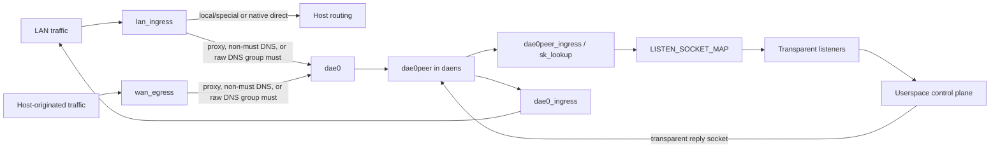

# eBPF 内核数据路径

内核侧拦截见本页；用户态路径见[控制平面](./control-plane.md)，持有首包的 UDP 路径见 [NFQUEUE](./nfqueue.md)。

## 网络命名空间与挂钩架构

普通代理路径通过隔离的网络命名空间重定向数据包，而不依赖主机侧 TPROXY 规则：

```mermaid
flowchart LR
  LAN[LAN traffic] --> LI[lan_ingress]
  LOCAL[Host-originated traffic] --> WE[wan_egress]
  LI -->|local/special or native direct| HOST[Host routing]
  LI -->|proxy, non-must DNS, or raw DNS group must| DAE0[dae0]
  WE -->|proxy, non-must DNS, or raw DNS group must| DAE0
  DAE0 --> PEER[dae0peer in daens]
  PEER --> ASSIGN[dae0peer_ingress / sk_lookup]
  ASSIGN --> SOCK[LISTEN_SOCKET_MAP]
  SOCK --> TPROXY[Transparent listeners]
  TPROXY --> USER[Userspace control plane]
  USER -->|transparent reply socket| PEER
  PEER --> DI[dae0_ingress]
  DI --> LAN
```

### 网络命名空间生命周期

一个临时线程调用 `unshare(CLONE_NEWNET)`，打开 `/proc/thread-self/ns/net`，再把得到的 `OwnedFd` 交给进程。该 FD 在进程生命周期内固定 `daens`。`/var/run/netns/daens` 只是尽力创建的兼容性 bind mount；引擎不依赖它持有网络命名空间。

内核支持时，rtnetlink 以 L2 netkit pair 创建 `dae0`/`dae0peer`；否则回退到 veth pair。随后通过网络命名空间 FD 移动 `dae0peer`，并配置链路、地址、邻居、策略规则与路由。当前地址为：

| 一侧 | IPv4 | IPv6 |
| --- | --- | --- |
| 主机 `dae0` | `169.254.0.1/32` | `fd00:686f:6e6b::1/64` |
| `daens` 的 `dae0peer` | `169.254.0.11/32` | `fd00:686f:6e6b::2/64` |

两个 IPv4 端点是独立的 `/32` 地址，并不共享 `/30`。链路作用域路由与静态邻居使对端可达。在 `daens` 中，fwmark `TPROXY_MARK` 选择表 `100`，其中的 IPv4 和 IPv6 local 默认路由把数据包交给本地透明套接字。

进程在其余时间都留在主机网络命名空间。`with_daens_netns` 用进程级 mutex 串行化每次切换，保存 `/proc/thread-self/ns/net`，进入 `daens`，执行完全同步的闭包，并在正常返回或 panic 的所有路径上恢复原网络命名空间。闭包绝不能跨越 `.await`，因为 `setns(2)` 作用于线程。若恢复失败，进程直接 abort，避免某个 worker 留在 `daens` 中并从那里发起后续拨号。

### 接口挂钩集合

以太网接口使用 `_l2` 程序；没有以太网头的接口使用 `_l3`。流量可能绕过 master qdisc，因此 bridge 和 bond slave 也安装等价且由进程持有的挂钩。

| 拓扑 | LAN 侧挂钩 | WAN 侧挂钩 |
| --- | --- | --- |
| 双网卡 | LAN 上的 `lan_ingress` + `lan_egress` | WAN 上的 `wan_ingress` + `wan_egress` |
| LAN/WAN 共用接口的单网卡 | `lan_ingress` | `wan_egress`；跳过 `lan_egress` 和 `wan_ingress` |
| 未配置 LAN 接口的纯 WAN | 无 | `wan_ingress` + `wan_egress` |

`lan_ingress` 对转发的客户端流量分类。`wan_egress` 独立地对主机创建的流量分类。拓扑提供独立方向时，反向 ingress/egress 挂钩刷新连接状态。

### 动态接口协调

`auto` 解析为当前默认路由接口。没有默认路由时，该项保持未挂载，而不会回退到 loopback。`IfaceWatcher` 订阅 rtnetlink 的链路、IPv4/IPv6 地址和 IPv4/IPv6 路由组；每 60 秒一次的协调 tick 作为事件交付的后备。协调过程重新解析 `auto`，通过 ifindex 识别接口重建，重新计算单网卡或双网卡角色，并安装或忘记进程持有的挂钩。

链路、地址、路由或接口角色变化时，接口地址仍用于拓扑检测与 ECS 刷新，不再发布生成的 `direct(must)` 规则，也没有隐藏的内核地址白名单。系统仍清除健康检查 cooldown 并触发新探测。在新探测成功前，失效 UDP 和多叶节点出站仍保持 fail-closed；未配置 `final` 的单叶节点 TCP 组仍可作为用户态最后尝试。

## 程序清单

| 程序 | 挂钩 | 内核职责 |
| --- | --- | --- |
| `lan_ingress_l2`, `lan_ingress_l3` | LAN TC ingress | 检查准入，绕过特殊/控制平面及非 DNS 本地流量，执行包含端口 53 的有序路由策略、DNS 接管判断、连接状态、direct 卸载、代理重定向、TX 计数，以及可选的歧义 UDP 暂存。 |
| `wan_ingress_l2`, `wan_ingress_l3` | WAN TC ingress | 刷新反向连接状态；单网卡拓扑不挂载。 |
| `lan_egress_l2`, `lan_egress_l3` | LAN TC egress | 刷新反向连接状态，但来自 `dae0` 的 UDP 包只刷新已有条目、不创建新条目；并抑制本机生成的 ICMPv6 Redirect 数据包；单网卡拓扑在共用接口上跳过。 |
| `wan_egress_l2`, `wan_egress_l3` | WAN TC egress | 路由主机发起的 TCP/UDP，使用进程名与控制平面 bypass 数据，检查出站连通性，缓存决策并重定向代理流量。 |
| `dae0_ingress` | 主机 `dae0` 的 TC ingress | 反查 `REDIRECT_TRACK`，恢复原始 MAC/接口交付，并统计 RX 流量。没有精确记录的 UDP 回复改用客户端的 `CLIENT_REPLY_TRACK` 帧信息，且不计入 RX。 |
| `dae0peer_ingress` | `daens` `dae0peer` 的必需 TC ingress | 校验重定向数据包，恢复跨链路保存的逐报文 UDP53 路由/代际 mark，对普通重定向应用 `TPROXY_MARK`，并用 `bpf_sk_assign` 把 UDP 和新 TCP 交给监听器。 |
| `tproxy_sk_lookup` | `daens` 中的 `sk_lookup` | 用 `LISTEN_SOCKET_MAP` 中的透明监听器覆盖普通套接字查找。 |
| `tproxy_wan_cg_sock_create`, `tproxy_wan_cg_sock_release` | cgroup `sock_create`, `sock_release` | 创建/刷新或删除套接字 cookie 到 PID/`comm` 的条目。 |
| `tproxy_wan_cg_connect4`, `tproxy_wan_cg_connect6` | cgroup `connect4`, `connect6` | 刷新已连接套接字的 cookie 到进程元数据。 |
| `tproxy_wan_cg_sendmsg4`, `tproxy_wan_cg_sendmsg6` | cgroup `sendmsg4`, `sendmsg6` | 刷新数据报发送的 cookie 到进程元数据。 |

`LISTEN_SOCKET_MAP` 的 key 固定为：`0` TCP4、`1` TCP6、`2..=5` UDP4、`6..=9` UDP6。UDP 用流稳定 hash 在每个地址族的四个监听器中选择一个。`tproxy_sk_lookup` 中读取 IPv4 和 IPv6 key 的函数保持为分离的 `#[inline(never)]` 子程序。在优化级别 2 下，内联会让 LLVM 把地址族分支变为按计算偏移读取 lookup context；verifier 会以解引用已修改 context 指针为由拒绝它。

TC 入口点是接受 `*mut __sk_buff` 的原始 `#[unsafe(no_mangle)] #[unsafe(link_section = "classifier")]` 函数。它们不用 Aya 的 `#[tc]` 宏，因为该宏的结构化参数形状在 7.0 及更高版本内核上触发 verifier 拒绝。程序主体返回 `Verdict = Result<c_long, c_long>`（`action::Verdict`）：`Ok` 表示正常路径，`Err` 表示提前退出，但两者都携带真实的 `TC_ACT_*` 值，`flatten` 把任一变体归约为内核的 `i32` verdict。`flatten` 由 `action::flatten` 定义，`src/action.rs` 持有 `TC_ACT_*`。解析器与辅助函数的哨兵值（如 `transport::ERR_FALLBACK`、`ERR_FRAGMENT`、`PASS_UNSUPPORTED`）与 verdict 分离；`bpf_loop` 回调用于控制是否继续执行的返回值也独立。

`src/sk.rs` 中，`sk_assign_by_index` 是 TC 侧对应 aya `SockMap::redirect_sk_lookup` 的 helper，后者只接受 `SkLookupContext`；`probe_udp_socket` 查询非 DNS 本地 UDP socket。全部辅助函数都会释放隐式查找引用。程序分工：

- `lan_ingress_l2/l3` — LAN 分类、路由和重定向，以及有序策略下的 DNS 所有权、`CLASSIFIED_MARK` 去重；NFQUEUE 已启用且 ready 时，仅将有歧义的非 DNS UDP 决策以唯一 token 暂存为 Pending；已启用但未 ready 时 fail-closed（`src/ingress.rs`）。
- `wan_ingress_l2/l3` — 反向 conntrack 刷新，单网卡时跳过。
- `lan_egress_l2/l3`、`wan_egress_l2/l3`（`src/egress.rs`）— 反向 conn state；本机流量路由（经 `COOKIE_PID_MAP` 匹配 pname、控制面旁路、`OUTBOUND_CONNECTIVITY_MAP` 活性及重定向控制面）。存活的非 DNS WAN UDP 条目只查询缓存路由；未命中时求值一次路由，再发布完整 conntrack 元数据。
- `dae0_ingress` — 回复路径：按 `RedirectEntry.outbound` 统计 RX 流量、重写 MAC 并重定向到原 LAN 接口。客户端从未联系过的对端发来的 UDP 回复使用仅含客户端的记录，不归属任何出站；来自 honk 自身链路地址的回复永不使用。
- LAN egress 仅抑制本机发起的 ICMPv6 Redirect，使用扩展头遍历后的 ICMPv6 header；转发的 Redirect 与其他 ICMPv6 仍放行。`honk-core/tests/ebpf_datapath_test.rs` 通过 `BPF_PROG_TEST_RUN` 检查 L2、通过隔离 TUN 接口检查 L3，并覆盖精确 tuple RX 计数与 cached-route 策略。
- `dae0peer_ingress` — 必须恢复 UDP53 路由/代际 provenance，并在 `daens` 中经 `LISTEN_SOCKET_MAP` 用 `bpf_sk_assign` 交付 TPROXY listener。
- `tproxy_sk_lookup`（`src/sk_lookup.rs`）— 透明 listener：key 0/1 为 TCP4/TCP6，2..5 为 UDP4，6..9 为 UDP6。v4/v6 UDP listener-key 读取保留在 `#[inline(never)]` 子程序中。opt-level=2 时，LLVM 会把地址族分支转成通过计算 ctx offset 的 load，导致 verifier 报告 "dereference of modified ctx ptr"；新的分支选择 ctx 读取须保留此形态。
- cgroup sock_create/sock_release/connect4/6/sendmsg4/6（`src/cgroup.rs`）— cookie → `PIDName{pid, pname}`，供进程名规则及控制面旁路使用；`pname` 通过运行时 kernel-BTF offset 读取 `argv[0]` 可执行文件 basename，限制为 15 字节，不可用或读取失败时回退到线程 `comm`。

## Map 清单

`crates/honk-ebpf/src/maps.rs` 声明以下 map：

| Map | 形状与职责 |
| --- | --- |
| `CONN_STATE_MAP` | 不预分配的普通 hash，最多 524,288 项。保存每流 TCP/UDP 状态和已发布路由元数据；用户空间负责压力驱逐。 |
| `REDIRECT_TRACK` | 不预分配的 65,536 项 hash。把有方向的五元组映射到原始 MAC/接口、出站、时间戳和决策身份，用于恢复回复路径。 |
| `CLIENT_REPLY_TRACK` | 16,384 项 LRU hash。把非 DNS UDP 客户端地址和端口（目的字段清零）映射到与 `REDIRECT_TRACK` 相同的帧信息记录（token 已清除），使未联系过的对端的回复无需经过主机转发即可到达客户端。内核 LRU 淘汰是近似的：接近容量时（CPU 越多越明显），近期未发包的客户端可能在表满之前就被淘汰。该客户端的这类回复随后退回主机转发；不会造成错误路由，也没有用户空间清扫。 |
| `ROUTING_HANDOFF_MAP` | 不预分配的 65,536 项 hash；TCP SYN handoff 包含已提交策略代际，暂存 UDP 携带 decision token。原始 must UDP/53 不发布 tuple handoff，所有权使用逐报文 mark；非 must UDP/53 保留供畸形 payload 回退使用的事实。 |
| `ROUTING_POLICY_ROOT` | 单项 map-in-map，选择不可变 policy descriptor 和两个同步生成函数槽之一。root 成功替换返回后，旧 non-sleepable 读者已完成 grace。 |
| 按代持有的 IP/MAC 索引 | 分离的目的/源 IPv4、IPv6 LPM maps 及 MAC LPM。value 是完整的本代谓词 bitmap，更具体前缀继承祖先位。 |
| 按代持有的 domain map | 不预分配的 IP 到域名谓词 bitmap hash。DNS/sniff 事实覆盖正负条件；存在的零 bitmap 表示 known-false。descriptor 提供其 map ID 供诊断读取。 |
| `OUTBOUND_CONNECTIVITY_MAP` | 1,536 项数组。每个出站有六个存活槽，覆盖 TCP/UDP 类别与 IPv4/IPv6；缺失槽按存活处理。 |
| `OUTBOUND_STATS` | 直接以 `u8` 出站编号为索引的 256 项（`MAX_OUTBOUNDS`）per-CPU 数组。每个 32-byte `OutboundStatsCounters` 值紧凑保存 `tx_packets`、`tx_bytes`、`rx_packets`、`rx_bytes`；当前 ABI 不使用 `outbound * 4 + counter` 索引。 |
| `LISTEN_SOCKET_MAP` | 16 槽 `SockMap`；key `0..=9` 保存两个 TCP 和八个 UDP 透明监听器。 |
| `DATAPATH_STATE_MAP` | 单槽准入数组。零值不改动地放行流量；非零值启用分类与重定向。 |
| `DATAPATH_FLAGS_MAP` | 单槽运行时策略字：Rule/Direct 卸载属性、`global.nfqueue_enable` 及 NFQUEUE ready 栅栏。新流分类读取它；已建立流的 direct 卸载使用缓存元数据。 |
| `COOKIE_PID_MAP` | 不预分配的 65,536 项套接字 cookie 到 PID/可执行文件 basename 的 hash，用于 `pname` 路由和识别控制平面；verifier 允许时内核通过 BTF 偏移读取 argv[0]，否则由 cgroup hook 同步记录线程 `comm`。 |
| `CONN_STATE_OCCUPANCY` | 两槽 per-CPU 累计插入/eBPF 删除计数；结合用户空间删除计数估算占用率。 |
| `BPF_STATS_MAP` | 五个计数器：UDP/TCP conn-state overflow，以及 redirect、handoff 和 cookie map 插入失败。 |
| `EVENT_RINGBUF` | 262,144-byte ring buffer，承载固定布局的 blocked、conntrack overflow 和 UDP token exhausted 事件。 |
| `UDP_DECISION_SEQUENCE` | NFQUEUE 决策身份的单槽 pinned allocator 状态；协议细节见 [NFQUEUE](./nfqueue.md)。 |
| `UDP_DECISION_EPOCH` | NFQUEUE 决策与 WAN UDP 所有权共用的单槽 grace-period selector；见 [NFQUEUE](./nfqueue.md)。 |
| `UDP_DECISION_INFLIGHT` | 上述决策路径共用的两槽 per-CPU reader 计数；见 [NFQUEUE](./nfqueue.md)。 |
| `UDP_DECISION_RETIRE_FENCE` | NFQUEUE 与 WAN 用户态 UDP retirement 共用的 65,536 项 tuple fence map；见 [NFQUEUE](./nfqueue.md)。 |

内核/用户空间共用的 map key 和 value 是 `#[repr(C)]` ABI。共享流结构中的 IPv4 地址都以网络字节序的 IPv4-mapped IPv6 值保存。

TCP SYN handoff 尾部增加 `routing_generation: u64`：`RoutingHandoffEntry` 为 56 字节，`result` 仍在偏移 8，UDP `decision_token` 仍在偏移 44。生成路由函数的 `RoutingInput` ABI、`ConnState` 和 `UDP_DECISION_SEQUENCE` 不变。旧显式 BPF 对象或不兼容的 handoff map 布局会在原始读取前被拒绝；`honk-tool` 也检查布局，请使用匹配版本的 core、工具和对象。

`RoutingMeta` 的 bit 58 显式标记 WAN UDP 用户态所有权，不改变其布局。带 mark 的 WAN direct 决策即使含 `must` 也需要用户态 socket；该 bit 使退役逻辑能将其与原生 LAN direct/must 及 offloaded state 区分。无 mark 的原生 WAN UDP direct 决策则设置 bit 57（`OFFLOAD`），在不改变转发行为的前提下防止旧 endpoint callback 删除它。WAN UDP 的缓存读取和 conn/handoff/redirect 写入都参与共用的 reader epoch，并在访问 tuple 状态前拒绝已安装 fence 的 tuple。

`crates/honk-ebpf-common/src/lib.rs` — 共享 mark、NFQUEUE token 编码、`OutboundIndex`、`RoutingMeta`、`DaeParam`、`OutboundStatsCounters` 与 map 常量。
`crates/honk-ebpf-common/src/routing_policy.rs` — 固定 `RoutingInput`/`RoutingDecision`/`RoutingPolicyDescriptor` ABI（128/24/24 字节）、feature bit 与进程名归一化限制。`RoutingDecision` 含直连 mark 索引（未指定时为 `u32::MAX`）；loader 检查 slot 的 BTF 输出布局并拒绝旧外部对象。
`crates/honk-ebpf-common/src/redirect_need.rs` — `TuplesKey`、`Tuples`、携带 token 的 `RoutingResult`/`RoutingHandoffEntry`、256 位 `DomainRouting` 与 `PIDName`。
`crates/honk-ebpf-common/src/conn.rs` — `ConnState`（含 `UdpDecisionState` 与 `decision_token`）、`ConntrackArgs`、`ParseTransportCtx`、`BpfStatsKey` 与 `TcpState`。
`crates/honk-ebpf/src/maps.rs` — 静态 TC map 声明与内核侧容量。
`crates/honk-ebpf/src/route.rs` — 静态 root/slot facade 与固定 ABI dispatch；生成的 policy code 由用户态加载。
`crates/honk-ebpf-common/src/event.rs` — 固定布局的 ring event，包括 conntrack overflow 与 UDP decision-token exhaustion。
`crates/honk-ebpf-common/src/dae_ip.rs` — `In6Addr` union 与 v4-mapped helper。
`crates/honk-core/src/routing/ir.rs` — 规范 `CompiledPredicate` 与用户态 `PortRange`；`crates/honk-core/src/control/routing_matcher.rs` 将其转换为生成函数 ABI。

## Mark 及其所有权

| 常量 | 值 | 含义 |
| --- | --- | --- |
| `TPROXY_MARK` | `0x08000000` | 选择 `daens` 表 100 的 local-delivery 路由，并标记要交给监听器的重定向数据包。`global.tproxy_mark` 必须等于这个编译期值。 |
| `DAE_BYPASS_MARK` | `0x00000100` | `global.so_mark_from_dae` 为零时的默认值；非零时 honk 套接字和监听器识别使用配置值精确匹配。 |
| `CLASSIFIED_MARK` | `0x40000000` | 防止同时挂在 bridge master 和 slave 上的数据包被重复分类；也标记最终 direct verdict。 |
| `NFQUEUE_PENDING_MARK` | `0x80000000` | 标识必须在 conntrack/NAT 前持有的流量；有效的暂存 mark 还携带 `CLASSIFIED_MARK` 和非零 token。 |
| `NFQUEUE_TOKEN_MASK` | `0x3fffffff` | 选取 NFQUEUE 暂存数据包中承载决策 token 的 skb mark 低 30 bit。 |

`SKB_MARK_RESERVED_MASK` 为 `0xc0000000`，即 `CLASSIFIED_MARK` 与 `NFQUEUE_PENDING_MARK` 的并集。配置校验拒绝与这些 bit 重叠的 `global.so_mark_from_dae` 和路由规则 mark。NFQUEUE direct 完成路径在接受规则 mark 前重复相同检查。

最终带 mark 的直连报文携带 `rule_mark | CLASSIFIED_MARK`，包括 LAN 原生转发、NFQUEUE 接受以及用户态 TCP/UDP socket。Linux 策略路由只匹配用户位：`fwmark 0x200/0x3fffffff`。WAN egress 旁路精确匹配的非零全局 socket mark，或带分类位且不含 `NFQUEUE_PENDING_MARK` 的报文；仅含 `0x100` 位不再构成旁路。宿主发起且带非零直连 mark 的流量交给用户态，因为在 WAN TC 才修改 skb mark 已晚于原始 Linux 路由查询。

真实透明 UDP/53 从 `SO_RCVMARK` 启用的 `SOL_SOCKET`/`SO_MARK` 辅助数据取得逐报文出站及策略代际。同一个 skb 的 `cb[2]` 跨链路保存路由编码与不回绕的 20 位已提交策略代际，再由必需的 `dae0peer` TC 恢复。签名掩码为 `0xc8000000`，可变携带位为 `0x37ffffff`。位 `0x100` 表示 8 位字段为不可变直连 mark 索引，而非出站编号；索引通过当前 Router 的排序 mark 表解析。`daens` 内部 fwmark 规则忽略这些可变位。用户 mark 保留位和 `UDP_DECISION_SEQUENCE` 保持不变。原始直连/分组的归属绝不依赖可变 tuple handoff。

`RoutingInput`、`RoutingDecision`、`RoutingPolicyDescriptor` 的 ABI 分别为 128、24、24 字节。`RoutingDecision` 新增直连 mark 索引（缺省为 `u32::MAX`）；loader 校验路由槽输出的 BTF 布局，拒绝旧版本外部对象。

非 DNS 本地套接字探测通过完整 socket mark 与 `PARAM.dae_socket_mark` 的比较，区分 honk 的透明监听器和普通本地服务。主机网络命名空间中的 `dns.bind` 套接字仍是普通未标记监听器，但它的存在不能绕过 LAN 端口 53 策略。

## 数据包行为与不变量

### DNS 与本地监听器优先级

LAN/WAN TCP/UDP 目的端口 `53` 在既有入口与控制平面排除后执行一次正常有序策略，不单独扫描 must 规则。[流量规则所有权](../reference/routing.md#出站目标与-must)决定原生、丢弃、原始转发或控制器路径。具体地址或通配地址的本地 `:53` 监听均不能覆盖该策略。端口 `53` 仍豁免 LAN 出站健康检查丢包，但不豁免已选用户 `must` 结果。

只有非 DNS 流量继续在流量策略之前探测本地 socket。探测使用报文所在的当前网络命名空间（负 netns ID），不是相对命名空间 ID `0`；匹配的非 honk socket 可以接收，通配匹配还要求完整 FIB 返回 `NOT_FWDED`。原有 TCP 纯 SYN 跳过探测的行为保留。解析后的目的端口 `53` 请求，在标记非零且完全匹配控制平面 bypass mark 时保留原生投递；普通请求继续执行路由，不探测本地监听器。后端回包仍受既有非 53 策略约束。空 bind 不代表关闭透明 DNS。

实际本地 socket 的优先接收不等于所有网关地址强制直连。非 DNS TCP 纯 SYN 的现有探测策略不变，因此不能承诺无需配置即可始终访问网关管理面；需要时使用[显式用户规则](../reference/routing.md#显式本地路由)。

原生直连仍受外部防火墙/NAT 影响；它与 `asis` 及客户端侧 anyfrom 回复的区别见[DNS 来源边界](./dns.md#入口路径)。
LAN UDP/53 分片需要控制器或原始组处理时，使用[内核重组与 NFQUEUE](./nfqueue.md#lan-dns-分片)；未分片查询仍走 TC redirect。不创建普通 UDP conn-state 或 decision token；持久化路由代际计数器隔离重启前的排队元数据，不增加分片缓存或配置键。

### 特殊与内部流量

在 LAN ingress/egress 和 WAN egress 上，`dst_is_special` 遇到以下目的地址时，会在路由和 conntrack 前放行流量：

- L2 目的 MAC 的 individual/group bit 已设置，覆盖 broadcast 和 multicast；
- IPv4 `255.255.255.255`、`224.0.0.0/4` 或 `0.0.0.0`；
- IPv6 `ff00::/8`。

这使 DHCP、mDNS、SSDP、LLMNR 等链路流量不进入代理。内部链路地址空间为 `169.254.0.0/16` 和 `fd00:686f:6e6b::/64`。当任一端点位于这些范围时，控制平面 UDP 准入拒绝初始化代理；引擎自身的交付路径由 `dae0`/`dae0peer` 挂钩处理。

### 出站存活状态

用户态把 group-OR 健康状态发布到 `OUTBOUND_CONNECTIVITY_MAP`。若新 LAN 流被路由到显式标为失效的槽，内核以 `TC_ACT_SHOT` 丢弃；这是有意的 fail-closed 行为。唯一的窄例外是：未配置 `final` 且只有一个唯一叶节点的 TCP 组保持槽开放，使真实流量可经同一代理尝试并验证恢复，而不会隐式回退到 `direct`。UDP 和全部叶节点失活的多叶节点组仍保持 fail-closed。含有 `direct`/`block` 内建成员的组永不失活：内建节点不会被判定死亡，因此 group-OR 槽保持开放。LAN ingress 上的 TCP 和 UDP 目的端口 `53` 均豁免该健康检查丢包，但仍遵循上述 DNS 所有权规则。网关管理访问不再由自动地址规则保障。

### 路由时 direct 卸载

是否让非 `must`、非 DNS 流留在内核 direct 路由，只在路由时决定一次，并缓存到 `RoutingMeta` bit 57。已建立流检查该缓存 bit，而不再读取 `DATAPATH_FLAGS_MAP`。下表的模式卸载不适用于非 `must` DNS，不能剥夺 DNS 控制器的接管权限。

| 有效模式 | 路由时策略 |
| --- | --- |
| `Rule`（也包括没有 Clash 模式覆盖） | 仅当 SNI 不可能改变结果时，才卸载非 `must` 的 `direct` 结果：不存在域名类重新求值、DNS 学习已提供该流的域名 bitmap，或从首条 live 规则到当前 direct 规则（包含当前）的前缀没有域名谓词。后置域名规则不再阻止卸载；前置或当前规则中尚未确定的域名谓词仍保持保守。 |
| `Direct` | LAN ingress、WAN TCP 与 WAN UDP 都把每个非 `must`、非 `block` 流归一化为 `direct` 并卸载；不经过代理健康门控。仅当规则本身路由到 `direct` 时才保留规则 mark。与用户空间模式覆盖不同，这里不参考 SNI，因此只能靠 sniff 域名命中的 `block` 或 `must` 规则不会生效。 |
| `Global` | 全局选择恰为 `direct` 时使用相同的全 direct 策略。其他全局选择让非 final 流留在用户空间，以应用所选出站。 |

`direct(must)` 始终保持 direct，不需要 bit 57 标志。普通非 DNS 的 `block` 与 `block(must)` 保持 final；普通非 `must` DNS `block` 仍交给 DNS 控制器。完整规则求值与模式语义见[路由设计](./routing.md)。

### 主机发起的 WAN UDP

`wan_egress` 只分类本机生成的流量；转发数据包具有真实 ingress ifindex，因此原样放行。带有 honk 自有 mark 的套接字以及匹配控制平面 cookie/PID 元数据的流量也会 bypass。对于具有已发布连接状态的存活非 DNS UDP 流，程序使用只查询的缓存路由路径。miss 时只运行一次路由，并发布完整状态，后续数据包再使用缓存。DNS 保持短生命周期，不创建该 UDP 缓存项。

## 准入顺序

挂钩安装期间，`DATAPATH_STATE_MAP[0]` 保持为零。此状态下 TC 程序原样放行流量。控制平面绑定监听器，原子发布完整 TCP/UDP FD 集合，启动接收循环，建立所有已启用的 NFQUEUE readiness，之后才写入非零准入值。因此，不完整的监听器 generation 无法把流量重定向到不存在的套接字。

关闭时，系统先在适用时阻止新的 NFQUEUE 暂存，在拆除监听器前关闭 `DATAPATH_STATE_MAP[0]`，然后 drain 并 detach producer。准入 map 操作失败是 fatal，而不会在所有权不明确的状态下静默继续。

## 用户空间维护与计数

`BpfJanitor` 每两秒唤醒一次。已接受 TCP relay 在其生命周期内 pin 对应的 `CONN_STATE_MAP` 和 `REDIRECT_TRACK` 项。未 pin 的 TCP closing 状态在 10 秒后过期；未 pin 的 active TCP 和 UDP 状态使用 120 秒 backstop。

Conn-state sweep 通常每 60 秒运行。占用率达到 70% 时，间隔降为 15 秒；达到 85% 时进入 pressure mode，每个两秒 tick 都执行 sweep。内核 overflow 计数增长也会启动 pressure mode，作为 fail-closed 的最后保障。`CONN_STATE_OCCUPANCY` 合并 per-CPU 内核插入/删除、用户空间删除计数，以及 sweep 时的精确重新校准。有界 auxiliary map 扫描（`REDIRECT_TRACK`、`COOKIE_PID_MAP`、`ROUTING_HANDOFF_MAP`）在最近一次扫描未完成或覆盖至少 85% 的 65,536 项容量时，使用 8 秒的激进清理周期。

每个出站的流量计数器均为 per-CPU。路由结果产生时，`lan_ingress` 对重定向和 direct 卸载结果都统计 TX 数据包与字节。`dae0_ingress` 在 `REDIRECT_TRACK` 识别返回流量所属出站后统计 RX 数据包与字节；经 `CLIENT_REPLY_TRACK` 交付的回复没有对应出站，不计数。未分类的直通流量与丢包没有出站计数。

Backend API 使用 `TuplesKey`/`ConnState`、有界 map 扫描和条件退役。旧 `ConnTuple` CRUD、字符串 IP/域名路由、参数缓存 setter 与 backend 统计适配器已删除；加载时配置的 `DaeParam` global、带 generation fence 的 IP/规则位投影、`StatsManager` 和 pinned `OUTBOUND_STATS` 仍是正式路径。

`just test-netns` 包含生产 TC 报文回归：完整反向 tuple 的 RX 计数、缓存路由的健康/就绪政策，以及本机 ICMPv6 Redirect 抑制。L2 使用 `BPF_PROG_TEST_RUN`；L3 使用隔离网络命名空间内的真实 TUN 接口，并验证转发报文与卸载 hook 后的对照行为。

## 相关文档

- [路由设计](./routing.md)
- [NFQUEUE 持包路径](./nfqueue.md)
- [控制平面](./control-plane.md)
