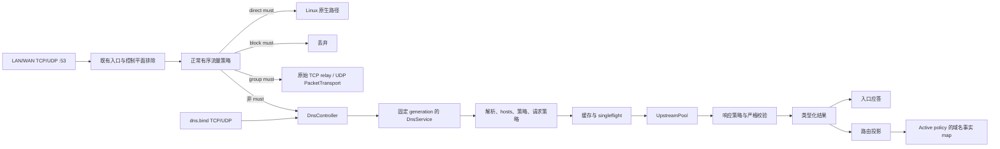

# DNS 子系统

本文说明透明 53 端口拦截与可选 `dns.bind` 监听器共用的用户态 DNS 架构。

字段级设置、可接受的 URI 形式及默认值见 [DNS 配置参考](../reference/dns.md)。缓存完全位于用户态；active policy 的 domain map 保存学习到的谓词事实，不保存 DNS 应答。

## 架构



非 `must` 透明入口与独立 `dns.bind` 两个 adapter 使用同一个 `DnsController`、当前 `DnsServiceProvider`、forwarder、缓存、singleflight 集合、上游池与路由投影。adapter 从准入开始一直持有所有权，直至应答 I/O 完成；它不会直接写 domain route。终局 `group(must)` 使用原始 TCP relay / UDP `PacketTransport`，不进入这条 DNS 管线，跳过 hosts、缓存、请求/响应策略和投影。

[`honk-config/src/dns/validation.rs`](../../../crates/honk-config/src/dns/validation.rs) 负责命名上游引用校验，由启动、SIGHUP 和公开运行时重载入口的 `Config::validate` 调用。`DnsRouting` 的私有请求来源选择逻辑同时供校验和 `effective_request` 使用，既保留旧版字段的诊断路径，也避免在校验时分配转换后的规则。仅解析配置的接口不执行完整配置校验。

## 入口路径

| 路径 | Socket 与目的地址模型 | 应答模型 |
| --- | --- | --- |
| 透明 53 端口，无终局用户 `must` 结果 | 按[流量规则所有权](../reference/routing.md#出站目标与-must)准入的有效查询进入 `DnsController`。 | 控制器接管的透明 UDP 使用绑定到原始目的地址的 anyfrom socket；TCP 在被拦截的 stream 上应答。请求动作 `asis` 拨该原始目的地址并保留 TCP/UDP，包括 UDP `TC` 后回退 TCP。 |
| 独立 `dns.bind` | 所选 TCP/UDP socket 是 host network namespace 中普通且未打 mark 的 socket。它们没有拦截所得的目的地址。 | TCP 在 accept 得到的 socket 上应答。UDP 使用 packet info，使通配 bind 从查询实际命中的本地地址与网卡应答。 |

`DnsRequestMeta` 以一个不可变值承载逻辑客户端来源与拦截所得目的地址。透明 adapter 和独立 adapter 都从 socket peer 设置 `source_ip`；只有透明拦截设置 `original_dst`。IPv4-mapped IPv6 peer 会规范化为 IPv4。代表已接纳 TCP/UDP 流执行的查询使用该流的客户端地址，且没有拦截所得的 DNS 目的地址。内部、bootstrap、prefetch 与 Clash API 查询两者都为空。

`asis` 仍然通过 honk 新建的 socket 查询原始目的解析器，不保留客户端的网络源地址。只有原生 `direct(must)` 绕过用户态重发；是否仍发生 SNAT/MASQUERADE 取决于其他防火墙和网络配置。原生直连或原始分组转发绕过的 DNS 回答不会补充 honk 的域名路由事实；anyfrom 负责客户端侧回复源地址，不是上游源地址伪装。私网 DNS 绕过迁移见[路由参考](../reference/routing.md#显式本地路由)。

[TCP handoff 与 UDP 逐报文准入](./control-plane.md#透明代理入口)由控制面负责，包括两者不同的路由代际要求。

独立监听器具有以下生命周期与准入不变量：

- 启动 supervisor 前，同步且 all-or-nothing 地 bind 全部所选 transport。任一 bind 失败都会关闭部分集合并令启动失败。
- 只转发完整、结构有效的单问题请求。无效 UDP 请求收到 `FORMERR`；畸形或不完整 TCP frame 会关闭连接。
- UDP 入口 profile 将声明的应答大小钳制到 `512..=1232`。Packet-info provenance 保留通配应答源地址选择。
- TCP 使用持久 RFC 7766 双字节 framing。每次长度读取、正文读取和应答写入都有 30 秒限制。
- 独立 TCP 最多占用进程级全局连接预算的四分之一。持久连接上的每个 frame 都分别进入 DNS 查询预算。
- `DnsListener` 为进程级对象，由 `ControlPlane::run` 持有。关闭时先停止准入，再排空或中止子任务，并在 DNS runtime 退役前 join 每个 supervisor。
- SIGHUP 中 `dns.bind` 的语义变化要求重启。未变化的监听器继续使用新发布的 DNS generation。
- 独立请求传入 `original_dst=None`；选择 `asis` 因而产生 DNS 失败（`SERVFAIL`），不会递归拨回监听器。

将 `dns.bind` 留空不关闭透明 TCP 与 UDP 拦截。本地端口 53 监听器不能让普通 LAN DNS 跳过流量策略。

## DNS 所有权状态机

下表区分 LAN 入站与普通主机/loopback 投递。`透明 Honk` 依赖真实 eBPF 数据面与已挂载的 LAN hook；mock 模式不能拦截报文。`must` 表示不再通过嗅探重判、保留已选出站，不是一个“绕过所有处理”的开关。

| 查询路径 | 流量策略结果 | 接收者 | 应答路径 |
| --- | --- | --- | --- |
| LAN 查询网关或外部 `:53`，无论本机是否有 dnsmasq / `dns.bind` 监听 | 非 `must` | Honk DNS 控制器 | Honk hosts、缓存、请求/响应策略与选定上游；透明 anyfrom/stream 回包 |
| LAN 查询由 dnsmasq 监听的网关 `:53` | `direct(must)` | Linux 原生投递到 dnsmasq | dnsmasq 本地数据、缓存或上游 |
| LAN 查询网关或外部 `:53`，即使有本地监听 | `block(must)` | 无 | 丢弃 |
| LAN 查询网关或外部 `:53`，即使有本地监听 | `group(must)` | Honk 原始 TCP/UDP 组传输 | 原始 DNS 流量经已选组转发，不经过 `DnsController` |
| 不经过透明准入的普通主机/loopback 查询 `127.0.0.1:53` | 不适用 | dnsmasq | dnsmasq 本地数据、缓存或上游 |
| 投递到非 53 端口的 `dns.bind`，例如 `127.0.0.1:54` | 不是透明端口 53 准入 | Honk bind | 同一套 Honk DNS 策略与上游栈 |
| 数据面未启用或流量不经过已挂载 hook | 不执行 Honk 策略 | 普通目的 socket | 对应本地服务；没有监听则拒绝或超时 |

有效非 `must` DNS 查询遵循[流量规则所有权](../reference/routing.md#出站目标与-must)；畸形 UDP payload 保留既有回退。具体地址或通配地址上的本地 `:53` socket 均不能提前终结 LAN 准入。非 DNS 本地 socket 探测保留原有 transport、FIB 与 TCP 纯 SYN 规则。

解析后的 DNS 请求仅在携带非零、与配置控制平面 bypass mark 完全相等的标记时保留原生投递。这是请求侧豁免，与用户规则中的 `must` 无关；回包仍遵循既有非 53 路由规则。未经过 LAN hook 的普通 loopback 后端访问不变。Honk 和 dnsmasq 绑定同一已占用端口仍会产生普通 socket bind 冲突；透明拦截本身不占用主机端口 `53`。

需要控制器/原始组处理的 LAN UDP 分片查询要求 NFQUEUE ready，并使用[内核重组](./nfqueue.md#lan-dns-分片)，不是原生策略旁路；该路径不处理 TCP 分片。

以 dnsmasq 为后端时，LAN 查询可以先进入 Honk，而 dnsmasq 保留端口 53 监听：

```text
LAN 客户端 -> 网关 :53 -> Honk 透明 DNS 策略
                           | local 上游 -> 127.0.0.1:53 -> dnsmasq -> 外部解析器
                           | remote 上游 -> 选定直连/代理传输
```

Honk 的独立 bind 可以是 `:53530`、其他空闲端口或关闭；它不是 LAN 端口 53 的接管开关。主机 loopback 到 dnsmasq 的请求不会因为启动了 Honk 就变成 LAN 请求。如果改为 dnsmasq 把未命中请求转发给 Honk，Honk 的选定上游就不能再指回该 dnsmasq，否则形成递归环。只有 Honk DNS 策略选中 dnsmasq 后端时，才会获取它的本地/DHCP 名称与缓存应答。

## 解析管线

生产路径顺序如下：

| 阶段 | 不变量 |
| --- | --- |
| 1. 准入与 generation | `DnsController` 固定一个 runtime，取得该代的 owned query permit；UDP 入口同时取得该代的 UDP permit。每代 2,048 查询的 permit 一直保留到应答完成；饱和时降级为 `REFUSED`。 |
| 2. 解析与校验 | adapter 要求一条完整请求。`DnsEngine` 解析 wire，拒绝没有可用问题或有多个问题的请求，生成小写的路由域名而不改变 qname 的大小写，并记录入口 profile。 |
| 3. 地址族 gate 与 hosts | `ipv4only`/`ipv6only` 在 hosts 或上游工作前，以 NODATA 拒绝另一地址族。除此之外，不可变 hosts 快照先于请求路由、缓存与上游交换执行。 |
| 4. 请求规划 | 按源码顺序的请求规则依据路由域名、QTYPE 与逻辑客户端来源选择 reject、`asis` 或命名上游。首条命中。 |
| 5. 复用 | 符合资格的请求先查询精确身份的正/负缓存；未命中时共用一次 singleflight 交换。不符合资格的请求绕过两者。 |
| 6. 交换 | 请求 scope 选择拦截所得目的地址或某个 `UpstreamPool` transport。 |
| 7. 响应规划 | 策略使用每个上游响应前，都会严格核对其与查询是否匹配。响应规则执行 accept、reject 或经命名上游重新查询；遍历无环且最多包含三个上游。 |
| 8. 发布与渲染 | 只有严格校验后的最终 wire 响应才能进入缓存或发布给 singleflight waiter。偏好地址族压制在保存已校验、可复用的应答后，才应用于调用方渲染。 |
| 9. 结果与投影 | forwarder 返回类型化结果。`DnsController` 使用固定 generation 的投影快照提交该结果，随后入口 adapter 写应答。 |

每代有两个相互独立的 2,048 上限：controller 查询生命周期与活跃 singleflight key。UDP 入口另用该代按启动预算确定的 slow-path 配额（最多 256），与普通 UDP 初始化隔离。每个 flight 最多接受 256 个 follower。flight 饱和时拒绝，不会开启无限上游交换；controller 将该过载渲染为 `REFUSED`。发布结果时，删除 flight 与向已加入 follower 广播结果原子完成；后续缓存未命中的请求可以开启新 flight。已完成的失败保留原始原因但不进入缓存，因此已加入的 follower 不会各自重复失败的交换。丢弃未发布结果的 leader 会删除 flight 并唤醒 follower 重新竞争所有权；这包括取消，以及缺少已验证 response template、仅被 compatibility mode 接受的成功结果。

初始化与 flight fan-out 使用 `SharedError`。该 Arc-backed error 为 builder 与
waiter clone 原始 causal chain，而不是从 display 文本重建。完成的 failure 不
进入 cache；所有已加入 waiter 观察相同 typed source，包括
`PacketRejection::Capacity`。

### Hosts 快照

构建 generation 时会按声明顺序读取并合并每个可重复的 `use_host` 来源。`true` 选择 `/etc/hosts`，其解析器索引精确名称及别名；路径选择 OxiDNS 兼容的精确、domain 后缀、regexp 和 keyword 规则文件。后定义的同名规则覆盖先定义的规则；精确与最长后缀匹配优先于有序的 regexp 和 keyword 匹配。查询处理不执行文件 I/O。

只有 IN class 的 A 与 AAAA 查询使用该快照。已知名称缺少所请求地址族时返回 `NOERROR`/NODATA，绝不泄漏给上游。hosts 应答 TTL 为 60 秒，绕过正缓存与负缓存复用，但仍产生正常的路由投影结果。快照在其 generation 内不可变；修改来源后发送 SIGHUP 以发布替换项。加载或解析失败会令启动失败，或在发布前中止 reload。

### 地址族策略

| 策略 | 转发与结果语义 |
| --- | --- |
| `both` | 内部/应用 A+AAAA 名称解析并发启动两个符合资格的地址族查询，并保留两者的可用记录。调用方的单条 DNS 查询不会被压制。 |
| `preferipv4` | A+AAAA 名称解析并发启动两者，但以 IPv4 作为偏好结果集。对普通 AAAA 请求，forwarder 通过正常管线发起 A sibling；仅当 sibling 含可用 IPv4 记录时才返回 NODATA。 |
| `preferipv6` | 与 `preferipv4` 对称：仅当 AAAA sibling 含可用 IPv6 记录时才压制 A 响应。 |
| `ipv4only` | 只有 A 符合资格。AAAA 不进行上游 I/O，直接应答 NODATA。 |
| `ipv6only` | 只有 AAAA 符合资格。A 不进行上游 I/O，直接应答 NODATA。 |

偏好地址族 sibling 查询只修改第一个问题的 QTYPE。事务 ID、flags、QCLASS、EDNS 数据、入口 profile、逻辑客户端来源、原始目的地址及其余 wire profile 均保持不变。Sibling 普通失败或 NODATA 不会压制可用的非偏好响应；typed local packet refusal 则以原始原因终止调用方的解析。对于内部/应用主机名解析，bootstrap fallback 仅在所有符合资格的地址族均不可用时运行一次，随后用同一地址族资格过滤 fallback 地址。

该策略也决定 bootstrap 解析出的上游拨号目标顺序。`both` 使用 IPv4 优先的兼容顺序；偏好模式把对应地址族放在前面，同时保留另一地址族。stream 与 QUIC transport 会依次尝试候选地址。直连 UDP 保持现有两次尝试上限：首个候选失败后，唯一一次重试先选择另一地址族，再考虑同族其他地址，并缓存成功的 socket。

包括 capacity 在内的类型化 local packet refusal 不是 availability failure。
DoH3/DoQ 与代理 reusable-session 初始化为 builder 和每个 waiter 保留同一个
`SharedError` cause。外层 route loop 与地址族 aggregation 不会把它变成另一条
route、bootstrap 或 system-DNS attempt。health 与 URLTest resolver hook 把该
错误保留到最终消费者，因此 denied lookup 不降低节点 health，也不替换默认
UDP check target。独立允许的 probe 与配置 literal fallback IP 仍可使用。
Typed refusal 不会变成 stale-cache 应答或成功的非偏好地址族应答；普通失败、
空 response 及已接受的 SERVFAIL 保持文档规定的 fallback 行为。
此规则同样覆盖通过代理 TCP session 承载的 `udp://` 冷启动及缓存路径：
收到拒绝后不会继续解析重试地址，最终一次尝试的拒绝也保留类型化原因，
而不是变成仅有显示文本的错误。
QUIC 健康目标在 generation 内延迟解析。类型化拒绝不会初始化缓存，后续符合
条件的 probe 仍可重试；目标解析与该次 QUIC 尝试共用一个 timeout 预算。
不支持 UDP 的节点及被显式策略拒绝的目标完全跳过解析。

### DNS 路由

同一规则内的条件按 AND 组合；一个条件内的参数按 OR 组合；每个条件都可取反。编译后的条件模型覆盖 qname、qtype、仅请求可用的来源 IP、上游名与响应 IP。规则按源码顺序求值，并在首条命中时停止。来源未知时，`sip(...)` 与 `!sip(...)` 都为 false；response 规则中的 `sip` 会在配置阶段被拒绝。

| 阶段 | 策略使用的输入 | 动作 |
| --- | --- | --- |
| 请求 | 规范 qname、QTYPE 与逻辑客户端来源；`asis` 还要求存在拦截所得的原始目的地址。 | `reject`、`asis` 或 `upstream(name)` |
| 响应 | 规范 qname、QTYPE、当前上游与提取出的应答 IP。 | `accept`、`reject` 或用于重新查询的 `upstream(name)` |

响应重新查询始终向所选上游发送原始请求 wire。环会被拒绝，遍历深度最多为三个上游。

### 缓存与 singleflight 身份

缓存与持久化使用以下不可变 `CacheKey`：

```text
canonical query wire (TXID zeroed)
+ ingress profile
+ logical request scope
+ DNS policy identity
+ operation (resolve or refresh)
```

wire 身份保留 flags、精确 question 编码、QCLASS 与 EDNS 内容。UDP 声明大小仍属于入口 profile。逻辑 request scope 在请求路由后确定：它区分命名上游与 `asis` 目的地址，policy identity 防止跨语义 reload 复用。

客户端 IP 不属于缓存或持久化身份。不同来源选择同一命名上游时共享其与来源无关的应答；选择不同上游时由 scope 自然隔离，`asis` 仍按原始目的地址隔离。前台 `FlightKey::Resolve` 包含 resolve `CacheKey`，始终额外区分 strict/compatibility mode，并且仅在 preference-sensitive sibling 查询可能改变发布应答时加入 `DnsRequestMeta`；其他前台 flight 仍可跨客户端合并。后台 `FlightKey::Refresh` 只包含 refresh `CacheKey`，由 leader 捕获发起方 metadata 与 mode。正缓存、负缓存与 stale 命中都会用当前调用方 metadata 重新执行偏好地址族渲染。

仅被 compatibility mode 接受的响应链不会进入共享内存缓存或持久化，例如终止于响应路由环/深度上限，或未通过 strict response-template 校验的响应链。因此后续 strict 查询不会继承 compatibility-only 的接受结果。由于 HDNS v2 不存储执行模式来源，恢复的条目在当前进程完成一次上游交换并替换它们之前仅供 compatibility mode 使用；持久化 codec 仍保持 v2。

复用仅适用于标准单问题 QUERY：没有 answer 或 authority record，且至多一个无 option 的 EDNS-v0 OPT。ECS、COOKIE、任何其他 EDNS option、EDNS-v1、多个 OPT record 或异常 flags 会同时绕过缓存与 singleflight。请求仍使用正常的严格交换路径。

配置生成的 ECS 属于 generation 固定的命名上游 transport policy，而不属于入口身份。有效 IPv4 prefix 会写入 `PolicyId`，原始查询仍作为 cache/singleflight key。上游池仅在接纳后添加 ECS，保留客户端自带的 ECS，校验生成 option 的回显，并在响应分析及缓存发布前移除生成的 EDNS 状态。`asis` 绕过该转换。自动推断会在启动、reload 与网络事件时以事务方式刷新，因此替换 generation 探测和构建期间，活动查询仍使用旧 generation。

## 缓存与持久化

| 机制 | 不变量 |
| --- | --- |
| 容量 | 最多 16 个 LRU 分片精确划分 `max_cache_size`。每个分片同时受条目数与保留的 key/response wire 字节限制。字节目标为每个配置条目 4 KiB，每分片至少 65,535 字节，全局上限 64 MiB。 |
| 正缓存 TTL | `fixed_domain_ttl` 优先级最高；零表示该域名不缓存。否则，非零 `optimistic_cache_ttl` 覆盖应答最小 TTL。两者均未覆盖时，NOERROR 正应答取所有已遍历非 OPT 记录的最小 TTL，包括零；最小值为零时移除精确缓存槽，不保留新应答。选定的非零 TTL 也会写入缓存中的记录。失败响应码仍使用原有的 TTL 提取规则。 |
| 负缓存 TTL | NXDOMAIN 使用 `min(SOA TTL, SOA MINIMUM, 300)` 秒；缺少 SOA 或生命周期为零时移除精确缓存槽，不保留应答。SERVFAIL 仍缺省为 60 秒，并将 SOA 得出的生命周期限制在 `1..=300` 秒。`fixed_domain_ttl: 0` 禁止缓存所有响应码的应答，但不移除已有条目。 |
| NODATA TTL | `ANCOUNT=0` 的 NOERROR 应答以完整报文保留在正缓存槽中。非零 `fixed_domain_ttl` 优先于 SOA 和上限；否则生命周期为 `min(SOA TTL, SOA MINIMUM, 300)`，缺少 SOA 或生命周期为零时移除精确缓存槽，不保留新应答。`optimistic_cache_ttl` 不适用。NODATA 仍可作为过期应答返回；过期改写只改变 SOA TTL，不改变 MINIMUM。 |
| Stale 处理 | 过期正应答在一小时内仍可用于 serve-stale。普通上游交换失败或已接受的 SERVFAIL 可返回该应答；typed local packet refusal 不可。`optimistic_stale_reply_ttl` 默认为 30 秒；非零值替换每个非 OPT RR 的 TTL，并设置 outcome TTL。`0` 保留缓存中已按策略改写的 TTL，而不是权威 TTL；此时 outcome TTL 由该 wire 的 `extract_min_ttl` 得出，不存在正 TTL 时回退为 60 秒。接近过期的命中会启动去重的 stale-while-revalidate refresh。 |
| Flush fence | publication epoch 防止 flush 前开始的前台或后台工作在 flush barrier 后重新填充内存或持久化。 |

后台刷新在命中正缓存时，一并读取 `Resolve` 缓存槽的发布版本号（`revision`）。每次已接受的精确键发布都会推进版本号，包括负缓存合并和持久化恢复。发布时在分片锁内检查：版本号必须一致，正缓存也必须仍在。版本号不符、缓存槽仅剩负缓存或已被驱逐时，刷新结果会被丢弃；被驱逐的槽不会因刷新完成而重新写入。

匹配且可缓存的 NXDOMAIN 先移除被刷新的正缓存，再写入负缓存；可缓存的正应答或 NODATA 替换整个缓存槽。NXDOMAIN、NODATA 或零 TTL 正应答没有可用生命周期时移除整个槽，包括其中的负缓存。若 SERVFAIL 没有可用的过期应答回退，则保留正缓存并合并负缓存。

前台仍以最后完成的发布为准。不可缓存的 NXDOMAIN、NODATA 或零 TTL 正应答移除整个精确缓存槽；可缓存的 NXDOMAIN 仍合并在正缓存之上。例如，严格模式的前台 SERVFAIL 可使兼容模式对已恢复正缓存发起的刷新失去发布资格；负缓存过期后，该正缓存会再次可见。替换受发布 epoch 约束，通过分片的计数维护接口移除条目；转发器禁用缓存时不执行替换。缓存命中时不会递减报文 TTL。

此保证仅适用于内存；缓存槽版本号仅在进程内有效，不改变持久化格式或严格模式的应答准入。移除正缓存不会使已保存的 SQLite 行失效。若在该行过期前重启，该正缓存可能恢复为仅兼容模式可用：严格模式不会复用它，兼容模式则可能在持久化过期时间之后的一小时内继续提供过期应答。因为刷新触发条件对剩余秒数向下取整，所以刷新开始时原应答可能仍有至多 `max(min_ttl / 10, 1) + 1` 秒的实际有效期。

`store_dns` 启用持久化后，一个有界 actor 会将仍被保留的正缓存插入镜像到 SQLite。若条目因分片 wire 字节预算而立即被驱逐，则不会进入持久化队列。actor 将命令队列与 pending set 都限制为 4,096 项，批量写入并按 epoch 隔离；flush 会在接纳当前状态前丢弃更旧的排队 epoch。

`HDNS` version 2 行位于 `dns:v2:` 下，编码 canonical wire、入口 profile、scope、policy、operation、expiry 与已校验的 response wire。恢复时跳过已过期、损坏、version 不匹配、collision 不匹配及 policy 不匹配的行。v2 namespace 不消费也不改写旧 `dns:` 行。v2 之前的二进制会忽略 `dns:v2:` 行，因此将其留在 `cache.db` 中可安全回滚。

## 上游 transport

| 协议 | 复用模型 | 拨号路径代理 |
| --- | --- | --- |
| UDP | 每个直连上游一个由 generation 持有的 connected socket 与 receive task；`TC` fallback 由 TCP 池处理。 | 配置代理时，查询会刻意由池化 TCP-DNS 承载。 |
| TCP | RFC 7766 空闲 stream 池。 | 支持经所选节点或组叶子。 |
| DoT | 空闲 TLS stream 池。 | 支持经代理 TCP 基础 stream。 |
| DoH | 一个长生命周期、可复用并发请求的 HTTP/2-only TLS session。 | HTTP/2 会话可经由代理 TCP 连接建立。 |
| DoQ | 一个长生命周期 QUIC connection；每个查询一条双向 stream。 | 支持经所选叶节点的 `PacketTransport`。 |
| DoH3 | 一个长生命周期 QUIC 与 HTTP/3 session。 | QUIC 会话可使用所选叶节点的 `PacketTransport`。 |

代理 DoQ 与 DoH3 会把 generation 固定的叶节点 `PacketTransport` 适配为 quinn `AsyncUdpSocket`。每个池化 QUIC connection 或 HTTP/3 session 持有一个有界 adapter 与 client endpoint，直到 retry 或 shutdown 将其关闭；datagram 边界和 peer 元数据保持不变，内层 QUIC payload 上限为 1252 bytes。缺少代理 registry 或 packet capability 时会 fail closed，不会绕过为直连。直连 QUIC 仍复用带 bypass mark 的原生 endpoint。

`-> node-or-group` 强制选择一个由 generation 固定的拨号叶子。没有显式目标时，上游 endpoint 经过固定的流量 Router 与组快照。UDP+代理有意使用 TCP-DNS；此策略独立于普通代理 UDP 流量使用的 SOCKS5 RFC 1928 UDP transport。

直连上游 socket 带 bypass mark，使其流量不会重新进入透明拦截。主机名 endpoint 通过 generation 捕获的 bootstrap resolver 解析；拨号从不依赖 honk 被拦截的 resolver 路径。

拨号/TLS/QUIC/HTTP session 建立使用 dial/handshake timeout，请求/响应交换使用独立的 query timeout。一次查询尝试只有一个绝对交换 deadline。每个 transport 失败后最多重试一次，并在需要时重置无效的可复用 session，因此总查询工作有界。Transport slot 对并发初始化执行 singleflight，并只分配一个 closer。池关闭先停止准入并等待已准入交换，然后关闭空闲资源，显式 join 每个 receive 或协议 driver task。

直连 UDP 为每个查询分配由 CSPRNG 选择的新 16-bit ID，接收时同时校验 ID 与 question，恢复调用方 ID，并将退役 ID 隔离三秒。因此延迟报文无法在 ID 复用后满足另一个问题。

## 路由投影

`DnsController` 将解析结果转换为 desired state，而不是内联写 active policy 的 domain map：

| 结果 | 投影 observation |
| --- | --- |
| 已接受的 positive | 可缓存时，用 outcome 的有效 TTL 替换该域名的 IP 集合与 expiry；不可缓存的正应答改用已有 wire TTL 规则：非 OPT 记录中的最小正 TTL，不存在正 TTL 时回退为 60 秒。拒绝缓存不应抹去已接受地址的路由寿命。同一 IP 的多个域名 owner 会贡献按 OR 合并的路由 bitmap。 |
| 已接受的 NODATA 或 NXDOMAIN | 清除该域名 owner。 |
| 已接受的 SERVFAIL 或被策略拒绝 | 保留当前状态。 |

每个 policy generation 内的域名关联仍为全局且与来源无关。带来源的请求路由隔离 DNS 交换 scope 与应答；它不划分 eBPF domain observation 或普通流量路由。投影独立于其他条件逐一计算全部域名谓词，包括用于否定的谓词；已知域名没有匹配项时可投影为存在的零 bitmap。

投影最多保留 10,000 个域名 owner，并向容量为 65,536 的 domain map 准入最多 49,152 个唯一 IP key。选入 desired/reload 集合的零 bitmap 另有 32,768 个 key 的上限，为后续命中规则的 DNS 事实留出空间；等待成功删除的过时零值 key 可暂时突破该子上限，但仍受 applied 总上限约束。剩余 16,384 个 map 槽位不供 DNS 投影使用，留给 sniff 写入。IPv4 与 mapped-IPv6 owner 共用一个 key，并按 OR 合并事实。增量协调与 reload 使用同一准入策略：先淘汰零 bitmap，同一优先级内淘汰地址最大的 IP。被省略的 owner 仍可在后续策略 generation 重新参与投影；普通刷新也可在空间可用时重新准入被省略的 IP。容量压力会产生警告。

被省略的 key 按普通的缺失域名事实处理，而不是伪造零 bitmap。现有 dial-mode 和终态 `must`/`block` 语义仍然有效：符合条件的未确定 direct 结果进入 control-plane routing，但该容量策略不会把所有未知事实都强制送入慢路径，也不改变 `ip` 模式。Sniff 写入共享物理 map，仍可能耗尽其预留空间；backend 写入失败继续可观测，并在适用路径中重试。

worker 以最多 256 个 set/remove 为一批，协调带 generation 的 desired state，并自行调度剩余已就绪工作，不必等待下一次 DNS observation。过时 key 优先于新增项进入批次；已写入的投影达到 IP 上限后，新增 DNS key 必须等待删除确认，删除失败期间也不释放额度。失败写入保持 dirty，并以有界退避重试。批次修改 backend 前，worker 获取 backend lock，并在持有 publication fence 时重新检查 generation。reload 在同一个 backend lock 下安装替换投影快照。因此，旧批次在替换 generation 发布后既不能进入，也不能继续修改 map。

重试唤醒与批次准入共用同一个带容量判断的逐 IP deadline；投影已满时，过期但无法准入的新增项不会在删除退避期间空转。成功 reload 会先把实际写入新 map 的完整 IP 集合记为 applied，再协调当前 owner，包括加载期间已到期的 owner。worker 的 map 写入与确认保持在同一个 generation fence 内，旧完成事件不能覆盖新发布的记账。保留物理 map 的 reload 也保留原有 applied 状态。

增量确认将成功写入与当前期望位图或缺失状态比较，不保留历史 IP revision 账本。owner 的 TTL sequence 与策略 generation 仍分别保护各自的边界。

## Generation 与 reload

一个 `DnsRuntime` 包含 forwarder 与 policy、不可变 hosts 表、routing/group snapshot、transport manager、路由投影、捕获的 bootstrap resolver 及代内 query/UDP admission。每个新 forwarder 独占 singleflight 和 refresh/prefetch worker；clone 仍属于该代。每个 DNS pool 持有新的 outbound runtime fork，不复用 traffic session 或旧 DNS 代 session。fork 与来源配置代共享 dial semaphore、进程 physical-dial ceiling 和进程 VLESS-carrier gate，但不共享 retirement state 或 protocol pool。

现有 TLS 维护任务也会回收当前 DNS registry 的空闲 connector。Registry 终止关闭时会释放其缓存 connector，即使已退役 runtime 仍被保留。

发布后，新代立即拥有独立执行资源：旧代即使饱和，也不能占用新代 query/UDP 配额，或让新查询加入旧 flight。仅已完成答案缓存、publication/flush fence 和持久化继续共享；它们不持有在途工作。旧查询 lease 自然排空到应答 I/O 完成，然后退役流程 join 后台 worker、关闭 DNS transport 及其私有代理 session，再退役捕获的普通流量 registry 中未转移的可复用状态。

30 秒期限只限制等待查询 lease 排空的时间，不限制 transport 与 outbound pool 整体拆除所需的时间。它是安全兜底，并非新代服务的前置条件；到期会取消 runtime 所有的 forwarding 和已准入应答 future。Forwarding 返回后的 bootstrap fallback 不在该取消范围内。最多保留四个已退役 runtime；超过上限与 provider 关闭会触发相同的强制取消。已就绪的终端 `SERVFAIL` 应答仍会尝试发送，但卡住的已准入应答 I/O 会取消；TCP 写入被取消时关闭连接。

Provider 持有、回收退役 supervisor，并在关闭时 join。监听 socket 与进程级物理资源限制仍共享，因此代际隔离不承诺描述符耗尽后仍可服务。

SIGHUP 在 commit point 前构建 policy、`/etc/hosts`、组、路由、上游 transport、投影数据与 outbound runtime。发布在持有控制面 routing/config lock 时进行；准备失败会完整保留当前 generation。`dns.bind` 的语义变化是例外：监听器所有权为进程级，reload 会被拒绝并要求重启。

路由发布在准入前拒绝旧代排队元数据；已准入查询保留原代 lease。20 位 carrier 使用持久化、启动周期内不回绕的分配器，也计入只替换 descriptor 的 NFQUEUE fence。失败预留值不复用，普通重启不重置耗尽；见[路由发布](./routing.md)。

## 可观测性

DNS 诊断使用相互独立、单调递增的 atomic counter。类别覆盖缓存 hit/miss/stale、singleflight 饱和/cancel/retry/amplification avoided、持久化 drop/flush failure、runtime 退役/forced close、transport 初始化/reset、投影 stale-generation/write failure/retry，以及 positive/NODATA/NXDOMAIN/SERVFAIL/rejected/error 结果。

记录不获取共享 metrics gate。内部 scrape 以 relaxed ordering 独立加载每个 counter；它是 best-effort，不代表同一一致时刻，因此不能建立跨 counter 等式。

结构化 DNS 失败事件将错误压缩为有界 `error_kind` 类别：forwarder（`engine`、`exchange`、`response`、`internal`、`rejected_plan`、`overloaded`）、持久化（`worker_closed`、`ack_dropped`、`worker_failed`、`database`）、投影（`map_full`、`backend_write`）及 transport（`exchange_failed`，另带有界 transport label）。这些事件字段不包含 query name、upstream 地址或自由格式 error payload。

该快照仅供内部使用。honk 不公开 DNS metrics endpoint、配置开关或 DNS telemetry API。

## 相关文档

- [控制面设计](./control-plane.md)
- [路由设计](./routing.md)
- [DNS 配置参考](../reference/dns.md)
- [DNS 灰度操作](../operations/dns-rollout.md)
