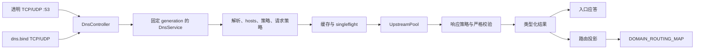

# DNS 子系统

本文说明透明 53 端口拦截与可选 `dns.bind` 监听器共用的用户态 DNS 架构。

字段级设置、可接受的 URI 形式及默认值见 [DNS 配置参考](../reference/dns.md)。缓存完全位于用户态；`DOMAIN_ROUTING_MAP` 保存学习到的路由投影，不保存 DNS 应答。

## 架构



两个入口 adapter 使用同一个 `DnsController`、当前 `DnsServiceProvider`、forwarder、缓存、singleflight 集合、上游池与路由投影。adapter 从准入开始一直持有所有权，直至应答 I/O 完成；它不会直接写 domain route。

## 入口路径

| 路径 | Socket 与目的地址模型 | 应答模型 |
| --- | --- | --- |
| 透明 53 端口 | eBPF TCP 与 UDP 快速路径不经过完整路由循环，直接重定向 53 端口流量。adapter 保留拦截所得的原始目的地址与入口 transport。 | 透明 UDP 使用绑定到原始目的地址的 anyfrom socket；TCP 在被拦截的 stream 上应答。请求动作 `asis` 拨该原始目的地址并保留 TCP/UDP，包括 UDP `TC` 后回退 TCP。 |
| 独立 `dns.bind` | 所选 TCP/UDP socket 是 host network namespace 中普通且未打 mark 的 socket。它们没有拦截所得的目的地址。 | TCP 在 accept 得到的 socket 上应答。UDP 使用 packet info，使通配 bind 从查询实际命中的本地地址与网卡应答。 |

`DnsRequestMeta` 以一个不可变值承载逻辑客户端来源与拦截所得目的地址。透明 adapter 和独立 adapter 都从 socket peer 设置 `source_ip`；只有透明拦截设置 `original_dst`。IPv4-mapped IPv6 peer 会规范化为 IPv4。代表已接纳 TCP/UDP 流执行的查询使用该流的客户端地址，且没有拦截所得的 DNS 目的地址。内部、bootstrap、prefetch 与 Clash API 查询两者都为空。

独立监听器具有以下生命周期与准入不变量：

- 启动 supervisor 前，同步且 all-or-nothing 地 bind 全部所选 transport。任一 bind 失败都会关闭部分集合并令启动失败。
- 只转发完整、结构有效的单问题请求。无效 UDP 请求收到 `FORMERR`；畸形或不完整 TCP frame 会关闭连接。
- UDP 入口 profile 将声明的应答大小钳制到 `512..=1232`。Packet-info provenance 保留通配应答源地址选择。
- TCP 使用持久 RFC 7766 双字节 framing。每次长度读取、正文读取和应答写入都有 30 秒限制。
- 独立 TCP 最多占用进程级全局连接预算的四分之一。持久连接上的每个 frame 都分别进入 DNS 查询预算。
- `DnsListener` 为进程级对象，由 `ControlPlane::run` 持有。关闭时先停止准入，再排空或中止子任务，并在 DNS runtime 退役前 join 每个 supervisor。
- SIGHUP 中 `dns.bind` 的语义变化要求重启。未变化的监听器继续使用新发布的 DNS generation。
- 独立请求传入 `original_dst=None`；选择 `asis` 因而产生 DNS 失败（`SERVFAIL`），不会递归拨回监听器。

已绑定的本地 `:53` 监听器按 TCP、UDP transport 分别优先于透明拦截。具体地址的 bind 对相应 transport 优先。通配 bind 仅在完整 FIB 查询报告 `NOT_FWDED` 时优先，避免远程 resolver 流量绕过透明 DNS。将 `dns.bind` 留空会保留透明 TCP 与 UDP 拦截。

## DNS 所有权状态机

下表针对 LAN 客户端，并明确区分**第一接收者**、**真正的应答来源**与**最终回包者**。`Honk bind` 是 host network namespace 中的普通监听器；绑定 `:54` 不会占用 `:53`。`透明 Honk` 依赖真实 eBPF datapath 与已挂载的接口 hook；mock 模式没有这条路径。

| dnsmasq 状态 | Honk `dns.bind` | 查询目标 | 第一接收者 | 真正的应答来源 | 最终回包者 |
| --- | --- | --- | --- | --- | --- |
| 运行于 `:53`；命中本地/DHCP/缓存 | 任意不冲突的 bind | 网关 `:53` | dnsmasq | dnsmasq 本地数据或缓存 | dnsmasq |
| 运行于 `:53`；未命中并转发到 `127.0.0.1#54` | `:54` 运行 | 网关 `:53` | dnsmasq | Honk 缓存/hosts/策略或 Honk 上游 | dnsmasq |
| 运行于 `:53`；未命中且 dnsmasq 没有可用上游 | 任意 | 网关 `:53` | dnsmasq | 无 | dnsmasq 返回 `SERVFAIL` 或超时 |
| 运行于 `:53`；转发目标 `127.0.0.1#54` 已停止 | `:54` 停止 | 网关 `:53` | dnsmasq | 无 | dnsmasq 返回 `SERVFAIL` 或超时 |
| 运行于 `:53` | `:54` 运行 | 外部 `:53`（例如 `8.8.8.8:53`） | 启用时为透明 Honk | Honk 缓存/hosts/策略或 Honk 上游 | Honk 透明 anyfrom/stream 路径 |
| 已停止 | `:54` 运行 | 网关 `:54` | Honk bind | Honk 缓存/hosts/策略或 Honk 上游 | Honk bind |
| 已停止 | `:54` 运行 | 网关 `:53` | 启用时为透明 Honk | Honk 缓存/hosts/策略或 Honk 上游 | Honk 透明 anyfrom/stream 路径 |
| 已停止 | bind 关闭 | 网关或外部 `:53` | 启用时为透明 Honk | Honk 缓存/hosts/策略或 Honk 上游 | Honk 透明 anyfrom/stream 路径 |
| 已停止或没有占用 `:53` | `:53` 运行 | 网关 `:53` | Honk bind | Honk 缓存/hosts/策略或 Honk 上游 | Honk bind |
| 已占用 `:53` | 尝试绑定 `:53` | 网关 `:53` | 启动时 bind 冲突 | 在只剩一个所有者前无 | 没有确定的所有者；一个服务必须失败 |
| 任意 | bind 关闭或已停止 | 网关 `:54` | 没有 Honk listener | 无 | 连接拒绝或超时 |
| 任意 | 任意 | 非 DNS 端口 | 普通路由路径 | 选中的出站 | 普通流 |

每种 transport 的优先级转移如下：

```text
gateway:53 数据包
  -> 匹配的 host-network listener（dnsmasq 或 Honk bind）
  -> 否则 Honk 透明 53 路径
  -> 否则普通内核路由 / 没有 DNS 服务
```

本地 listener 检查按 TCP、UDP transport 分开执行。具体地址的本地 `:53` socket 优先；通配 socket 只有在完整 FIB 查询报告 `NOT_FWDED` 时优先，转发或结果不明确的目的地址仍走透明路径。因此，停止 dnsmasq 不会让 Honk `:54` 自动占用 `:53`；实际观察到的接管来自透明拦截。若要让 Honk 成为普通网关 `:53` 服务，应停止或迁移 dnsmasq，并将 `bind` 配置为 `tcp+udp://:53`。

OpenWrt 最常见的转发状态是：

```text
LAN 客户端 -> dnsmasq :53 -> 127.0.0.1:54 -> Honk DNS 策略/上游
            <- dnsmasq :53 <- 127.0.0.1:54 <----------------------
```

如果 Honk 选择的上游也是 dnsmasq `127.0.0.1:53`，而 dnsmasq 又把未命中请求转发到 Honk `:54`，两个服务会形成递归环。应使用真正的外部 Honk 上游，或让 dnsmasq 自己处理该上游。

## 解析管线

生产路径顺序如下：

| 阶段 | 不变量 |
| --- | --- |
| 1. 准入与 generation | `DnsController` 取得 owned semaphore permit 与 runtime lease。2,048 查询的 permit 一直保留到应答完成；饱和时降级为 `REFUSED`。lease 为该请求固定一个完整 generation。 |
| 2. 解析与校验 | adapter 要求一条完整请求。`DnsEngine` 解析 wire，拒绝没有可用问题或有多个问题的请求，将 qname 规范化为小写，并记录入口 profile。 |
| 3. 地址族 gate 与 hosts | `ipv4only`/`ipv6only` 在 hosts 或上游工作前，以 NODATA 拒绝另一地址族。除此之外，不可变 hosts 快照先于请求路由、缓存与上游交换执行。 |
| 4. 请求规划 | 按源码顺序的请求规则依据规范 qname、QTYPE 与逻辑客户端来源选择 reject、`asis` 或命名上游。首条命中。 |
| 5. 复用 | 符合资格的请求先查询精确身份的正/负缓存；未命中时共用一次 singleflight 交换。不符合资格的请求绕过两者。 |
| 6. 交换 | 请求 scope 选择拦截所得目的地址或某个 `UpstreamPool` transport。 |
| 7. 响应规划 | 策略使用每个上游响应前，都会严格核对其与查询是否匹配。响应规则执行 accept、reject 或经命名上游重新查询；遍历无环且最多包含三个上游。 |
| 8. 发布与渲染 | 只有严格校验后的最终 wire 响应才能进入缓存或发布给 singleflight waiter。偏好地址族压制在保存已校验、可复用的应答后，才应用于调用方渲染。 |
| 9. 结果与投影 | forwarder 返回类型化结果。`DnsController` 使用固定 generation 的投影快照提交该结果，随后入口 adapter 写应答。 |

系统有两个相互独立的 2,048 上限：controller 查询生命周期与活跃 singleflight key。每个 flight 最多接受 256 个 follower。flight 饱和时拒绝，不会开启无限上游交换；controller 将该过载渲染为 `REFUSED`。丢弃 leader 会删除 flight、唤醒 follower 重新竞争所有权，并记录取消。

### Hosts 快照

构建 generation 时会按声明顺序读取并合并每个可重复的 `use_host` 来源。`true` 选择 `/etc/hosts`，其解析器索引精确名称及别名；路径选择 OxiDNS 兼容的精确、domain 后缀、regexp 和 keyword 规则文件。后定义的同名规则覆盖先定义的规则；精确与最长后缀匹配优先于有序的 regexp 和 keyword 匹配。查询处理不执行文件 I/O。

只有 IN class 的 A 与 AAAA 查询使用该快照。已知名称缺少所请求地址族时返回 `NOERROR`/NODATA，绝不泄漏给上游。hosts 应答 TTL 为 60 秒，绕过正缓存与负缓存复用，但仍产生正常的路由投影结果。快照在其 generation 内不可变；修改来源后发送 SIGHUP 以发布替换项。加载或解析失败会令启动失败，或在发布前中止 reload。

### 地址族策略

| 策略 | 转发与结果语义 |
| --- | --- |
| `both` | 内部/应用 A+AAAA 名称解析并发启动两个符合资格的地址族查询，并保留两者的可用记录。调用方的单条 DNS 查询不会被压制。 |
| `preferipv4` | A+AAAA 名称解析并发启动两者，但以 IPv4 作为偏好结果集。对普通 AAAA 请求，forwarder 通过正常管线发起 A sibling；仅当 sibling 含可用 IPv4 记录时才返回 NODATA。 |
| `preferipv6` | 与 `preferipv4` 对称：仅当 AAAA sibling 含可用 IPv6 记录时才压制 A 响应。 |
| `ipv4only` | 只有 A 符合资格。AAAA 不进行上游 I/O，直接应答 NODATA。 |
| `ipv6only` | 只有 AAAA 符合资格。A 不进行上游 I/O，直接应答 NODATA。 |

偏好地址族 sibling 查询只修改第一个问题的 QTYPE。事务 ID、flags、QCLASS、EDNS 数据、入口 profile、逻辑客户端来源、原始目的地址及其余 wire profile 均保持不变。Sibling 失败或 NODATA 不会压制可用的非偏好响应。对于内部/应用主机名解析，bootstrap fallback 仅在所有符合资格的地址族均不可用时运行一次，随后用同一地址族资格过滤 fallback 地址。

该策略也决定 bootstrap 解析出的上游拨号目标顺序。`both` 使用 IPv4 优先的兼容顺序；偏好模式把对应地址族放在前面，同时保留另一地址族。stream 与 QUIC transport 会依次尝试候选地址。直连 UDP 保持现有两次尝试上限：首个候选失败后，唯一一次重试先选择另一地址族，再考虑同族其他地址，并缓存成功的 socket。

### DNS 路由

同一规则内的条件按 AND 组合；一个条件内的参数按 OR 组合；每个条件都可取反。编译后的条件模型覆盖 qname、qtype、仅请求可用的来源 IP、上游名与响应 IP。规则按源码顺序求值，并在首条命中时停止。来源未知时，`sip(...)` 与 `!sip(...)` 都为 false；response 规则中的 `sip` 会在配置阶段被拒绝。

| 阶段 | 策略使用的输入 | 动作 |
| --- | --- | --- |
| 请求 | 规范 qname、QTYPE 与逻辑客户端来源；`asis` 还要求存在拦截所得的原始目的地址。 | `reject`、`asis` 或 `upstream(name)` |
| 响应 | 规范 qname、QTYPE、当前上游与提取出的应答 IP。 | `accept`、`reject` 或用于重新查询的 `upstream(name)` |

响应重新查询始终向所选上游发送原始请求 wire。环会被拒绝，遍历深度最多为三个上游。

### 缓存与 singleflight 身份

缓存与持久化使用以下不可变 `CacheKey`：

```text
canonical query wire (TXID zeroed)
+ ingress profile
+ logical request scope
+ DNS policy identity
+ operation (resolve or refresh)
```

wire 身份保留 flags、精确 question 编码、QCLASS 与 EDNS 内容。UDP 声明大小仍属于入口 profile。逻辑 request scope 在请求路由后确定：它区分命名上游与 `asis` 目的地址，policy identity 防止跨语义 reload 复用。

客户端 IP 不属于缓存或持久化身份。不同来源选择同一命名上游时共享其与来源无关的应答；选择不同上游时由 scope 自然隔离，`asis` 仍按原始目的地址隔离。前台 `FlightKey::Resolve` 包含 resolve `CacheKey`，始终额外区分 strict/compatibility mode，并且仅在 preference-sensitive sibling 查询可能改变发布应答时加入 `DnsRequestMeta`；其他前台 flight 仍可跨客户端合并。后台 `FlightKey::Refresh` 只包含 refresh `CacheKey`，由 leader 捕获发起方 metadata 与 mode。正缓存、负缓存与 stale 命中都会用当前调用方 metadata 重新执行偏好地址族渲染。

仅被 compatibility mode 接受的响应链不会进入共享内存缓存或持久化，例如终止于响应路由环/深度上限，或未通过 strict response-template 校验的响应链。因此后续 strict 查询不会继承 compatibility-only 的接受结果。由于 HDNS v2 不存储执行模式来源，恢复的条目在当前进程完成一次上游交换并替换它们之前仅供 compatibility mode 使用；持久化 codec 仍保持 v2。

复用仅适用于标准单问题 QUERY：没有 answer 或 authority record，且至多一个无 option 的 EDNS-v0 OPT。ECS、COOKIE、任何其他 EDNS option、EDNS-v1、多个 OPT record 或异常 flags 会同时绕过缓存与 singleflight。请求仍使用正常的严格交换路径。

配置生成的 ECS 属于 generation 固定的命名上游 transport policy，而不属于入口身份。有效 IPv4 prefix 会写入 `PolicyId`，原始查询仍作为 cache/singleflight key。上游池仅在接纳后添加 ECS，保留客户端自带的 ECS，校验生成 option 的回显，并在响应分析及缓存发布前移除生成的 EDNS 状态。`asis` 绕过该转换。自动推断会在启动、reload 与网络事件时以事务方式刷新，因此替换 generation 探测和构建期间，活动查询仍使用旧 generation。

## 缓存与持久化

| 机制 | 不变量 |
| --- | --- |
| 容量 | 最多 16 个 LRU 分片精确划分 `max_cache_size`。每个分片同时受条目数与保留的 key/response wire 字节限制。字节目标为每个配置条目 4 KiB，每分片至少 65,535 字节，全局上限 64 MiB。 |
| 正缓存 TTL | `fixed_domain_ttl` 优先级最高；零表示该域名不缓存。否则，非零 `optimistic_cache_ttl` 覆盖应答最小 TTL。所选 TTL 也会写入缓存的 answer record。 |
| 负缓存 TTL | NXDOMAIN 与 SERVFAIL 使用从 SOA 得出的负 TTL，缺省为 60 秒，随后钳制到 `1..=300` 秒。 |
| Stale 处理 | 过期正应答在一小时内仍可用于 serve-stale。上游错误或 SERVFAIL 可返回该应答，并将 wire TTL 改为 30 秒。接近过期的命中会启动去重的 stale-while-revalidate refresh。 |
| Flush fence | publication epoch 防止 flush 前开始的前台或后台工作在 flush barrier 后重新填充内存或持久化。 |

`store_dns` 启用持久化后，一个有界 actor 会将仍被保留的正缓存插入镜像到 SQLite。若条目因分片 wire 字节预算而立即被驱逐，则不会进入持久化队列。actor 将命令队列与 pending set 都限制为 4,096 项，批量写入并按 epoch 隔离；flush 会在接纳当前状态前丢弃更旧的排队 epoch。

`HDNS` version 2 行位于 `dns:v2:` 下，编码 canonical wire、入口 profile、scope、policy、operation、expiry 与已校验的 response wire。恢复时跳过已过期、损坏、version 不匹配、collision 不匹配及 policy 不匹配的行。v2 namespace 不消费也不改写旧 `dns:` 行。v2 之前的二进制会忽略 `dns:v2:` 行，因此将其留在 `cache.db` 中可安全回滚。

## 上游 transport

| 协议 | 复用模型 | 拨号路径代理 |
| --- | --- | --- |
| UDP | 每个直连上游一个由 generation 持有的 connected socket 与 receive task；`TC` fallback 由 TCP 池处理。 | 配置代理时，查询会刻意由池化 TCP-DNS 承载。 |
| TCP | RFC 7766 空闲 stream 池。 | 支持经所选节点或组叶子。 |
| DoT | 空闲 TLS stream 池。 | 支持经代理 TCP 基础 stream。 |
| DoH | 一个长生命周期、可复用并发请求的 HTTP/2-only TLS session。 | 支持经代理 TCP 基础 stream。 |
| DoQ | 一个长生命周期 QUIC connection；每个查询一条双向 stream。 | 仅直连。 |
| DoH3 | 一个长生命周期 QUIC 与 HTTP/3 session。 | 仅直连。 |

DoQ 与 DoH3 目前仅支持直连，因为它们的客户端会在带 bypass mark 的原生 UDP socket 上创建 quinn endpoint，而 DNS 代理拨号路径当前只提供 boxed TCP 字节流；QUIC 无法运行在这种 stream 上。代理支持需要把所选出站的 `PacketTransport` 适配到 quinn 的 `AsyncUdpSocket` 接口，并保留 datagram 边界、地址元数据、MTU 行为、generation 所有权、重连与关闭语义。在该适配层完成前，选到代理的 DoQ/DoH3 上游会在拨号前失败，而不会静默绕过所选路由；需要代理加密 DNS 时应使用 DoT 或 DoH。

`-> node-or-group` 强制选择一个由 generation 固定的拨号叶子。没有显式目标时，上游 endpoint 经过固定的流量 Router 与组快照。UDP+代理有意使用 TCP-DNS；此策略独立于普通代理 UDP 流量使用的 SOCKS5 RFC 1928 UDP transport。

直连上游 socket 带 bypass mark，使其流量不会重新进入透明拦截。主机名 endpoint 通过 generation 捕获的 bootstrap resolver 解析；拨号从不依赖 honk 被拦截的 resolver 路径。

拨号/TLS/QUIC/HTTP session 建立使用 dial/handshake timeout，请求/响应交换使用独立的 query timeout。一次查询尝试只有一个绝对交换 deadline。每个 transport 失败后最多重试一次，并在需要时重置无效的可复用 session，因此总查询工作有界。Transport slot 对并发初始化执行 singleflight，并只分配一个 closer。池关闭先停止准入并等待已准入交换，然后关闭空闲资源，显式 join 每个 receive 或协议 driver task。

直连 UDP 为每个查询分配由 CSPRNG 选择的新 16-bit ID，接收时同时校验 ID 与 question，恢复调用方 ID，并将退役 ID 隔离三秒。因此延迟报文无法在 ID 复用后满足另一个问题。

## 路由投影

`DnsController` 将解析结果转换为 desired state，而不是内联写 `DOMAIN_ROUTING_MAP`：

| 结果 | 投影 observation |
| --- | --- |
| 已接受的 positive | 用应答的有效 TTL 替换该域名的 IP 集合与 expiry。同一 IP 的多个域名 owner 会贡献按 OR 合并的路由 bitmap。 |
| 已接受的 NODATA 或 NXDOMAIN | 清除该域名 owner。 |
| 已接受的 SERVFAIL 或被策略拒绝 | 保留当前状态。 |

`DOMAIN_ROUTING_MAP` 保持全局且与来源无关。带来源的请求路由隔离 DNS 交换 scope 与应答；它不划分 eBPF domain observation 或普通流量路由。

worker 以最多 256 个 set/remove 为一批，协调带 generation 的 desired state。失败写入保持 dirty，并以有界退避重试。批次修改 backend 前，worker 获取 backend lock，并在持有 publication fence 时重新检查 generation。reload 在同一个 backend lock 下安装替换投影快照。因此，旧批次在替换 generation 发布后既不能进入，也不能继续修改 map。

## Generation 与 reload

一个 `DnsRuntime` 包含 forwarder 与 policy、不可变 hosts 表、路由与组快照、transport manager、路由投影、捕获的 bootstrap resolver 以及固定的 outbound runtime。`DnsServiceProvider` 将该对象作为一个整体发布。查询 lease 使所有组件保持在同一 generation，包括延迟初始化的 transport 与出站 session 状态。

发布会让替换项立即可供新 lease 使用，并将旧 runtime 转为 draining。旧 runtime 等待 lease，关闭 prefetch 与 DNS transport，随后 drain 其固定的 outbound session pool。lease 排空最多等待 30 秒，随后开始关闭。最多保留四个已退役 runtime；超过上限会取消并强制关闭最旧 generation。Provider 持有的退役 supervisor 数量有界，会被回收并在关闭时 join，因此不会分离 transport 或 forced-close task。

SIGHUP 在 commit point 前构建 policy、`/etc/hosts`、组、路由、上游 transport、投影数据与 outbound runtime。发布在持有控制面 routing/config lock 时进行；准备失败会完整保留当前 generation。`dns.bind` 的语义变化是例外：监听器所有权为进程级，reload 会被拒绝并要求重启。

## 可观测性

DNS 诊断使用相互独立、单调递增的 atomic counter。类别覆盖缓存 hit/miss/stale、singleflight 饱和/cancel/retry/amplification avoided、持久化 drop/flush failure、runtime 退役/forced close、transport 初始化/reset、投影 stale-generation/write failure/retry，以及 positive/NODATA/NXDOMAIN/SERVFAIL/rejected/error 结果。

记录不获取共享 metrics gate。内部 scrape 以 relaxed ordering 独立加载每个 counter；它是 best-effort，不代表同一一致时刻，因此不能建立跨 counter 等式。

结构化 DNS 失败事件将错误压缩为有界 `error_kind` 类别：forwarder（`engine`、`exchange`、`response`、`internal`、`rejected_plan`、`overloaded`）、持久化（`worker_closed`、`ack_dropped`、`worker_failed`、`database`）、投影（`map_full`、`backend_write`）及 transport（`exchange_failed`，另带有界 transport label）。这些事件字段不包含 query name、upstream 地址或自由格式 error payload。

该快照仅供内部使用。honk 不公开 DNS metrics endpoint、配置开关或 DNS telemetry API。

## 相关文档

- [控制面设计](./control-plane.md)
- [路由设计](./routing.md)
- [DNS 配置参考](../reference/dns.md)
- [DNS 灰度操作](../operations/dns-rollout.md)
