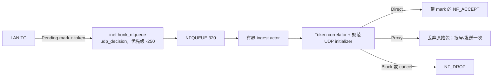

# NFQUEUE 持有首包的 UDP 路径

本文说明 fail-closed 路径：它持有语义尚不明确的 LAN 转发 UDP 原始包，直到用户空间得到 direct、proxy 或 block 终态决策。

## 启用与范围

该路径通过 `global.nfqueue_enable` 默认开启。设置为 `false` 可关闭：

```dae
global {
    nfqueue_enable: false
}
```

修改该设置必须重启进程；reload 会拒绝该变更。启动阶段 NFQUEUE 采用 best-effort：mock 模式、不带 `ebpf` 的构建、固定队列前置检查失败，或数据路径准入前的队列/规则/健康检查失败时记录 warning，仅在本进程关闭暂存且不改写配置文件。持久化 token generation 恢复失败仍为 fatal，因为分配器状态已无法确定。真实模式会先取得单实例锁，再执行该前置检查，因此正常交接会等待旧队列所有者，不会误降级；保留的 nftables table 会在绑定队列后由安装阶段回收。服务准入后，listener、queue、watchdog、verdict、cleanup 和 retirement 的失败仍为 fatal。进程级配置项见[全局配置参考](../reference/global.md)。

该 hook 的范围刻意保持狭窄：

| 流量或状态 | 行为 |
| --- | --- |
| 经过 LAN TC 后语义尚不明确的新 LAN 转发 UDP | 启用且 ready 时，暂存唯一 token 并在 NFQUEUE 中持有原始 skb |
| 主机发起的 WAN UDP | 保持规范 TPROXY 路径；主机 egress 不经过这个 `inet prerouting` hook |
| UDP 端口 `53` | 保持专用 DNS fast path；绝不暂存 |
| 内部/特殊或反向流量 | 绝不暂存 |
| `must` 或 `block` 路由结果 | 视为终态；绝不暂存 |
| 路由时已经确定安全的 direct 结果 | 走内核 direct 路径；绝不暂存 |
| 已启用但尚未 ready 时的暂存候选 | 丢弃新流；无关的非暂存 UDP 保持正常路径 |

“语义尚不明确”是指初步路由仍可能在用户空间路由、模式/组选择或域名/QUIC 检查后改变。该路径避免仅因初步结果不完整就靠猜测把数据包重定向到用户空间 relay。

## 持包机制



| 机制 | 当前契约 |
| --- | --- |
| 队列传输 | `honk-nfqueue` 使用原始 `NETLINK_NETFILTER`；不调用防火墙命令，也不使用 netfilter helper 库 |
| 队列参数 | 固定队列 `320`、内核 maxlen `4096`、packet-copy range `65535`，并请求 `8 MiB` 套接字接收缓冲区 |
| Verdict 所有权 | 不可 `Clone`、恰好一次的 `VerdictGuard`；未提交的 guard 在 drop 时发送 `NF_DROP` |
| Ingest 所有权 | 单 actor，队列上限为 `256` 项和 `8 MiB` payload；仅当 actor dequeue 时才尝试取得 UDP slow-path permit |
| nftables 所有权 | 单个原子事务独占精确的 `inet honk_nfqueue` / `udp_decision`，即优先级 `-250` 的 `inet prerouting` filter chain；只有携带 Pending 签名的 UDP 才进入队列 |
| 失败策略 | 不设置 queue bypass、fanout 或 fail-open flag。输入畸形或截断、`ENOBUFS`、listener 意外退出以及 verdict socket 失败均为 fatal |

服务先绑定队列 `320`，再发布 nftables 事务。安装阶段在单实例锁保护下回收残留的保留 table；最终有序关闭时，它会 drain 所有已分发 guard、关闭队列，并最后删除自有 table。同一网络命名空间的防火墙管理器不得在 honk 运行期间修改任一保留 nftables 对象。

## 决策 token 协议

`UDP_DECISION_SEQUENCE` 是 pinned、持久化的单槽 spin-lock allocator。其 legacy 值恰好是 12 字节：lock、`next` 中的完整 raw token，以及 `exhausted`。启动只验证该 ABI 和值，绝不重写。普通重启和清理会保留该 pin，因此回滚后的旧版程序可以从同一 raw-token 边界继续。

| bit 或字段 | 含义 |
| --- | --- |
| skb mark bit `31..30` | `CLASSIFIED_MARK | NFQUEUE_PENDING_MARK` = `0xc0000000`，即 nftables 规则选择的暂存签名 |
| Token mask | `NFQUEUE_TOKEN_MASK` = `0x3fffffff`；token 占用 mark 的其余 bit |
| Token bit `29..28` | 2 bit generation `0..=3` |
| Token bit `27..0` | generation 内单调递增的 28 bit sequence |

Token 表示所有权，而不只是相关性元数据。它必须在 skb mark、`CONN_STATE_MAP`、`ROUTING_HANDOFF_MAP`、`REDIRECT_TRACK`、用户空间 verdict cell、`UdpInitLease`、endpoint 或 retirement tombstone，以及后端终态转换之间一致。任何终态操作都不能只凭 tuple 身份执行。

## 终态转换

| 决策 | 有序转换 |
| --- | --- |
| Direct | 检查 token 的 `ArmDirect` → 按 FIFO 顺序为每个被持有的原始 skb 发出带 mark 的 `NF_ACCEPT` → 检查 token 的 `ActivateDirect` |
| Proxy | 提交 token-bound 最终出站和 mark → 把唯一保留的 payload 转移到规范 UDP initializer → 对原始包发出 `NF_DROP` → 拨号并发送一次 |
| Block | 提交 token-bound `Block` → 丢弃所有原始 skb → 以 kernel handoff 方式退役 initializer |
| Cancel 或过期 | 只 abort 匹配的 Pending incarnation → 丢弃所有原始 skb，并退役其 lease identity |

Direct 不创建用户空间 UDP 套接字、payload copy 或 replay、endpoint 或 `/connections` 条目。其最终 verdict mark 保留 classified 状态，并移除 Pending/token carrier。如果流的另一个包在 Arm 后到达，correlator 只追加其 verdict guard，丢弃 payload 和 slow permit，并在 activation 前返回 FIFO accept 循环。

Proxy 不会创建第二条路由路径。它复用普通透明 UDP 使用的同一个 `UdpInitLease` 和 `UdpEndpointPool` initializer。在拨号/发送前发布最终内核状态可以防止 reply race；只转移保留的 payload 并丢弃原始包，可确保只发送一次且没有 replay fallback。

## 截止时间与 fatal 策略

每个包只有一个绝对 3 秒截止时间，从 raw-netlink listener 收包时开始计算。Actor 延迟和每一次后端锁等待都消耗同一预算，包括 Direct Arm 与 Activate 之间的第二次取锁。队列、correlator、slow path 或截止时间饱和时都 fail closed 丢包，而不会延长所有权或内存增长。

Watchdog 独立检查被持有的 cell，并强制执行硬持有上限。Token、endpoint generation 或后端状态不匹配时会丢包，且不会修改更新的 incarnation。Verdict 失败或 Direct 已 Arm 后的任何失败都会使进程 fatal，因为用户空间已无法安全判断内核接受了哪些原始包。

## 栅栏与生命周期

### 重载与关闭

Reload 和 shutdown 共用同一 producer fence：

1. 发布 `DATAPATH_FLAG_NFQ_READY=false`。现在需要暂存的新流会 fail closed。
2. 翻转 `UDP_DECISION_EPOCH`，等待旧 per-CPU `UDP_DECISION_INFLIGHT` 槽归零，再移除残留的 `Preparing` 和 `Pending` conn state。之后延迟到达的 queue delivery 会因 token lookup 失败而终止。
3. 关闭 correlator admission；在改变 runtime 所有权前 drain 或 cancel verdict guard、initializer lease、scheduled token cleanup、endpoint tombstone 和 retirement work。
4. 成功 reload 会发布 replacement runtime generation，最后再重开 correlator admission 和 readiness。Shutdown 会 detach producer、关闭 queue 所有权，并最后删除 `inet honk_nfqueue`。

Listener、queue、watchdog、cleanup、verdict 或 retirement 生命周期中的失败或歧义均为 fatal；runtime 绝不会在所有权不确定时重新开放暂存。

### 精确 tuple 退役

Retirement 以 `BPF_NOEXIST` 插入 `UDP_DECISION_RETIRE_FENCE[tuple] = token`，因此并发的新 owner 无法替换该 fence。随后翻转 epoch，等待 pre-fence reader 退出，并重新验证 conn state、token、handoff 和 redirect track。只删除匹配的辅助项与 conn state；之后释放精确 fence。不匹配时保留更新的 tuple incarnation 并 fail closed。

## Sequence 耗尽与 generation 轮转

耗尽使用生命周期 fence，而不会重置仍存活的 allocator：

1. Fence readiness，quiesce 内核 stager，cancel 并 drain 用户空间 cell，再对固定队列执行 hard rebind，确保旧的被持有 skb 和 guard 无法跨越轮转存活。
2. 检查所有四个存活的 token-bearing map：`CONN_STATE_MAP`、`UDP_DECISION_RETIRE_FENCE`、`ROUTING_HANDOFF_MAP` 和 `REDIRECT_TRACK`。
3. 仅当候选 generation **以及数值上比它更高直至 `3` 的所有 generation** 都不存在于四张 map 中时才重置。从候选值开始的回滚 legacy allocator 恰好可以沿该 suffix 前进，因此只检查候选值会允许 token 重用。
4. 只有锁定 allocator 重置成功后，才重新开放 admission 和 readiness。

使用 batch lookup 时，短的成功 map batch 不能证明扫描完成；absence scan 会持续到终态 `ENOENT`。如果没有 rollback-safe suffix 可用，暂存保持 fenced，并按 `1`、`2`、`5`、`30` 秒重试，后续失败保持 `30` 秒。非暂存 UDP 继续运行；只有需要暂存的新流 fail closed。

## 容量上限

| Owner | 上限 |
| --- | --- |
| 内核 NFQUEUE | `4096` 个排队数据包 |
| 用户空间 ingest actor | `256` 项和 `8 MiB` 保留的排队 payload |
| Verdict correlator | `4096` 个存活 flow cell |
| 单个 flow cell | `64` 个被持有的 verdict guard，包括首包 |
| UDP slow path | 启动时有效预算上限为 `256`；仅在 actor dequeue 时获取 permit |

有效的 slow-path、endpoint、dial 和文件描述符预算来自进程启动时的 `RLIMIT_NOFILE` 规划，因此 `256` 是 ceiling，而不是保证可用的 permit 数。预算推导与所有权见[控制平面](./control-plane.md)。

## 可观测性

启用 API 后，`GET /stats` 会公开 `udp.nfqueue`（文档中的 dotted path `/stats.udp.nfqueue`）：listener/correlator 计数、actor 深度/字节数/最老 age、内核队列/drop/read 状态、held/peak guard 与实际接收缓冲区、终态 verdict 和 token 计数、verdict 错误，以及从收包到 verdict 成功的延迟。字段清单见 [API 参考](../reference/api.md)。

`EVENT_RINGBUF` 会发送受速率限制的 `udp_decision_token_exhausted` 警告，作为即时耗尽提示。恢复不依赖这个有损通道：supervisor 会定期锁定读取 `UDP_DECISION_SEQUENCE`，即使事件丢失也能发现耗尽；该 backstop 失败为 fatal。

## 相关文档

- [eBPF 数据路径](./datapath.md)
- [控制平面](./control-plane.md)
- [全局配置参考](../reference/global.md)
