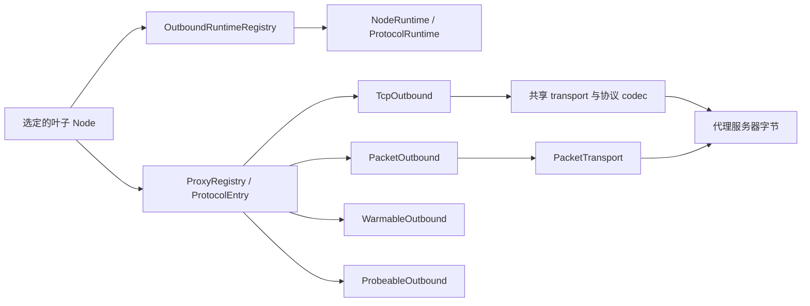

# 出站与代理栈

本文描述从选定叶节点到向代理服务器或目标端发送协议字节的路径。

## 范围

出站栈从路由和组选择产生一个叶子 `Node` 后开始。它负责 capability
分派、可复用协议状态、transport 建立、TLS 与 REALITY、代理 framing，
以及返回给控制面的 TCP 或 UDP 对象。

本文不定义节点配置面；见[节点参考](../reference/nodes.md)。本文也不
选择组成员或定义健康策略；见[组设计](./groups.md)。

普通调用方向外返回以下边界之一：

- `ProxyStream`：已经建立、绑定目标的 TCP 字节流；或
- `Arc<dyn PacketTransport>`：已经建立、面向一个 UDP 目标的分帧报文路径。

推测式 UDP 拨号先返回 `PreparedUdpTransport<T>`；其 commit 可能失败，且只返回已选中值的 `Arc<T>`，未选中的 preparation 在 drop 时回滚。来源共享的 VLESS 路径把类型化 `VlessXudpTransport` 提交给 core 所有的 source attachment，使同一 source scope 下的多个五元组共用 receiver。

`direct` 不使用代理协议而直接到达目标。`block` 终止请求。其他每个
handler 都把选定节点转换成其代理服务器能够理解的字节。

## 实现模块归属

公开的 `proxy::*`、`quic::*` 与 `quic_boring::*` import 路径保持支持；
实现拆为较小的普通 Rust 模块：

| 范围 | 实现模块 |
| --- | --- |
| Proxy 契约 | `proxy/{error,packet,outbound,registry}.rs` |
| 协议族 | `proxy/shadowsocks/{mod,aead2022,stream}.rs`；`proxy/vless/{mod,handler,mux,cool,encryption}.rs` |
| QUIC | `quic/{path_health,flow_control,metrics,endpoint,client,stream,boring}.rs` |
| AnyTLS | `proxy/anytls/{padding,writer,overflow}.rs` |
| Score 与健康 | `group/score/{evidence,ranking,feedback}.rs`；`alive/{health,urltest}.rs` |
| Session pool | `session/{maintenance,speculative}.rs` |

共享状态仍留在共同祖先中，子模块实现不会把字段公开。REALITY、TLS、
stream transport 与 UoT 仍由多个协议共用，不归 VLESS 独占。既有测试主题
名称在对应协议族内保留。物理文件/行号及定义模块 metadata 随归属变化；
公开 reexport 不会保留 `type_name` 或默认 tracing target。旧 `quic_boring`、
`vless_mux`、`shadowsocks_2022` 日志过滤目标应改为 `honk_outbound::` 前缀下的
`quic::boring`、`proxy::vless::mux`、`proxy::shadowsocks::aead2022`。

## Registry 与 capability 模型



`ProxyRegistry` 是协议分派器，不是 session 所有者。每个
`ProtocolEntry` 包含一个 `ProtocolDescriptor`、必需的 TCP handler，
以及可选的 packet、warm 与 probe capability 槽。`None` 槽表示协议
没有实现该 capability；分派会拒绝，而不是静默替换。

`src/proxy/mod.rs` 中，`ProxyStream::into_tcp_stream` 保持 zero-copy splice
downcast 不变量；`PreparedUdpTransport<T>` 以一次消费式 commit 隔离推测式
发布并返回精确选中的 `Arc<T>`；`WarmAttempt` 在建立期间持有 retention lock，
失败或取消只回滚自己插入的 bit。

### Capability trait

`WarmRequirement::Session|Udp` 选择要建立的可复用状态。VLESS 分别从 TCP
和 UDP path 解析两种 requirement；因此仅 UDP 的 Xray pool 不会被 Selector
预热打开。

| Trait | 操作 | 契约 |
| --- | --- | --- |
| `TcpOutbound` | `dial`、`dial_with_tcp`、`dial_runtime` | 打开绑定目标的 `ProxyStream`。`dial_with_tcp` 可以使用已经连接的裸服务器 socket。`dial_runtime` 把拥有 session 的工作固定到捕获的 generation。 |
| `PacketOutbound` | `dial_udp_transport`、`dial_udp_transport_runtime`、`dial_udp_transport_speculative_runtime` | 打开或准备普通 `PacketTransport` 契约。runtime 与 speculative 变体防止 reload 或冷竞速工作查询可变的当前状态。 |
| `WarmableOutbound` | `warm(runtime, timeout, WarmRequirement)` | 只建立 requirement 指定的可复用状态。Hysteria2 用 `Udp` 验证服务端准入；VLESS 可以把 `Session` 与 `Udp` 映射到不同 pool。 |
| `ProbeableOutbound` | `test_connectivity` | 测试原始代理服务器可达性。协议可以覆盖默认的带 mark TCP 连接。 |

`PacketTransport` 暴露 relay 目标、`send_packet`、
`send_packet_confirmed` 与 `recv_packet`。对于带队列的 tunnel，
`send_packet_confirmed` 是更强的首包准入点。full-cone 协议还可以声明
服务端 metadata 能够权威指定回包源地址。来源共享的 VLESS 在内部使用同一
framing transport，但由 core 串行化各 endpoint view 的发送并持有唯一 receive loop。

生产 UDP handler 不返回裸 socket 或 loopback bridge。Direct 与 SOCKS5
把 native socket 包装在 `PacketTransport` 后面；tunnel 协议在其真实
transport 上实现 framing。

### 协议 descriptor

`ProtocolDescriptor` 是唯一的逐协议事实表。predicate 接收具体节点，
因为 VLESS 的 `network` 与 TCP path、以及 Trojan transport 会影响 capability
或 pooling。Trojan 与 AnyTLS 共用 `network_allows_udp`；VLESS 使用规范的
`VlessConfig::udp_enabled()`。

| 协议 | `supports_udp` | `pool_ready_streams` | `pool_bare_tcp` | Generation runtime | 分享链接 scheme |
| --- | --- | --- | --- | --- | --- |
| Shadowsocks（含 2022） | 是 | 否 | 是 | `None` | `ss` |
| Trojan | `network` 缺省或包含 `udp` 时 | 仅 `tcp`/空 transport | 是 | `None` | `trojan` |
| VMess | 否 | 否 | 是 | `None` | `vmess` |
| VLESS | `network` 允许 UDP 时 | 否 | TCP path 为 direct 时 | `Vless` | `vless` |
| SOCKS5 | 是 | 是 | 是 | `None` | `socks5`、`socks4`、`socks4a` |
| Hysteria2 | 是 | 否 | 否 | `Quic` | `hysteria2`、`hysteria` |
| TUIC | 是 | 否 | 否 | `Quic` | `tuic` |
| Juicity | 是 | 否 | 否 | `Quic` | `juicity` |
| AnyTLS | `network` 缺省或包含 `udp` 时 | 否 | 否 | `AnyTls` | `anytls` |
| Direct | 是 | 否 | 是 | `None` | 无 |
| Block | 否 | 否 | 是 | `None` | 无 |

Ready-stream pooling 保存已经完成且绑定目标的握手。Bare-TCP pooling
只保存连接到代理服务器的 socket，再由 `dial_with_tcp` 执行逐目标协议握手。
TCP multiplex 与 QUIC 协议排除两者，因为 generation runtime 持有复用状态。
即使配置了独立的仅 UDP Xray pool，direct TCP 的 VLESS 仍可进入 bare pool。

Ready stream 按 runtime generation、节点身份和目标分别保存，只能由使用
拨号时所属 generation 的流取出。reload 发布新 generation 后，连接池在
同一把锁内移除旧 generation 的 ready stream、目标计数、预热任务记录和
目标访问计数，并拒绝旧 generation 后续的 ready 写入、访问计数更新和预热请求。
新 generation 的 ready 命名空间从空开始。reload 被拒绝时，保留当前连接池状态。
Bare-TCP 仍以代理服务器地址为键；节点失效时，清除该地址的 bare 连接，
但只清除当前 generation 中对应节点身份的 ready 连接。

Bare entry 只完成了到代理服务器的 TCP connect。复用前，pool 会拒绝任何
已经排队的入站字节，包括 fatal TLS alert；此时协议/TLS 建立尚未开始，任何
服务端字节都不可能有效。该 socket 不做 SNI/alert 特判，也不重试握手。Ready
entry 已完成绑定目标的协议握手，因此已缓冲的目标数据仍然有效，不构成 stale。

Registry 组装会检查 descriptor capability 与填充的槽是否一致。
依赖节点的 entry 即使默认节点没有 UDP，也可以携带 packet 槽。`block`
是显式例外：其 descriptor 声明没有 UDP capability，但分派允许其 packet
槽通过，使选定的 block 决策能够终结并拒绝该流。
关闭 UDP 的节点返回普通 capability 拒绝，允许继续配置中的冷候选回退。
显式目标策略拒绝仍是终态且不影响健康，不等同于缺少 UDP 支持。

### 协议与 UDP 清单

| Handler | TCP 行为 | `dial_udp_transport` |
| --- | --- | --- |
| `direct` | Native 带 mark 目标连接 | `PacketTransport` 后的 native 带 mark UDP |
| `block` | 拒绝 | 显式拒绝路径例外；不承载 UDP |
| `socks5` | SOCKS CONNECT | RFC 1928 UDP association；协商和认证、ASSOCIATE 请求和应答（含中继域名解析）各有五秒超时 |
| `ss` / Shadowsocks 2022 | Shadowsocks stream | Shadowsocks packet framing |
| `trojan` | 共享 transport 上的 Trojan stream | `network` 允许 UDP 时使用 Trojan UDP framing |
| `vmess` | VMess stream | 未实现 |
| `vless` | 由独立 multiplex policy 选择 direct、H2 或 Mux.Cool | `network` 允许 UDP 时可用；encoding 与可选 UDP multiplex 决定路径 |
| `hysteria2` | QUIC stream | Hysteria2 QUIC datagram |
| `anytls` | AnyTLS 逻辑 stream | UoT v2 逻辑 stream |
| `tuic` | TUIC v5 QUIC stream | QUIC datagram 或 uni-stream fallback |
| `juicity` | Juicity QUIC stream | 一条长度分帧 QUIC bi stream |

VMess 与 VLESS entry 只在 `rprx` feature 下编译。`honk-core` 与 `honk-tool`
默认 feature 集启用它。不带 `rprx` 时，这些节点形式仍能解析，但 registry
中没有对应 entry，拨号以普通的 `No handler for protocol` 拒绝。正常的
feature-off 构建不分配 VLESS runtime pool 或 carrier semaphore。单元测试
通过 `cfg(test)` 保留 backend 覆盖；feature 边界集成测试链接正常 library，
验证这两种构建的区别。

## Runtime 所有权与 reload

`OutboundRuntimeRegistry` 是控制面对一个不可变配置 generation 中可复用
出站状态的唯一所有者。它把 `Node.id` 映射到 `NodeRuntime`：

- 不可变的 `Arc<Node>` 配置；
- 节点相关的 `udp_capable` 结果；以及
- 由 descriptor 选择的一个 `ProtocolRuntime`。

`ProtocolRuntime` 可以是 `None`、AnyTLS 状态、`VlessRuntime` 或类型擦除的
QUIC client 槽。每个 VLESS 节点都持有 `VlessRuntime`；其中只创建配置选择的
H2/shared-Cool/separate-Cool pool，并保存 lazy private source-ID key。handler
对这些 generation 所有的资源保持无状态。

### Generation 生命周期

启动时先构建并校验完整 runtime registry，再发布。Reload 根据前一份
registry 构建 replacement。只有完整节点配置相等时 runtime 才能迁移，
比较时忽略解析期的 `created_at` 与 `updated_at` metadata。

迁移发生在 reload commit 点。旧 generation 只在 replacement 发布后
记录已经移出的 `Node.id`，随后在 drain 与 shutdown 时跳过这些 runtime。
因此，未变化节点保留：

- TUIC、Juicity 与 Hysteria2 QUIC client 和连接；
- AnyTLS 物理 session；以及
- 完整 VLESS runtime，包括 H2/Mux.Cool carrier 与 source-ID key。

退役 generation 首先对新工作变成 terminal。未迁移的 AnyTLS 与 VLESS
pool 进入 draining：不再接收新逻辑 stream，但现有 stream 保留 carrier
直到结束。QUIC flow 拥有连接 clone，因此 terminal generation 检查会
拒绝新工作，而当前 flow 自然完成。只有进程级 flow drain 之后，进程
shutdown 才强制关闭剩余 pool 与 QUIC client。

standalone probe 等无 generation 调用方使用 `EphemeralRuntimeGuard`。
AnyTLS 或 VLESS stream 与 packet transport 在整个生命周期内保留 guard。
正常完成可以等待 `close`；drop 也会启动确定性 teardown，因此一次性
pool 不会在调用方 abort 后残留。Single XUDP 也使用 VLESS runtime 生成
逐 source key，但其 private carrier 不进入可复用 session pool。

### 拨号准入

物理出站连接（包括 direct TCP 与代理 TCP/QUIC 尝试）及其协议握手获取两个 permit：

1. 捕获 generation 的配置拨号 gate；然后
2. 所有重叠 reload generation 共享、启动时固定的进程级 ceiling。

先获取 generation gate，防止低限额 generation 在等待时占住进程容量。
replacement 可以立即采用新的 generation 局部限额，而旧的进行中工作
继续占用共享进程 gate。已经热 session 上的逻辑 stream 不再执行物理拨号。

Session pool 的自主 replacement dial 只绑定已发布 owner 的 admission。reload
发布时原子地重新绑定迁移的 pool；迟到的 speculative commit 不能恢复前任
generation 的 gate。退役会立即清除已存 admission；未 commit 的
`PreparedUdpTransport` 不保留 generation 或进程级 dial-admission permit。

Pool waiter 在检查容量前注册容量变化通知。每个由 pool 持有的 stream permit
（包括 detached session 的首个 permit）释放时都会通知 waiter。carrier 发布会
唤醒所有符合条件的 waiter，避免不预留 stream 的 warm offer 消耗唯一通知，
导致仍有可用容量的 stream checkout 一直等待。
拨号发起者在启动 task 前订阅结果，并直接消费该次尝试的结果。即使已有 warm
session 可以承接普通 spread 拨号失败，已完成的本地拒绝仍保持终态。
Pool-owned task 在 poll 拨号前重新检查终态。进行中的普通拨号预留一个可复用
slot；并发的 detached commit 在该预留占满上限时进入 drain-only，保留已有 child。
解除 warm retention 时，多余的 live carrier 进入 Draining 后也会唤醒容量
waiter，无需等待这些 carrier 上已有的 child 结束。
maintenance 因 max-age 退役或清理已关闭 session 释放容量时，也会发布通知，
即使没有关闭 idle carrier 或执行 prewarm。
Backend 关闭或从 Active 进入 Draining 时会通知同一个所属 pool，包括 child
permit 仍持有时的 H2 driver 终止。Session 在发布或 detached attach 前绑定
pool 通知；手动清理已关闭 carrier 时也会广播容量变化。

VLESS 物理 carrier 还持有不可变进程级 VLESS-carrier gate 的一个 permit。
启动资源预算在计算 UDP endpoint 前先分出 `min(after_dials / 8, 8192)`；零值
保持为零。重载流量与 DNS runtime fork 共用同一个 gate。permit 随实际 carrier
I/O 经 provisional、active、draining 与 idle 状态一直保留到 task teardown，
因此权威描述符边界来自它，而不是各节点 pool cap 的总和。

## 共享 stream、socket 与 bootstrap 层

### Stream transport

`proxy/transport.rs` 由 Trojan、VMess 与 VLESS 共享。顺序固定：

```text
TCP -> optional TLS or REALITY -> optional WebSocket or gRPC -> protocol header
```

`maybe_tls_wrap_concrete` 保留 Vision 所需的具体 TCP/TLS 类型。存在
REALITY 参数时，它使用[有界认证建立过程](#服务端认证与指纹约束)，而不是普通 TLS。因此同一
共享路径为 Trojan、VMess 与 VLESS 提供一致的 TLS、REALITY、WS 与 gRPC
建立过程。

Trojan 冷连接和 pool 中取出的裸连接使用同一套完整 transport。
TLS 批量读取先返回已经读到的字节，再在下一次非空读取中报告后续的 I/O
错误，不会把该错误转换成 EOF。

gRPC transport 是手写的最小 gRPC-over-HTTP/2 client。opening HEADERS
frame 不设置 `END_STREAM`，TLS 请求使用 `:scheme: https`。DATA 携带 gRPC
长度前缀，以及 gun 风格服务端预期的 protobuf 单 bytes 字段 envelope。
gRPC over TLS 始终协商 `h2`，与指纹 profile 无关。有界 write queue 取得字节
所有权后才报告已接受长度；取消不能把这些字节归到后一次调用的 buffer。
只要 HTTP/2 正窗口能容纳一个 payload 字节及其 envelope，就允许推进。

### 带 mark socket 与名称解析

`util.rs` 集中创建出站 socket：

- `connect_marked` 先解析再连接 TCP，并设置 timeout、nodelay、
  keepalive 与可选 `SO_MARK`；
- `connect_outbound` 对代理服务器 TCP 应用 bypass mark；以及
- `udp_marked_bind` 与 `marked_udp_socket` 创建带 bypass mark 的 UDP socket。

控制面发起的所有非 loopback socket 都必须携带 `DAE_BYPASS_MARK`
（`0x100`）。否则 WAN egress 分类可能把 honk 自己的代理、DNS 或 probe
流量重定向回 `daens`，形成环路。只有在没有生产 datapath 的非特权
`EPERM` 环境中 mark 应用才是 best-effort；其他错误都会传播。

带 mark UDP socket 为 `SO_RCVBUF` 与 `SO_SNDBUF` 分别请求 8 MiB。Linux
可能 clamp，并以配置 sysctl 记账值的两倍报告；core 在启动时提高对应上限。

`bootstrap.rs` 避免代理主机名解析依赖 honk 自己拦截的 DNS 路径。节点
拨号点经 `connect_marked` 或 QUIC 建立调用 `bootstrap::resolve`，绝不
直接调用裸 `lookup_host`。配置的 bootstrap resolver 通过带 bypass mark
的 UDP/TCP 查询；失败时回退系统 resolver。`query_ech_config` 通过同一
raw 路径查询 DNS HTTPS 记录（`qtype 65`），并提取 SVCB `ech` 参数。

解析完成后，代理服务器 TCP 与共享 QUIC client 会稳定交错两种地址族，并且
最多同时竞速两个地址。首个地址立即开始；fallback 在 250 ms 后启动。首个
地址若更早失败会提前 fallback，但物理尝试之间仍至少间隔 10 ms。每个进行中
的地址尝试分别持有 generation 与进程级拨号 permit；达到配置上限时，fallback
必须等待先前尝试结束，因此
`max_concurrent_dials: 1` 会串行尝试地址。竞速始终位于已经选定的同一节点
内部：socket mark 与安全配置保持一致，QUIC 协议认证也只对胜出连接执行。

## TLS、指纹、ECH 与 pin

出站与 DNS transport 栈中的所有生产 TLS 都使用 BoringSSL。TCP 使用 `boring` 与
`tokio-boring`；QUIC 使用自定义 `quinn-proto` crypto backend。信任库由
`webpki-root-certs` 构建。显式 no-verify connector 用于配置的不安全模式
和 REALITY；后者以自己的握手后检查替代 PKI。

### 进程级 TLS profile

`tls_implementation = "utls"` 在进程范围启用唯一实现的 Chrome-oriented
模拟 profile。该 profile 配置：

- GREASE 与逐连接扩展乱序；
- 先 `X25519MLKEM768`、后 `X25519` 的 key share；
- Chrome-derived signature algorithm、curve、cipher 集与 ALPN；
- brotli 证书压缩；
- h2 ALPS 使用历史 `0x4469` codepoint；本次核对的
  [uTLS Chrome_133 profile](https://github.com/refraction-networking/utls/blob/aa6edf4b11af/u_parrots.go)
  使用 `0x44cd`；以及
- 没有真实 ECHConfigList 时的 ECH GREASE。

其他 `utls_imitate` 名称会告警并使用该 profile。
`tls_implementation = "tls"` 保持普通 BoringSSL ClientHello。两者都不承诺
完整浏览器身份；REALITY 还必须增加 ed25519 signature algorithm。

### ECH 与证书 pin

节点可以内联或通过文件提供静态 ECHConfigList。无效的显式配置会使
registry 构建失败。服务端 `ECH_REJECTED` 失败关闭；服务端提供的 retry
config 会记录日志，但不持久化。

只启用 ECH discovery 时，connector 在连接期通过 bootstrap 路径查询
DNS HTTPS 记录。正结果采用受限的记录 TTL，负结果缓存五分钟。discovery
是 best-effort 且失败开放：查询失败表示该连接不使用真实 ECH，而 Chrome
模式仍可发送 ECH GREASE。

`pinSHA256` 比较叶证书的 SHA-256 digest，并替代 PKI chain 校验与主机名
校验。无效 pin 失败关闭。TCP TLS 与 QUIC crypto backend 实现同一规则。

## REALITY client

REALITY 是只允许 TLS 1.3 的专用 BoringSSL 握手。workspace 中 patched
`boring-sys` 提供两个 client hook：

- `SSL_set1_client_x25519_private_key` 为独立 X25519 share 预置 honk 的
  临时私钥；以及
- `SSL_set_client_hello_fixup_cb` 在序列化 ClientHello 进入握手 transcript
  前重写它。

### ClientHello 认证

首次 ClientHello 先声明 `X25519MLKEM768`，再声明独立 `X25519`。即使 peer 协商
hybrid share，REALITY 认证仍刻意从预置的 classic X25519 私钥/share 派生。
fixup callback 把 32 字节 legacy `session_id` 槽清零，并计算：

```text
shared  = X25519(client_ephemeral_private, server_public_key)
authKey = HKDF-SHA256(shared, salt=clientRandom[0:20], info="REALITY")
nonce   = clientRandom[20:32]
plain   = [version: 1,3,3][reserved: 0][timestamp: u32 BE][shortId: 8]
session_id = AES-256-GCM(authKey).Seal(nonce, plain, AAD=zeroed ClientHello)
```

16 字节加密 plaintext 加 16 字节 GCM tag 恰好填满 session ID。空 short ID
是八个零字节；配置值必须是至多八字节的偶数长度 hex，并向右补零。解析或
fixup 失败会在发送未认证 ClientHello 前中止。callback 只 seal 一次；第二次
调用（包括 HRR 的第二条 ClientHello）会在复用 GCM key/nonce 前中止。因此
客户端不声称支持 HRR。

### 服务端认证与指纹约束

REALITY 以自有认证替代普通证书校验。peer leaf 必须是临时 ed25519 证书，
signature 必须精确等于：

```text
HMAC-SHA512(authKey, raw_ed25519_public_key)
```

不匹配、普通 mask-target 证书或其他认证失败都 fail-closed；客户端不会据此
归因唯一远端原因。不会回退 PKI，也不使用 session resumption。

共享 VLESS/Trojan/VMess transport 仅在首次 TLS 握手完成后收到非 ed25519
叶证书时，允许一次兼容尝试：关闭该连接，向同一 peer 地址新建带 bypass mark
的 TCP socket，并只通告 X25519。SNI、服务端公钥和 short ID 不变；SSL 状态、
client random 与临时密钥全部重新生成。新连接仍须通过同一 REALITY HMAC 认证，
之后才能发送代理头或应用数据。ed25519 HMAC 错误、缺失证书、TLS/IO 错误或
HRR 不触发兼容尝试；第二次尝试的任何失败都是最终失败。

该证书结果未经认证，不能证明服务端是旧版本：错误凭据或主动攻击者也可能
诱发 classical 尝试，但不能绕过其认证。不缓存 profile，不增加配置项。
两次尝试、配额等待及连接共享 `3 × connect_timeout` 的 setup deadline；
外层调用方的 deadline 可以更早到期。冷连接替换期间持有已关闭 socket 的
配额直到认证结束；传入或池化 socket 的替换必须申请新配额，不能借用同级
连接持有的 permit。直接调用底层 `reality_connect` helper 仍只尝试一次。

REALITY profile 在 Chrome-derived signature algorithm 列表前加入 ed25519，
使 BoringSSL 能以该叶证书公钥验证服务端 TLS CertificateVerify。这与本次核对的
uTLS Chrome_133 profile 不同；不承诺完整 Chrome identity 或特定 JA4 值。

target 缓冲限制取决于服务端版本，不是 honk 客户端统一的证书大小上限。
文档中的 sing-box 1.12 / MetaCubeX-uTLS 1.8.0 peer 使用
[8192 字节的 target TLS record 缓冲区](https://github.com/MetaCubeX/utls/blob/v1.8.0/reality.go)，
包含 record framing，并非只限制 DER 证书长度。本次核对的
[XTLS/REALITY 实现](https://github.com/XTLS/REALITY/blob/8cdf7bf9c7f0/tls.go)
使用 17 KiB 缓冲区；应按实际部署的服务端版本选择兼容 target。

## VLESS wire 契约

规范配置是 `honk-config/src/node/vless.rs` 中的 `VlessConfig`。UDP permission、
协议 packet encoding 与 multiplex 是三条独立轴：

| 轴 | 值 | 路径作用 |
| --- | --- | --- |
| `network` | 仅 TCP 或允许 UDP | 唯一 UDP capability gate；关闭 UDP 不会选择 encoding。 |
| `udp_encoding` | `auto`、`native`、`xudp`、`uot-v2` | 选择非 multiplex packet 协议。无 Vision 时，`auto` 在 53/443 使用 native command-UDP，其他情况使用 Single XUDP。 |
| `multiplex` | `off`、H2、Xray | 独立选择 direct/H2/Mux.Cool TCP 与 protocol/H2/Mux.Cool UDP path。只有 H2 持有其 padding flag。 |

Xray TCP concurrency 为零表示 8，负值关闭 TCP mux。XUDP concurrency 为零
跟随 TCP pool，负值让 UDP 回到协议 encoding，正值创建独立 UDP pool。正值
规范化为 `1..=128`。UDP/443 policy 缺省为 `allow`：使用配置的 UDP pool，
没有 pool 时使用协议 encoding。显式 `reject` 即使在两个 pool 都关闭时仍是
终态；`skip` 使用协议 encoding 而不是 pool。Vision 不隐式限制 443 端口。

客户端绝不探测另一条服务端 path、以其他 framing 重试或重放首个 UDP packet。
原生 VLESS 使用 u16 分帧的 connected command-UDP，不发送 UoT magic destination
或 setup preamble。发送范围为 1–8190 字节；收到的零长度 frame 是 datagram，
不是 EOF。writer 会确认 flush，取消后的歧义写入不会重放。

类型化 policy、size 与 carrier-capacity 拒绝都是 terminal local result，与拥塞
或 transport failure 分开；它们不降低健康或 Score。候选准入在提交协议状态前
检查 policy；DNS、health 与 CLI 调用方保留该拒绝，不选择 fallback，也不把
路径报告为不适用。

### H2MUX

`src/proxy/uot.rs` 与 `src/proxy/vless/mux.rs` 实现共享 UoT v2 framing 和
sing-box H2MUX。H2MUX 把物理 VLESS 请求发往 `sp.mux.sing-box.arpa:444`，
选择 backend `2`，然后在 carrier 上运行 HTTP/2。逻辑 stream 承载 TCP 或
native connected UDP；UDP 使用共享 UoT 长度 codec，而不是 loopback bridge。

可选 H2 padding 为每个方向最初 16 条 record 增加 sing-mux v1 随机 preface
与 record framing。每节点最多有两条可复用或拨号中的 H2 carrier，每条最多
并发 128 条 stream；draining carrier 可以与 replacement 重叠。这里的 128
是并发限制，不是 carrier 生命周期/open-count rollover。

HTTP/2 flow control 驱动 backpressure。GOAWAY 使 carrier 进入 draining 并
把新工作滚动到 replacement。driver failure 向 child 扩散；half-close、reset、
receive-window 释放与 lazy response error 仍按 stream 隔离。接收 credit 保持
每 stream 2 MiB；connection credit 仍可为每条已准入 stream 容纳一个最大
UoT response frame。

### Mux.Cool 与 XUDP

`src/proxy/vless/cool.rs` 及其 `codec`/`child` 模块实现 Xray mux command、
child TCP 与 XUDP record。一个有序 writer 串行化所有 child frame。每条
carrier 的有效并发为配置正值与 128 的较小值。Session ID 单调增长且不复用；
发出 ID 128 后 carrier 进入 draining，由 replacement 接纳新工作。不存在逐节点
两 carrier 上限；进程级 VLESS-carrier FD gate 才是权威边界。

接收 payload 共用每 carrier 8 MiB 预算。TCP delivery 为瞬时预算或队列压力
保留 100 ms，超时只 reset 停滞 child；UDP 仍在满载时丢包。池化 Mux.Cool
packet 保持 8 KiB 上限；Single XUDP 保持 7,526 字节上限。

### Source/session ownership and capacity

对于 Single XUDP 与 shared/separate Mux.Cool，`honk-core` 按 reused
`NodeRuntime` identity、规范化 client 地址、所选 UDP path 与 reply projection
（`ActualPeer` 或 `RewriteTo(original destination)`）索引 source owner。一个
owner 持有一条 XUDP session 与一条 receiver，多个规范五元组 endpoint entry
提供串行 send view。Single XUDP 每 scope 使用一个 private、未池化的
SID 0；Mux.Cool 为各 scope 分配不同 child SID，而这些 SID 可以共享物理 pool。

完整 `(client, destination)` endpoint map 继续权威持有 route、decision token
与逐 flow Score。Ready entry 的 reply 仅在 endpoint 属于该 source owner 时
投递。wrong owner、`Initializing` 或 `Retiring` entry 必须丢弃，绝不能重新分类
为 foreign。只有 `ActualPeer` scope 中不存在 key 时才可使用 foreign full-cone
reply；它更新 source transport accounting，但没有 flow Score owner。domain
route 使用 `RewriteTo(original)`，永远不会变成 foreign reply。

runtime 从该 scope lazy 生成 private keyed source-ID hash。复用 runtime 时替换
carrier 保持 ID；替换 runtime 或重启进程会生成新 key。这刻意保留 honk 的
per-source 行为，不等同于 Xray 的 source-only global identity，也不保证 NAT
无碰撞。迟到 callback 在动作前重新检查 source owner 与 endpoint token/generation；
歧义 send 不会自动重放。

作为对照，本次核对的 [Xray 实现](https://github.com/XTLS/Xray-core/blob/c412e77a9b712082ac9ebf27fa793951cb5a7d85/common/xudp/xudp.go)
默认在进程内生成随机 base key。跨客户端重启保留 `XRAY_XUDP_BASEKEY` 是显式
选项，不是 Xray 默认保证。Honk 没有持久化 base-key 选项，并额外区分 runtime、
path 与 reply projection。ID 字节稳定或 carrier 复用，都不保证远端 NAT 状态
能跨过期或服务端重启保留。

source owner 报告共享 DataUdp transport health。每个绑定 endpoint 保留自己的
Score reporter；匹配 reply 与共享 terminal outcome 分别结算这些 flow。foreign
reply 没有逐 flow Score。source 容量耗尽返回 `PacketRejection::Capacity`：对该
候选终结，但不影响 health 或 Score。

source 关闭准入时同时发布中立或失败的结算结果；即使 driver cleanup 抢先取得
reporter，统一的 endpoint Score 结算入口也使用该结果。未绑定的 view，以及
在 source 关闭前已经退役的 view，保留自己的局部结果；shutdown 仍保持中立。
最后一个已绑定 view 只在 pending attachment 也全部释放后才退休 source；
兄弟 view 退休时，已有 attachment 仍可完成 commit。

endpoint 在 packet 入队后有意退役时，会终结结果不明确的 source，但不重放 packet，
也不产生负向 transport health。后续 sender 与 receiver 保留相同的取消原因，
避免兄弟 flow 的发送将其重新解释为 carrier 故障。
发送开始、完成与退役意图共用 source-state 临界区；先记录匹配 sender 的意图，
再在同一临界区发布 endpoint 和 source-view 退役标志，之后发送或接收端才能
对取消原因进行分类。

Selector 与 UDP warm retention 独立解析：TCP 所选 pool 响应
`WarmRequirement::Session`，UDP 所选 pool 响应 `WarmRequirement::Udp`。因此
仅 UDP 的 Xray pool 可参加 UDP 预热，而 direct TCP 仍可使用 bare pool。现有
outbound maintenance pass 回收未被 retention 持有的 idle VLESS session；没有
VLESS 专用 timer。active、provisional、draining 与 idle carrier 都会持有进程
carrier permit，直至实际 I/O task teardown。
同步未变化的 retention 不会 drain 任一 pool；只有实际解除保留才会 drain
该 pool 的多余 carrier，已有子流仍可继续完成。
只有 Active carrier 计入可复用的 warm/standby 下限。携带活动子流的 Draining
carrier 独立保留，不能挤掉空闲 replacement；idle 回收和解除保留的删除过程
均对 pool 进行线性遍历。

文件描述符分区在进程启动时固定，并在 reload 与 DNS fork 间共享。启用 `rprx`
时，即使初始配置没有 VLESS 节点，也会在划分 UDP endpoint 定额前预留
`min(after_dials / 8, 8192)` 个 carrier slot；原生 VLESS UDP、UoT 与 Single XUDP
也使用此 gate。关闭 `rprx` 时不预留 carrier，相关余量保留给 UDP endpoint。
耗尽后立即返回 typed Capacity 拒绝，不排队等待。

| 生效 `nofile` | 不预留 carrier 时的 UDP endpoint 上限 | 预留后的上限 | 减少 |
| ---: | ---: | ---: | ---: |
| 1,024 | 50 | 44 | 12.00% |
| 4,096 | 216 | 189 | 12.50% |
| 65,536 | 4,588 | 4,015 | 12.49% |
| 1,048,576 | 8,192 | 8,192 | 0%（已达 endpoint 封顶） |

这些是按描述符推导的上限，并非预分配 endpoint 内存。Reload 不会重新划分或
扩大启动时的分区。

### Vision 与 VLESS Encryption

`xtls-rprx-vision` 通过 VLESS addon 携带。response header 在第一次 read 时
lazy strip，因为它可能与目标字节同时到达。Vision 移除 response padding。
没有 VLESS Encryption 时，它要求 raw TCP 搭配 TLS 1.3 或 REALITY。即使启用
Encryption，TCP multiplex 也始终非法；仅 UDP 的 Xray multiplex 合法。Vision
拒绝 native、UoT 与 H2 UDP path。基础 `xtls-rprx-vision` 默认允许经 Single
XUDP 访问 UDP/443，包括 `mux=off`；用户可通过路由规则阻断 QUIC。
输入拼写 `xtls-rprx-vision-udp443` 在身份派生与 runtime 复用判断前规范化为
基础 Vision。显式 Xray `reject` 仍是终态，`skip` 使用协议回退。
wire addon 始终是基础 Vision flow。

**当前限制：Vision 只实现下行。** Honk 移除 response padding 并处理下行 Direct
命令，但不为客户端上行添加 Vision padding，也不执行上行 Direct 切换。
即使收到下行 Direct，上行仍经过原有 outer stack；在 TLS/REALITY carrier 中
承载内层 TLS 时，上行仍有 TLS-in-TLS 开销。明文流量或没有 outer TLS 的
Encryption 组合不应称为双层 TLS。互通 echo 成功不代表具有 Xray 的上行整形、
隐蔽性或上传性能保证。

`src/proxy/vless/encryption.rs` 在 VLESS 请求前包装所选 transport。实现的协议
是 `mlkem768x25519plus`，wire mode 为 `native`、`xorpub` 与 `random`。它接受
X25519 或 ML-KEM-768 服务端 key，包括 chained relay key；新的 1-RTT 连接组合
ML-KEM-768 与 X25519，认证 record 使用选定 AEAD。可选 0-RTT cache 按规范化
节点 identity 建 key，并使被拒绝的 ticket path 失效。

Encryption 可以包装 direct 与 Xray/Mux.Cool path，包括受支持的 Vision 组合，
但不能使用 H2 或 UoT framing。Vision direct-copy response 只移除 AEAD read
layer；outer transport 与 random-XOR layer 保持不变，write 侧也保留既有 outer
stack。这不表示 encrypted Vision 会 cut over 到 raw socket。

## QUIC 栈

TUIC、Juicity 与 Hysteria2 使用 quinn 0.11。`quic.rs` 负责 transport
调优、带 mark endpoint、连接 single-flight、rotation、stream wrapper
与共享分片支持。协议 handler 把节点设置转换成 `QuicClientOptions`；
共享层不读取协议特有字段。

### BoringSSL crypto backend

`src/quic/boring.rs` 在 BoringSSL QUIC callback 上实现 client 侧
`quinn_proto::crypto::Session`。它提供：

- TLS 1.3 握手字节与 traffic-secret 交付；
- RFC 9001 initial、handshake 与 1-RTT packet key；
- AES-GCM 与 ChaCha20-Poly1305 packet protection；
- AES 或 ChaCha20 header protection；
- key update 与 Retry integrity；以及
- QUIC transport-parameter 交换。

Header protection 感知 packet-number 长度。接收时先 unmask 第一字节，
再推导一到四字节的 packet-number 长度；仅 mask 或 unmask 这么多字节。
把所有 packet number 当作四字节，会破坏短 packet number 后面的 payload。

进程级、有界 `SESSION_TICKETS` cache 按服务端身份保存 BoringSSL TLS 1.3
session。BoringSSL resumption 要求显式 `SSL_set_session`。`pinSHA256`
节点绝不 resume，因为 PSK 握手会绕过证书 pin。被拒绝的缓存 session 会
被淘汰，同时不会删除并发连接写入的更新 ticket。

该 backend 可以承载真实 ECH 与 Chrome QUIC ClientHello。代理出站不向
quinn 暴露 early packet key，因此不会发送 0-RTT early payload；互通
检查中，受支持的官方 TUIC、Juicity 或 Hysteria2 服务端也都未接受这类
early data。

### 共享 client 所有权

每个 generation 所有的 QUIC runtime 有一个类型擦除的协议 client 槽。
`QuicClient` 对连接构建 single-flight，因此并发的首次拨号共享一次握手。
它最多保留一条可复用 active 连接。

Rotation 天然重叠：每个 flow 拥有自己的 `(Connection, protocol state)`
pair。当 holder 替换已关闭或失效连接时，新工作使用 replacement，而现有
flow 可以在旧 clone 上完成。移除最后一份 warm 所有权只会移除未来复用，
不会切断 active flow。
按地址族保存的自适应收发 floor 与 cooldown 属于 runtime，而不是可选的
client 槽，因此 warm 释放、重建与 speculative client 会复用同一份已学习路径画像。

每条池化 QUIC connection 每秒采样一次 Quinn path 与 UDP I/O counter，汇总到
`/stats` 的 `quic` 字段；临时 URL/健康探测连接明确排除。
同一份采样也驱动按地址族保存的流控画像。收发方向使用 10 秒 goodput EWMA；
只有 SRTT >= 80 ms 且连续三个样本确认高 BDP，才会把 connection 接收或发送
floor 提高到约 `2 x BDP`。peer 发来的 `STREAM_DATA_BLOCKED` 会独立地把 stream
接收 floor 加倍；connection 聚合 goodput 无法安全判断某一条 stream 的需求。
每个 floor 独立执行五分钟升档冷却，最大 32 MiB，不自动缩小，并且无需重连即可
更新当前 connection 与后续 stream。零进度样本只有在对应 connection credit
仍受压时才会保留尚未完成的升档 streak。
endpoint 的单次发送截止时间为 `clamp(4 × SRTT, 1 s, 5 s)`。连续三次发送
超时，或超过 `max(8 × SRTT, 10 s)` 没有新的 QUIC packet 被确认，endpoint 会被退役
并关闭该 connection，让下一条 flow 重新拨号。发送成功会重置超时 streak；确认进度
会同时重置两个时钟；已尝试的 UDP 报文绝不重放。TUIC 还启用 Quinn
PING keepalive，包括无法发送协议 heartbeat datagram 的 UDP-over-stream
fallback。

### 协议契约

| 协议 | 认证与 TCP | UDP | Transport 策略 |
| --- | --- | --- | --- |
| TUIC v5 | uni stream 上的 TLS-exporter 认证；每个 flow 一条 TCP bi stream | QUIC datagram、分片，以及没有 datagram 时的 uni-stream fallback | 10 秒 heartbeat；默认 8 MiB stream 与 8 MiB connection 接收窗口，可由节点覆盖 |
| Juicity | ALPN `h3`；TLS-exporter 认证；bi-stream header `[network][trojanc metadata]` | 一条含 `[metadata][u16 length][payload]` record 的 bi stream | 默认 BBR；8 MiB stream 与 8 MiB connection 接收窗口 |
| Hysteria2 | ALPN `h3`；最小 HTTP/3/QPACK `POST https://hysteria/auth`，成功状态 `233` | Native Hysteria2 QUIC datagram 与分片 | 设置上传 Mbps 时使用 Brutal 定速发送端，否则 BBR；接收带宽按 bytes/s 写入 `Hysteria-CC-RX`；同样默认 8/8 MiB 接收窗口 |

Go `juicity-server` v0.4.3 有实现层面的 UDP relay 限制：它申请的 1,500 字节
buffer 被池扩展为 2,048 字节，服务端会截断更大的分帧数据包。互操作实测
8,192 字节 payload 只返回 2,048 字节，而 2,048 字节回显正常。这不是 Juicity
线协议限制，因此 honk 不会对其他服务端任意施加 2,048 字节上限。

Hysteria2 HTTP/3 层刻意保持本地且最小：control/QPACK uni stream、静态表
QPACK，以及认证所需的 HEADERS 处理。它不得宣告
`SETTINGS_H3_DATAGRAM`；否则会启动一个竞争的 quic-go datagram reader，
可能吞掉 Hysteria2 UDP packet。

Hysteria2 沿用 sing-quic 的 lazy TCP 建立方式：首写合并 request 与 payload，首读移除 response，从而节省一次 RTT。

Salamander obfuscation 在每个 wire datagram 前加 8 字节随机 salt，并用
重复的 `BLAKE2b-256(password || salt)` 与 payload 做 XOR。client 端口
跳跃从第一次发送起就选择配置的目标端口。服务端必须把该端口范围 DNAT
到 listener。接收 metadata 把回包源端口重写为 nominal remote 端口，
使 QUIC 只看到一个稳定 peer。

## AnyTLS session 引擎

AnyTLS handler 无状态。每个 generation 的 `NodeRuntime::AnyTls` 拥有一个
`SessionPool<AnyTlsSession>` 与 lazy materialize 的 BoringSSL connector。
无 generation 调用使用带 guard 的 ephemeral 等价物。

### Pool 与 session 生命周期

通用 `SessionPool` 强制 `Active`、`Draining` 与 `Closed` 状态、atomic
stream permit、event-driven capacity wait、least-loaded 选择与 pool 所有的
物理拨号 single-flight。Draining session 不计入可复用 cap，并可在存活
stream 完成期间与 replacement 重叠。
初始化 waiter 接收同一个 `SharedError`；它通过 `Arc` clone 原始
`anyhow::Error` 并保留 source chain。pool 在广播 builder failure 前绝不会
把它压平成 display 文本。

AnyTLS 配置两条可复用物理 session，每条 128 个 stream。它会 spread：
第一条 session 变忙后，pool 会先建立第二条，再增加复用负载，随后按
least-loaded 调度。连续拨号失败使用有界 backoff，而不是让每条代理 flow
各执行一次物理连接。

协商 v2 server settings 后，每个复用逻辑 stream（SID 2 及以后）的 SYN 写出后
即加入按 SID 跟踪的 pending 集合，SYNACK 只结清自己的 SID——无关 stream 的应答
不会清除其他 stream 的 deadline，本地拆流同样取消对应定时器。SYN 写出三秒后
仍 pending 的 open，若窗口内 session 仍有入站帧（服务端活着只是未应答该开流）
则只重置该 stream；窗口内完全静默才退役物理 session，让 pool 重新拨号而不是
继续复用已死 carrier。

Session 在 30 分钟时按每 session jitter 进入 age-based drain。配置的
`min_idle` floor 与 idle timeout 输入同一个节点局部 janitor。Selector 或
UDP warm 所有权分别提高有效保留值；最后一个所有者释放时只排干未来复用，
不终止存活 stream。

### 有序 write 路径

所有 frame 都通过一个 `WriterQueue` 与一个物理 writer task。Data 使用两种单位的有界
permit：每个 session 896 个 frame 与 8 MiB 已排队或在途的 payload，先满者生效，预算
用尽时写入的 stream 被反压；control frame 保留 queue headroom，整个 queue 封顶
1,024 条命令。1,024 条命令的 queue 耗尽或关闭后再 push 时 session 会转为 terminal，
而不会继续增长内存。

限制排队 payload 的是字节预算：一个 frame 最多 65,535 字节，只按 frame 计数时一个
session 可以排队 56 MiB，线速上传会把它填满。预算不计 stream 尚未入队的 slot、取得
permit 之前的 UoT 包与编码后的 batch 缓冲。relay 每次最多读 65,535 字节，一次非空读
最多对应一个 AnyTLS frame；原先读 64 KiB 会变成一个 65,535 字节的 frame 加一个
1 字节的 frame。stream 的 SYN 与
第一个 PSH 作为一个 atomic batch 插入，因此其他 stream 不能插入两者之间。

完成一次 blocking pop 后，writer 只 gather 已经排队的 frame，最多 63
frame 或 256 KiB（均不含首帧），再执行一次 `write_all` 与一次 `flush`。它绝不等待
凑满 batch。只有物理 batch 成功或 session 变为 terminal 后，才释放 data
permit 与 confirmed-write completion。

`AnyTlsStream::poll_write` 通过自有 outbound slot 保证 cancellation-safe。
只有恰好这 `n` 字节进入有序 queue 后才返回 `Ok(n)`；取消既不会丢失
pending chunk，也不会重复入队。

### 非阻塞 demultiplex

每个 TCP child 都有有界 delivery queue。队列满时，demultiplexer 把
frame 按 SID 有序停放到 overflow，而不是等待，从而保持 sibling 进度与
精确 frame/byte 计数。

第一个 parked frame 启动每 250 ms tick
一次的 watchdog。只有整整 3 秒没有成功 overflow flush 的 stream 才被
reset；仅存在 queued byte 不是 stall 证据。

Emergency hard limit 为每 session 768 个 parked frame；retained payload
字节数由下文的 pool-wide budget 单独约束。如果某 stream 已超过 3 秒 grace，
admission 立即 reap 它。否则 demultiplexer 以有界
100 ms `OVERFLOW_EMERGENCY_WAIT` 轮次等待，并缩短到最近的 grace 到期时间，
在 reader progress 后重新判断。

同一节点 pool 中所有 current 与 draining session 对 TCP 与 UoT retained
payload 分别使用 12 MiB 的 pool-wide byte budget，aggregate ceiling 为
24 MiB。将 drop-on-full UoT class 分开，可防止 stalled datagram consumer
阻塞 TCP recovery。TCP budget 覆盖主 delivery queue 与 overflow；达到上限后
同样按 100 ms 轮次等待。当最旧的 TCP retained payload 已完整 3 秒没有
application-read progress 时，只 reset 该 stream 并丢弃其 retained payload。
reader 持续推进会重新开始 grace。

这样，一个被放弃的主队列不会占死 pool 中所有 sibling session。

FIN 与 error event 绕过 data-frame quota，使 termination 不会被满队列
隐藏，但每个 SID 最多停放两个 terminal event。普通 overflow reap 会在 reset
前排空已经 admitted 的 data；pool-budget recovery 是 fail-safe 例外，只丢弃
stalled stream 自己 retained 的 payload。session failure 变成
`ConnectionAborted`；逐 stream 拒绝或 slow-consumer reap 变成
`ConnectionReset`。

非空的服务端 ALERT 会使 session 失败；空 ALERT 仍被忽略。
ALERT 与 SYNACK 诊断文本在有损 UTF-8 解码前最多保留 1 KiB 源字节，
并标记截断，限制每个 deferred error 的大小。
TCP stream 在交付终止读取结果时释放容量 permit，包括先交付缓冲数据、
再交付 deferred error 的路径；drop stream 也会释放 permit。

UoT delivery 使用非阻塞 `try_send`。UoT sink 满时会移除该 sink 并退役
对应 SID，而不是阻塞 session demux，或丢弃任意 chunk 后继续使用已经
损坏的长度分隔字节流。

### Lazy UoT 创建

打开 AnyTLS UDP transport 会预留 stream，但延后其 UoT connect request。
connect request 与第一条编码后 datagram 作为一个有序 PSH 一起发送。payload
上限为 16 KiB，与 anytls-go 0.0.13 及 sing v0.5.1 的 relay buffer 一致；
更大的输入会在消耗 lazy setup 或破坏逻辑 stream 之前失败。这样既避免原本
空的 setup round trip，也不允许首包重放。

## 冷 URLTest speculative preparation

冷 URLTest 是唯一会准备多个叶子的选择路径。选择策略与 stagger 规则见
[组设计](./groups.md)；出站层只保证 preparation 的副作用安全。

Session pool 会原子返回已有共享 session 上的 permit，或一个计入 pool cap、
由调用方所有的 provisional 物理拨号槽。detached AnyTLS 或 VLESS mux
session 在 winner commit 前保持在可复用 pool 外。drop loser 会移除其
受 generation 保护的槽，并同步关闭 attached session。

QUIC candidate 构建 detached client。Loser 会被 force-close。Winner
commit 仅在 generation 槽仍为空时发布其 client。如果普通流量已经填充
该槽，则保留 incumbent；winning flow 继续使用它已经拥有的 detached
connection 与 protocol-state clone。

Promotion 在暴露 `PacketTransport` 前完成。Commit failure 失败关闭并
drop transport。QUIC 槽仲裁在修改槽后不再 await，因此 cancellation
不可能留下已经发布但未 commit 的 winner。

## 相关文档

- [组设计](./groups.md)
- [控制面设计](./control-plane.md)
- [节点参考](../reference/nodes.md)
