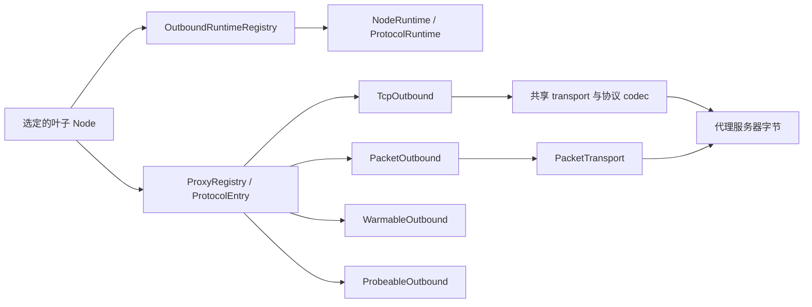

# 出站与代理栈

本文描述从选定叶节点到向代理服务器或目标端发送协议字节的路径。

## 范围

出站栈从路由和组选择产生一个叶子 `Node` 后开始。它负责 capability
分派、可复用协议状态、transport 建立、TLS 与 REALITY、代理 framing，
以及返回给控制面的 TCP 或 UDP 对象。

本文不定义节点配置面；见[节点参考](../reference/nodes.md)。本文也不
选择组成员或定义健康策略；见[组设计](./groups.md)。

返回给调用方的边界是以下之一：

- `ProxyStream`：已经建立、绑定目标的 TCP 字节流；或
- `Arc<dyn PacketTransport>`：已经建立、面向一个 UDP 目标的分帧报文路径。

`direct` 不使用代理协议而直接到达目标。`block` 终止请求。其他每个
handler 都把选定节点转换成其代理服务器能够理解的字节。

## Registry 与 capability 模型



`ProxyRegistry` 是协议分派器，不是 session 所有者。每个
`ProtocolEntry` 包含一个 `ProtocolDescriptor`、必需的 TCP handler，
以及可选的 packet、warm 与 probe capability 槽。`None` 槽表示协议
没有实现该 capability；分派会拒绝，而不是静默替换。

### Capability trait

| Trait | 操作 | 契约 |
| --- | --- | --- |
| `TcpOutbound` | `dial`、`dial_with_tcp`、`dial_runtime` | 打开绑定目标的 `ProxyStream`。`dial_with_tcp` 可以使用已经连接的裸服务器 socket。`dial_runtime` 把拥有 session 的工作固定到捕获的 generation。 |
| `PacketOutbound` | `dial_udp_transport`、`dial_udp_transport_runtime`、`dial_udp_transport_speculative_runtime` | 打开唯一的生产 UDP 契约 `PacketTransport`。runtime 与 speculative 变体防止 reload 或冷竞速工作查询可变的当前状态。 |
| `WarmableOutbound` | `warm(runtime, timeout, WarmRequirement)` | 为 `WarmRequirement::Session` 或 `WarmRequirement::Udp` 建立可复用状态。只有 Hysteria2 区分 `Udp`，以验证服务端是否允许 UDP。 |
| `ProbeableOutbound` | `test_connectivity` | 测试原始代理服务器可达性。协议可以覆盖默认的带 mark TCP 连接。 |

`PacketTransport` 暴露 relay 目标、`send_packet`、
`send_packet_confirmed` 与 `recv_packet`。对于带队列的 tunnel，
`send_packet_confirmed` 是更强的首包准入点。full-cone 协议还可以声明
服务端 metadata 能够权威指定回包源地址。

生产 UDP handler 不返回裸 socket 或 loopback bridge。Direct 与 SOCKS5
把 native socket 包装在 `PacketTransport` 后面；tunnel 协议在其真实
transport 上实现 framing。

### 协议 descriptor

`ProtocolDescriptor` 是唯一的逐协议事实表。predicate 接收具体节点，
因为 VLESS mode、`network` 与 Trojan transport 会影响 capability 或 pooling。

| 协议 | `supports_udp` | `pool_ready_streams` | `pool_bare_tcp` | Generation runtime | 分享链接 scheme |
| --- | --- | --- | --- | --- | --- |
| Shadowsocks（含 2022） | 是 | 否 | 是 | `None` | `ss` |
| Trojan | `network` 缺省或包含 `udp` 时 | 仅 `tcp`/空 transport | 是 | `None` | `trojan` |
| VMess | 否 | 否 | 是 | `None` | `vmess` |
| VLESS | 非 `legacy` mode 且 `network` 允许 UDP | 否 | 仅 `legacy`、`uot-v2`、`xudp` | 按 mode 为 H2MUX、Mux.Cool 或 `None` | `vless` |
| SOCKS5 | 是 | 是 | 是 | `None` | `socks5`、`socks4`、`socks4a` |
| Hysteria2 | 是 | 否 | 否 | `Quic` | `hysteria2`、`hysteria` |
| TUIC | 是 | 否 | 否 | `Quic` | `tuic` |
| Juicity | 是 | 否 | 否 | `Quic` | `juicity` |
| AnyTLS | `network` 缺省或包含 `udp` 时 | 否 | 否 | `AnyTls` | `anytls` |
| Direct | 是 | 否 | 是 | `None` | 无 |
| Block | 否 | 否 | 是 | `None` | 无 |

Ready-stream pooling 保存已经完成且绑定目标的握手。Bare-TCP pooling
只保存连接到代理服务器的 socket，再由 `dial_with_tcp` 执行逐目标协议握手。
多路复用与 QUIC 协议排除两者，因为其 generation runtime 是可复用状态的
唯一所有者。

Registry 组装会检查 descriptor capability 与填充的槽是否一致。
依赖节点的 entry 即使默认节点没有 UDP，也可以携带 packet 槽。`block`
是显式例外：其 descriptor 声明没有 UDP capability，但分派允许其 packet
槽通过，使选定的 block 决策能够终结并拒绝该流。

### 协议与 UDP 清单

| Handler | TCP 行为 | `dial_udp_transport` |
| --- | --- | --- |
| `direct` | Native 带 mark 目标连接 | `PacketTransport` 后的 native 带 mark UDP |
| `block` | 拒绝 | 显式拒绝路径例外；不承载 UDP |
| `socks5` | SOCKS CONNECT | RFC 1928 UDP association |
| `ss` / Shadowsocks 2022 | Shadowsocks stream | Shadowsocks packet framing |
| `trojan` | 共享 transport 上的 Trojan stream | `network` 允许 UDP 时使用 Trojan UDP framing |
| `vmess` | VMess stream | 未实现 |
| `vless` | 取决于 mode | 仅当 `vless_mode != legacy` 且 `network` 允许 UDP 时可用 |
| `hysteria2` | QUIC stream | Hysteria2 QUIC datagram |
| `anytls` | AnyTLS 逻辑 stream | UoT v2 逻辑 stream |
| `tuic` | TUIC v5 QUIC stream | QUIC datagram 或 uni-stream fallback |
| `juicity` | Juicity QUIC stream | 一条长度分帧 QUIC bi stream |

VMess 与 VLESS entry 只在 `rprx` feature 下编译。`honk-core` 默认
feature 集启用它。不带 `rprx` 时，这些节点形式仍能解析，但 registry
中没有对应 entry，拨号以普通的 `No handler for protocol` 拒绝。

## Runtime 所有权与 reload

`OutboundRuntimeRegistry` 是控制面对一个不可变配置 generation 中可复用
出站状态的唯一所有者。它把 `Node.id` 映射到 `NodeRuntime`：

- 不可变的 `Arc<Node>` 配置；
- 节点相关的 `udp_capable` 结果；以及
- 由 descriptor 选择的一个 `ProtocolRuntime`。

`ProtocolRuntime` 可以是 `None`、AnyTLS `SessionPool`、VLESS H2MUX 或
Mux.Cool `SessionPool`，或一个类型擦除的 QUIC client 槽。对于 generation
所有的 session，handler 保持无状态。

### Generation 生命周期

启动时先构建并校验完整 runtime registry，再发布。Reload 根据前一份
registry 构建 replacement。只有完整节点配置相等时 runtime 才能迁移，
比较时忽略解析期的 `created_at` 与 `updated_at` metadata。

迁移发生在 reload commit 点。旧 generation 只在 replacement 发布后
记录已经移出的 `Node.id`，随后在 drain 与 shutdown 时跳过这些 runtime。
因此，未变化节点保留：

- TUIC、Juicity 与 Hysteria2 QUIC client 和连接；
- AnyTLS 物理 session；
- VLESS H2MUX carrier；以及
- VLESS Mux.Cool carrier。

退役 generation 首先对新工作变成 terminal。未迁移的 AnyTLS 与 VLESS
pool 进入 draining：不再接收新逻辑 stream，但现有 stream 保留 carrier
直到结束。QUIC flow 拥有连接 clone，因此 terminal generation 检查会
拒绝新工作，而当前 flow 自然完成。只有进程级 flow drain 之后，进程
shutdown 才强制关闭剩余 pool 与 QUIC client。

standalone probe 等无 generation 调用方使用 `EphemeralRuntimeGuard`。
AnyTLS 或 VLESS stream 与 packet transport 在整个生命周期内保留 guard。
正常完成可以等待 `close`；drop 也会启动确定性 teardown，因此一次性
pool 不会在调用方 abort 后残留。Single XUDP 没有 generation runtime。

### 拨号准入

物理出站连接（包括 direct TCP 与代理 TCP/QUIC 尝试）及其协议握手获取两个 permit：

1. 捕获 generation 的配置拨号 gate；然后
2. 所有重叠 reload generation 共享、启动时固定的进程级 ceiling。

先获取 generation gate，防止低限额 generation 在等待时占住进程容量。
replacement 可以立即采用新的 generation 局部限额，而旧的进行中工作
继续占用共享进程 gate。已经热 session 上的逻辑 stream 不再执行物理拨号。

## 共享 stream、socket 与 bootstrap 层

### Stream transport

`proxy/transport.rs` 由 Trojan、VMess 与 VLESS 共享。顺序固定：

```text
TCP -> optional TLS or REALITY -> optional WebSocket or gRPC -> protocol header
```

`maybe_tls_wrap_concrete` 保留 Vision 所需的具体 TCP/TLS 类型。存在
REALITY 参数时，它分派到 `reality_connect`，而不是普通 TLS。因此同一
共享路径为 Trojan、VMess 与 VLESS 提供一致的 TLS、REALITY、WS 与 gRPC
建立过程。

gRPC transport 是手写的最小 gRPC-over-HTTP/2 client。opening HEADERS
frame 不设置 `END_STREAM`，TLS 请求使用 `:scheme: https`。DATA 携带 gRPC
长度前缀，以及 gun 风格服务端预期的 protobuf 单 bytes 字段 envelope。

### 带 mark socket 与名称解析

`util.rs` 集中创建出站 socket：

- `connect_marked` 先解析再连接 TCP，并设置 timeout、nodelay、
  keepalive 与可选 `SO_MARK`；
- `connect_outbound` 对代理服务器 TCP 应用 bypass mark；以及
- `udp_marked_bind` 与 `marked_udp_socket` 创建带 bypass mark 的 UDP socket。

控制面发起的所有非 loopback socket 都必须携带 `DAE_BYPASS_MARK`
（`0x100`）。否则 WAN egress 分类可能把 honk 自己的代理、DNS 或 probe
流量重定向回 `daens`，形成环路。只有在没有生产 datapath 的非特权
`EPERM` 环境中 mark 应用才是 best-effort；其他错误都会传播。

带 mark UDP socket 为 `SO_RCVBUF` 与 `SO_SNDBUF` 分别请求 8 MiB。Linux
可能 clamp，并以配置 sysctl 记账值的两倍报告；core 在启动时提高对应上限。

`bootstrap.rs` 避免代理主机名解析依赖 honk 自己拦截的 DNS 路径。节点
拨号点经 `connect_marked` 或 QUIC 建立调用 `bootstrap::resolve`，绝不
直接调用裸 `lookup_host`。配置的 bootstrap resolver 通过带 bypass mark
的 UDP/TCP 查询；失败时回退系统 resolver。`query_ech_config` 通过同一
raw 路径查询 DNS HTTPS 记录（`qtype 65`），并提取 SVCB `ech` 参数。

解析完成后，代理服务器 TCP 与共享 QUIC client 会稳定交错两种地址族，并且
最多同时竞速两个地址。首个地址立即开始；fallback 在 250 ms 后启动。首个
地址若更早失败会提前 fallback，但物理尝试之间仍至少间隔 10 ms。每个进行中
的地址尝试分别持有 generation 与进程级拨号 permit；达到配置上限时，fallback
必须等待先前尝试结束，因此
`max_concurrent_dials: 1` 会串行尝试地址。竞速始终位于已经选定的同一节点
内部：socket mark 与安全配置保持一致，QUIC 协议认证也只对胜出连接执行。

## TLS、指纹、ECH 与 pin

出站与 DNS transport 栈中的所有生产 TLS 都使用 BoringSSL。TCP 使用 `boring` 与
`tokio-boring`；QUIC 使用自定义 `quinn-proto` crypto backend。信任库由
`webpki-root-certs` 构建。显式 no-verify connector 用于配置的不安全模式
和 REALITY；后者以自己的握手后检查替代 PKI。

### 进程级 TLS profile

`tls_implementation = "utls"` 在进程范围启用唯一已实现的模拟 profile：
Chrome。该 profile 配置：

- GREASE 与逐连接扩展乱序；
- 先 `X25519MLKEM768`、后 `X25519` 的 key share；
- Chrome signature algorithm、curve、cipher 集与 ALPN；
- brotli 证书压缩；
- h2 ALPS，固定使用 Chrome 的旧 `0x4469` codepoint，而不是 BoringSSL
  较新的 `0x44cd`；以及
- 没有真实 ECHConfigList 时的 ECH GREASE。

其他 `utls_imitate` 名称会告警并使用 Chrome。
`tls_implementation = "tls"` 保持普通 BoringSSL ClientHello。

### ECH 与证书 pin

节点可以内联或通过文件提供静态 ECHConfigList。无效的显式配置会使
registry 构建失败。服务端 `ECH_REJECTED` 失败关闭；服务端提供的 retry
config 会记录日志，但不持久化。

只启用 ECH discovery 时，connector 在连接期通过 bootstrap 路径查询
DNS HTTPS 记录。正结果采用受限的记录 TTL，负结果缓存五分钟。discovery
是 best-effort 且失败开放：查询失败表示该连接不使用真实 ECH，而 Chrome
模式仍可发送 ECH GREASE。

`pinSHA256` 比较叶证书的 SHA-256 digest，并替代 PKI chain 校验与主机名
校验。无效 pin 失败关闭。TCP TLS 与 QUIC crypto backend 实现同一规则。

## REALITY client

REALITY 是专用 BoringSSL 握手，与 Xray `reality.go` 字节兼容。workspace
中的 patched `boring-sys` 提供两个 client hook：

- `SSL_set1_client_x25519_private_key` 把 honk 的临时私钥放入序列化的
  X25519 `key_share`；以及
- `SSL_set_client_hello_fixup_cb` 在序列化 ClientHello 进入握手 transcript
  前重写它。

### ClientHello 认证

REALITY 强制只使用 X25519 group 与 key share。fixup callback 把完整
ClientHello 中 32 字节 legacy `session_id` 槽清零，并计算：

```text
shared  = X25519(client_ephemeral_private, server_public_key)
authKey = HKDF-SHA256(shared, salt=clientRandom[0:20], info="REALITY")
nonce   = clientRandom[20:32]
plain   = [version: 1,3,3][reserved: 0][timestamp: u32 BE][shortId: 8]
session_id = AES-256-GCM(authKey).Seal(nonce, plain, AAD=zeroed ClientHello)
```

16 字节加密 plaintext 加 16 字节 GCM tag，恰好填满 32 字节 legacy session
ID。空 short ID 是八个零字节；配置值必须是至多八字节的偶数长度 hex，
并向右补零。解析或 fixup 失败会中止握手；不会发送未认证 ClientHello。

### 服务端认证与指纹约束

REALITY 关闭普通证书校验，只因为它以另一种校验替代。peer leaf 必须是
临时 ed25519 证书，其 signature 必须精确等于：

```text
HMAC-SHA512(authKey, raw_ed25519_public_key)
```

被转发的 mask-target 证书、错误密钥、重定向或 MITM 都会失败关闭。不会
回退 PKI，也不使用 session resumption。

REALITY profile 在 Chrome signature-algorithm 列表中加入 ed25519，因为
否则 BoringSSL 会在自定义检查前拒绝临时 leaf。它还只使用 X25519 key
share。扩展后的 signature 列表是目前相对 Chrome 唯一已知的 `JA4_c`
差异；实测 REALITY Chrome JA4 为
`t13d1516h2_8daaf6152771_01adaf6b9c20`。

REALITY `dest` 必须返回小于 8 KiB 的 TLS Certificate message，因为兼容
sing-box 服务端缓冲 8192 字节。更大的证书 flight 无法完成该握手。

## VLESS wire 契约

`WireMode` 选择六种显式契约之一。它是配置，不是协商。

| Mode | TCP 路径 | UDP 路径 | 可复用形态 |
| --- | --- | --- | --- |
| `legacy` | 普通 VLESS stream | 无 | 无 generation runtime；可池化裸代理 TCP |
| `uot-v2` | 普通 VLESS stream | 每个 packet transport 一条 connected direct UoT v2 stream | 无 generation runtime；可池化裸代理 TCP |
| `h2mux` | H2MUX 逻辑 TCP stream | 使用 UoT 长度 framing 的 native connected H2MUX UDP | 节点所有 H2MUX pool，最多 2 条可复用/拨号中 carrier × 128 streams |
| `h2mux-padded` | 带 sing-mux v1 padding 的 H2MUX 逻辑 TCP stream | 同一带 padding 的 native connected UDP | 同一节点所有 2 × 128 H2MUX pool |
| `xudp` | 普通 VLESS stream | 专用 mux-command carrier 上的 Single XUDP，保留 ID 0 | 不入池；可池化裸代理 TCP |
| `mux-cool` | Mux.Cool 逻辑 TCP stream | 池化 XUDP | 节点所有 Mux.Cool pool，最多 2 条 active carrier × 128 children |

客户端绝不探测服务端 mode、回退到其他 mode，或重放首个 UDP packet。
不匹配就是协议失败。这使 packet 准入与副作用保持 single-commit。

### H2MUX

H2MUX 把物理 VLESS 请求发往 `sp.mux.sing-box.arpa:444`，选择 backend
`2`，然后在该 carrier 上运行 HTTP/2。逻辑 stream 承载 TCP 或 native
connected UDP。UDP 使用共享 UoT 长度 codec，而不是 loopback bridge。

`h2mux-padded` 为每个方向最初 16 条 record 增加 sing-mux v1 随机 preface
与 record framing。每条 carrier 最多接收 128 条逻辑 stream。最多两条
可复用或正在拨号的 carrier 计入 pool cap；draining carrier 可以与
replacement 重叠，直到最后一条存活 stream 结束。

HTTP/2 flow control 驱动 backpressure。GOAWAY 使 carrier 进入 draining，
并把新工作滚动到 replacement。driver failure 向其 child 扩散；half-close、
reset、receive-window 释放与 lazy response error 仍按 stream 隔离。

接收 credit 固定为每条 stream 2 MiB；connection credit 能为 128 条可接收
stream 中的每一条容纳一个最大 UoT response frame（8 MiB + 256 bytes）。
增大的 stream window 消除了长肥 TCP 路径原先每 RTT 只能推进一个 datagram
的上限。per-stream 上限防止一条未读取的 child 耗尽全部 connection credit；
aggregate 上限则保证交错的最大 UDP frame 都能完成。

### Mux.Cool 与 XUDP

Mux.Cool 发送 Xray VLESS mux command，并复用 child TCP 与 XUDP record。
一个有序 writer 串行化所有 child frame。Session ID 单调增长且不复用；
耗尽的 carrier 在 replacement 接收新 child 时排干。

pool 最多接收两条 active carrier，每条最多 128 个 child。Draining carrier
不占 active cap，但会为现有 child 保持存活。饱和时等待容量，而不是绕过
pool。

接收 payload 共用每条 carrier 8 MiB 的预算。TCP delivery 会为瞬时预算或
队列压力保留 100 ms，超时后只 reset 停滞的 child；UDP 仍在队列满时丢包。
这既容忍线速调度 burst，也避免未读取的 child 无限期阻塞 carrier。

XUDP reply metadata 可以改变逻辑 peer，因此支持 full-cone 回包源地址。
池化 Mux.Cool packet 上限为 8 KiB。Single XUDP 在专用、不入池的 carrier
上复用同一 codec，global ID 为 `0`，packet 上限为 7,526 字节。

### Vision

`xtls-rprx-vision` 在 VLESS addon 中携带 flow。response header 在第一次
read 时 lazy strip，因为服务端通常把它与目标的第一批下行字节一起发送；
如果目标等待客户端数据，eager read 会造成死锁。

Vision 移除 response padding。Command `2` 表示 direct-copy：服务端放弃
外层 TLS session，read 侧切换到 raw TCP socket。write 侧仍留在外层 stream，
除非客户端自己发送 direct command，而 honk 不这样做。

受支持的 carrier 是带 TLS 或 REALITY 的 TCP，受支持的 wire mode 是
`legacy` 与 Single `xudp`。H2MUX、padded H2MUX、Mux.Cool 与 UoT 拥有
不兼容的内层 framing。

### VLESS Encryption

VLESS Encryption 在普通 VLESS 请求前包装选定的 stream transport。唯一
实现的协议名为 `mlkem768x25519plus`，wire mode 为 `native`、`xorpub`
与 `random`。

prologue 接受 X25519 或 ML-KEM-768 服务端认证密钥，包括链式 relay key。
每条新的 1-RTT 连接执行 ML-KEM-768 加 X25519 前向保密。payload record
在有硬件加速时使用 AES-256-GCM，否则使用 ChaCha20-Poly1305。

`0rtt` 配置在 handler 的 node-ID-keyed client config 中缓存服务端 ticket
与 PFS key。冷缓存或过期缓存采用 1-RTT 路径。使用 ticket 时发生任何
record 认证失败都会使其失效，因此下一条连接不会重复被拒绝的缓存路径。

VLESS Encryption 仅支持 legacy。配置会拒绝它与 Vision 组合，也拒绝它
与所有非 `legacy` wire mode 组合，因为每种组合都会让两层同时拥有同一
内层 framing。

## QUIC 栈

TUIC、Juicity 与 Hysteria2 使用 quinn 0.11。`quic.rs` 负责 transport
调优、带 mark endpoint、连接 single-flight、rotation、stream wrapper
与共享分片支持。协议 handler 把节点设置转换成 `QuicClientOptions`；
共享层不读取协议特有字段。

### BoringSSL crypto backend

`quic_boring.rs` 在 BoringSSL QUIC callback 上实现 client 侧
`quinn_proto::crypto::Session`。它提供：

- TLS 1.3 握手字节与 traffic-secret 交付；
- RFC 9001 initial、handshake 与 1-RTT packet key；
- AES-GCM 与 ChaCha20-Poly1305 packet protection；
- AES 或 ChaCha20 header protection；
- key update 与 Retry integrity；以及
- QUIC transport-parameter 交换。

Header protection 感知 packet-number 长度。接收时先 unmask 第一字节，
再推导一到四字节的 packet-number 长度；仅 mask 或 unmask 这么多字节。
把所有 packet number 当作四字节，会破坏短 packet number 后面的 payload。

进程级、有界 `SESSION_TICKETS` cache 按服务端身份保存 BoringSSL TLS 1.3
session。BoringSSL resumption 要求显式 `SSL_set_session`。`pinSHA256`
节点绝不 resume，因为 PSK 握手会绕过证书 pin。被拒绝的缓存 session 会
被淘汰，同时不会删除并发连接写入的更新 ticket。

该 backend 可以承载真实 ECH 与 Chrome QUIC ClientHello。代理出站不向
quinn 暴露 early packet key，因此不会发送 0-RTT early payload；互通
检查中，受支持的官方 TUIC、Juicity 或 Hysteria2 服务端也都未接受这类
early data。

### 共享 client 所有权

每个 generation 所有的 QUIC runtime 有一个类型擦除的协议 client 槽。
`QuicClient` 对连接构建 single-flight，因此并发的首次拨号共享一次握手。
它最多保留一条可复用 active 连接。

Rotation 天然重叠：每个 flow 拥有自己的 `(Connection, protocol state)`
pair。当 holder 替换已关闭或失效连接时，新工作使用 replacement，而现有
flow 可以在旧 clone 上完成。移除最后一份 warm 所有权只会移除未来复用，
不会切断 active flow。

### 协议契约

| 协议 | 认证与 TCP | UDP | Transport 策略 |
| --- | --- | --- | --- |
| TUIC v5 | uni stream 上的 TLS-exporter 认证；每个 flow 一条 TCP bi stream | QUIC datagram、分片，以及没有 datagram 时的 uni-stream fallback | 10 秒 heartbeat；默认 8 MiB stream 与 8 MiB connection 接收窗口，可由节点覆盖 |
| Juicity | ALPN `h3`；TLS-exporter 认证；bi-stream header `[network][trojanc metadata]` | 一条含 `[metadata][u16 length][payload]` record 的 bi stream | 默认 BBR；8 MiB stream 与 8 MiB connection 接收窗口 |
| Hysteria2 | ALPN `h3`；最小 HTTP/3/QPACK `POST https://hysteria/auth`，成功状态 `233` | Native Hysteria2 QUIC datagram 与分片 | 设置上传 Mbps 时使用 Brutal 定速发送端，否则 BBR；接收带宽按 bytes/s 写入 `Hysteria-CC-RX`；同样默认 8/8 MiB 接收窗口 |

Hysteria2 HTTP/3 层刻意保持本地且最小：control/QPACK uni stream、静态表
QPACK，以及认证所需的 HEADERS 处理。它不得宣告
`SETTINGS_H3_DATAGRAM`；否则会启动一个竞争的 quic-go datagram reader，
可能吞掉 Hysteria2 UDP packet。

Hysteria2 沿用 sing-quic 的 lazy TCP 建立方式：首写合并 request 与 payload，首读移除 response，从而节省一次 RTT。

Salamander obfuscation 在每个 wire datagram 前加 8 字节随机 salt，并用
重复的 `BLAKE2b-256(password || salt)` 与 payload 做 XOR。client 端口
跳跃从第一次发送起就选择配置的目标端口。服务端必须把该端口范围 DNAT
到 listener。接收 metadata 把回包源端口重写为 nominal remote 端口，
使 QUIC 只看到一个稳定 peer。

## AnyTLS session 引擎

AnyTLS handler 无状态。每个 generation 的 `NodeRuntime::AnyTls` 拥有一个
`SessionPool<AnyTlsSession>` 与 lazy materialize 的 BoringSSL connector。
无 generation 调用使用带 guard 的 ephemeral 等价物。

### Pool 与 session 生命周期

通用 `SessionPool` 强制 `Active`、`Draining` 与 `Closed` 状态、atomic
stream permit、event-driven capacity wait、least-loaded 选择与 pool 所有的
物理拨号 single-flight。Draining session 不计入可复用 cap，并可在存活
stream 完成期间与 replacement 重叠。

AnyTLS 配置两条可复用物理 session，每条 128 个 stream。它会 spread：
第一条 session 变忙后，pool 会先建立第二条，再增加复用负载，随后按
least-loaded 调度。连续拨号失败使用有界 backoff，而不是让每条代理 flow
各执行一次物理连接。

协商 v2 server settings 后，每个复用逻辑 stream（SID 2 及以后）都必须在三秒内
收到 SYNACK。每次新建 stream 会替换前一个 deadline，任意 SYNACK 都会清除它，
与 sing-anytls 一致。deadline 到期会退役物理 session，让 pool 重新拨号，而不是
继续复用无响应的 carrier。

Session 在 30 分钟时按每 session jitter 进入 age-based drain。配置的
`min_idle` floor 与 idle timeout 输入同一个节点局部 janitor。Selector 或
UDP warm 所有权分别提高有效保留值；最后一个所有者释放时只排干未来复用，
不终止存活 stream。

### 有序 write 路径

所有 frame 都通过一个 `WriterQueue` 与一个物理 writer task。Data 使用有界
permit，control frame 保留 queue headroom，整个 queue 封顶 1,024 个 frame。
queue 耗尽时 session 会转为 terminal，而不会继续增长内存。stream 的 SYN 与
第一个 PSH 作为一个 atomic batch 插入，因此其他 stream 不能插入两者之间。

完成一次 blocking pop 后，writer 只 gather 已经排队的 frame，最多 64
frame 或 256 KiB，再执行一次 `write_all` 与一次 `flush`。它绝不等待
凑满 batch。只有物理 batch 成功或 session 变为 terminal 后，才释放 data
permit 与 confirmed-write completion。

`AnyTlsStream::poll_write` 通过自有 outbound slot 保证 cancellation-safe。
只有恰好这 `n` 字节进入有序 queue 后才返回 `Ok(n)`；取消既不会丢失
pending chunk，也不会重复入队。

### 非阻塞 demultiplex

每个 TCP child 都有有界 delivery queue。队列满时，demultiplexer 把
frame 按 SID 有序停放到 overflow，而不是等待，从而保持 sibling 进度与
精确 frame/byte 计数。

Soft limit 为：

- 每 session 512 个 parked frame 与 8 MiB；以及
- 每 stream 2 MiB。

越过 soft limit 不会杀死 stream。第一个 parked frame 启动每 250 ms tick
一次的 watchdog。只有整整 3 秒没有成功 overflow flush 的 stream 才被
reset；仅存在 queued byte 不是 stall 证据。

Emergency hard limit 为每 session 768 个 frame 或 12 MiB。如果某 stream
已经超过 3 秒 grace，admission 立即 reap 它。否则 demultiplexer 以有界
100 ms `OVERFLOW_EMERGENCY_WAIT` 轮次等待，并缩短到最近的 grace 到期时间，
在 reader progress 后重新判断。

FIN 与 error event 绕过 data-frame quota，使 termination 不会被满队列
隐藏，但每个 SID 最多停放两个 terminal event。已经 admitted 的 data 会
在随后 reset 前排空。session failure 变成 `ConnectionAborted`；逐 stream
拒绝或 slow-consumer reap 变成 `ConnectionReset`。

UoT delivery 使用非阻塞 `try_send`。UoT sink 满时会移除该 sink 并退役
对应 SID，而不是阻塞 session demux，或丢弃任意 chunk 后继续使用已经
损坏的长度分隔字节流。

### Lazy UoT 创建

打开 AnyTLS UDP transport 会预留 stream，但延后其 UoT connect request。
第一条 datagram 符合 AnyTLS frame-size 上限时，connect request 与编码后
datagram 作为一个有序 PSH 一起发送。组合过大时先发送 confirmed setup，
再发送 datagram。这样避免原本空的 setup round trip，同时不允许首包重放。

## 冷 URLTest speculative preparation

冷 URLTest 是唯一会准备多个叶子的选择路径。选择策略与 stagger 规则见
[组设计](./groups.md)；出站层只保证 preparation 的副作用安全。

Session pool 会原子返回已有共享 session 上的 permit，或一个计入 pool cap、
由调用方所有的 provisional 物理拨号槽。detached AnyTLS 或 VLESS mux
session 在 winner commit 前保持在可复用 pool 外。drop loser 会移除其
受 generation 保护的槽，并同步关闭 attached session。

QUIC candidate 构建 detached client。Loser 会被 force-close。Winner
commit 仅在 generation 槽仍为空时发布其 client。如果普通流量已经填充
该槽，则保留 incumbent；winning flow 继续使用它已经拥有的 detached
connection 与 protocol-state clone。

Promotion 在暴露 `PacketTransport` 前完成。Commit failure 失败关闭并
drop transport。QUIC 槽仲裁在修改槽后不再 await，因此 cancellation
不可能留下已经发布但未 commit 的 winner。

## 相关文档

- [组设计](./groups.md)
- [控制面设计](./control-plane.md)
- [节点参考](../reference/nodes.md)
