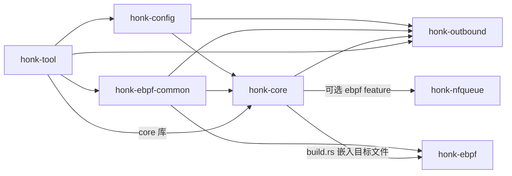
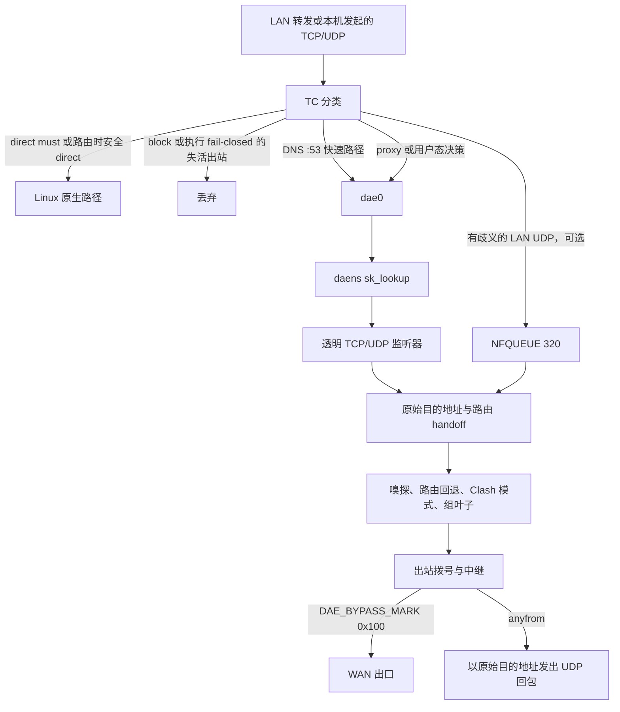

# 架构概览

`honk` 是面向网关与本机流量的 Linux eBPF 透明代理引擎；本页概述其架构及承载运行时的关键规则。项目当前为实验性 alpha `v0.0.1-alpha`，采用 `GPL-3.0-only` 许可证，仓库为 `Glassyiris/honk`。

其配置语法和 TC 数据路径源自 dae 技术脉络，并在文档声明的范围内保持 dae 兼容；出站 Handler、组与 Clash API 则采用 sing-box 风格的设计。`honk` 是独立实现，现已与两者显著分化。

## 目标与非目标

### 目标

- 通过 eBPF 透明代理数据路径拦截 Linux 上的 LAN 转发流量和本机发起流量。
- 将原生 `.dae` 配置语法保持为首要且唯一有文档说明的配置格式。
- 提供多协议出站、Selector/URLTest/LoadBalance/Fallback/Score 组、健康检查和 Clash 兼容控制 API。
- 只交付引擎 `honk-core`，不另设 GraphQL 服务或内置 dashboard 应用。

### 非目标

- 完整对齐 Clash Meta/mihomo；honk 尤其不提供 FakeIP 引擎，也不追求远程 rule provider/rule-set 对齐。
- 在 Windows 或 macOS 上进行透明代理；数据路径仅支持 Linux。

## Crate 分工

根 workspace 包含六个 crate。`honk-ebpf` 因面向 `bpfel-unknown-none` 而作为独立 Cargo 项目：它被排除在 workspace 外，并维护自己的 `Cargo.lock`。

| Crate | Workspace | 职责 |
| --- | --- | --- |
| `honk-config` | 成员 | 共享配置模型、dae 语法解析器、include 处理、分享链接解析和订阅解码。 |
| `honk-ebpf-common` | 成员 | 内核程序与用户态 map 写入端共享的 `no_std`、`#[repr(C)]` 常量和 ABI 类型。 |
| `honk-nfqueue` | 成员 | raw `NETLINK_NETFILTER` 队列 `320`、verdict 所有权和自有 nftables 事务。 |
| `honk-outbound` | 成员 | 协议 Handler、逐节点 runtime、出站组、健康状态、URLTest 探测和始终编译的 Score 评分器。 |
| `honk-core` | 成员 | 引擎库与二进制：eBPF/NFQUEUE runtime、控制面、DNS、路由、中继和 Clash API。 |
| `honk-tool` | 成员 | 用于订阅/节点探测、数据路径诊断、固定 map 检查和 geo 资源查询的 CLI 工具箱。 |
| `honk-ebpf` | 排除 | TC、`sk_lookup` 和 cgroup eBPF 程序；单独构建，并在启用真实 eBPF 时嵌入 `honk-core`。 |

共享 map 键、值、常量或布局的修改必须同步落到 `honk-ebpf-common`、`honk-ebpf` 和 `honk-core` 的 map 写入逻辑。

## 高层数据路径

### 报文路径

1. [数据路径](./datapath.md)在 LAN TC 分类 LAN 转发流量，并在 WAN TC 分类本机发起的 TCP/UDP。`direct(must)` 与路由时已安全的 direct 决策留在 Linux 原生路径；仍需用户态处理的决策不会卸载。
2. [DNS 路径](./dns.md)让 TCP 和 UDP 目的端口 `53` 进入快速路径，跳过通用匹配循环并重定向到控制面。
3. [数据路径](./datapath.md)将普通 proxy 和用户态决策经 `dae0` 重定向；在 `daens` 内，`sk_lookup` 将其指派给[控制面](./control-plane.md)的透明 TCP 或 UDP 监听器。
4. [NFQUEUE 暂存](./nfqueue.md)默认由 `global.nfqueue_enable` 开启，但只有启动前置条件通过时才激活；它仅在 LAN TC 之后、conntrack/NAT 之前保留仍有歧义的 LAN 转发 UDP。每个暂存流在固定队列 `320` 中携带唯一决策 token；本机发起的 WAN 流量继续走普通透明路径。
5. [控制面](./control-plane.md)恢复原始目的地址并消费 eBPF 路由 handoff。handoff 缺失或结果为 `ControlPlaneRouting` 时进入用户态路由。
6. [路由路径](./routing.md)可嗅探 TLS SNI、HTTP Host 或 QUIC Initial SNI，并在内核结果尚未终结时运行用户态 `Router`。
7. [组层](./groups.md)应用 Clash 模式覆盖但不改写最终 `must`/`block` 结果，再将权威组策略选择解析为叶节点。显式选择 Score 时，它只在健康合格成员中按目标的 TCP/UDP 与目标地址族 transport-quality 评分排名；服务特定的语义解锁应由 routing 或 geosite 选择专用 Score 组表达。省略策略仍使用 Selector。
8. [出站层](./outbound.md)拨号该叶节点，并中继 TCP 或数据报。嗅探得到的 TCP 字节先于后续流量转发。
9. 控制面出口携带 `DAE_BYPASS_MARK`（`0x100`），避免再次被 WAN TC 拦截。代理 UDP 与透明 53 端口回包使用绑定原始目的地址的 [anyfrom 套接字](./control-plane.md)，使[返回数据路径](./datapath.md)保持源地址。

## 运行时不变量

- **旁路标记纪律：** 拨号、探测、DNS 上游、QUIC endpoint 和透明监听器携带 `DAE_BYPASS_MARK`（`0x100`）或使用 loopback。接受后的 TCP 套接字会清除监听器标记；普通 host-netns `dns.bind` 入口套接字则有意保持无标记。
- **Anyfrom UDP 回包：** 代理 UDP 与透明 53 端口 DNS 回包使用在 `daens` 中创建、并绑定到流量原始目的地址的透明套接字。直接从 TPROXY 监听器回包会暴露 `dae0` 源地址，并在返回路径失败。
- **DNS 来源边界：** 透明入口与 `dns.bind` adapter 从 socket peer 得到逻辑客户端来源；流关联查询使用已准入流的来源。缓存仅在路由确定所选、与来源无关的 scope 后复用，而 `DOMAIN_ROUTING_MAP` 投影仍为全局且不区分来源。
- **网络命名空间纪律：** 进程常驻 host netns。它只通过有作用域且完全同步的 `with_daens_netns` 调用进入 `daens`；`setns` 跨度内不得出现 `.await`，恢复原命名空间失败时进程必须中止。
- **数据路径准入：** `DATAPATH_STATE_MAP[0]` 在全部监听 FD 已发布且全部接收循环已运行前保持关闭，并在拆除监听器前关闭。gate 关闭期间，TC 原样放行流量。
- **NFQUEUE 就绪与所有权：** 启用但尚未 ready 时，只丢弃需要暂存的新流。honk 独占队列 `320` 和 nftables `inet honk_nfqueue` / `udp_decision`；ready 变更必须经过 fence，生命周期歧义为致命错误，同一 netns 的防火墙管理器不得修改这些对象。
- **Token 校验终态：** 暂存 UDP token 必须在 skb mark、内核状态、handoff、redirect track、用户态 verdict 状态、lease/endpoint 和后端转换间一致。Direct 遵循 Arm → 全部带标记 verdict → Activate；proxy 在唯一的规范拨号/发送路径之前发布最终状态。
- **`must`/`block` 终结性：** Clash 模式覆盖永远不会替换 `block` 结果或 dae `(must)` 结果。
- **失活出站 fail-closed：** `lan_ingress` 丢弃路由到失活出站的新流。未配置 `final` 且只有一个唯一叶节点的 TCP 组会让同一代理继续作为用户态最后尝试；UDP 和全部叶节点失活的多叶节点组仍保持 fail-closed。TCP 与 UDP 端口 `53` 例外；`honk-core` 在启动、重载和接口拓扑变化时注入 `dip(<每个 LAN/WAN 接口地址>) -> direct(must)`，使本机管理流量不依赖代理健康状态。
- **组 OR 连通性：** 一个组的 eBPF alive slot 是全部叶子成员状态的 OR，并包含上述单叶 TCP 最后尝试例外。多叶节点组中的单个成员失活不得使整个组 fail-closed。
- **Score 隔离与原因：** Score 用业务目标地址族评分，用代理服务器地址族过滤健康状态；其权威单叶选择不能让死亡成员重新入选。周期探索按 `(group, TCP/UDP, 目标 IP 地址族或 none)` 分域，并选择 Beta 可靠性上置信界最高的非当前成员；连败将叶节点按指数退避移出探索（5 分钟起翻倍、上限 6 小时，独立于证据衰减），成功恢复探索资格但连败只逐级递减；连败只由真实流量驱动（探测结果中立）；连续三次新鲜失败还会让叶节点在存在更健康候选时退出可靠性带；组内相对延迟/吞吐只微调可靠性接近区间，现任余量随有效完成证据增长。全局、地址族与精确目标的新鲜失败 envelope 取最大值而非相加。每次已授权的多候选 Apply 按优先级只记录一个最终原因：`coldExplore`、`periodicExplore`、`incumbentHeld`、`freshFailureBypass`、`reliabilityWinner`，然后是 `performanceWinner`；`deadFiltered` 计数唯一死亡叶节点，`switchFlap` 计数八次选择内切回前一已提交胜者。精确目标键与聚合先验只存在于两个各 4,096 项的进程内 LRU，通过共享状态跨成功 reload 保留，进程重启即清空，且不会进入日志或持久化。经鉴权的 `/stats.score` 只导出组名和这些聚合 TCP/UDP 计数，绝不导出 cell、节点、目标、cadence 或 authority；既有 `/proxies`、`/stats.outbounds` 与 `/connections` 元数据契约保持不变。
- **Score 反馈覆盖：** 评分器始终编译，但仅在计划经过 Score 组时按需创建 `ScoreReporter` 和评分 cell；非 Score 路径不创建它们。实际 attempt 会报告 setup、首响应、双向字节和一个紧凑终态，包括透明 TCP/UDP、受支持的 DNS transport、健康与 delay 探测、preconnect/session/UDP 预热，以及直连或经代理的 UI 下载；没有业务目标的任务只更新聚合 setup 证据。
- **内部与特殊流量：** honk 的内部链路地址范围 `169.254.0.0/16` 和 `fd00:686f:6e6b::/64` 永不代理。L2 广播/组播、IPv4 广播/组播/未指定目的地址以及 IPv6 组播会在路由或 conntrack 前直通。

## 构建 feature 与 mock 模式

`honk-core` 默认启用 `clash-api`、`mimalloc` 和 `rprx`；真实 eBPF 需显式启用。

| Feature | 默认 | 作用 |
| --- | --- | --- |
| `ebpf` | 否 | 引入 `aya`、`aya-obj`、`aya-log` 和可选 `honk-nfqueue`；`build.rs` 嵌入 `honk-ebpf` 目标文件。运行时要求 Linux kernel 5.8+。 |
| `clash-api` | 是 | 引入可选 `axum` 与 `tower-http`，提供 Clash 兼容 REST/WebSocket 服务。 |
| `mimalloc` | 是 | 引入 `mimalloc` 与 `libmimalloc-sys`，并将 mimalloc 安装为 `honk-core` 二进制的 allocator。在 Linux 上，程序会在启动 Tokio 前为当前进程禁用透明大页。 |
| `rprx` | 是 | 启用 `honk-outbound/rprx`，注册 VLESS 与 VMess Handler，包括受支持的 VLESS Encryption 和 `xtls-rprx-vision` 路径。 |

`mock-ebpf` 不是 Cargo feature。不带 `ebpf` 的构建使用 `MockEbpfBackend`，`--mock-ebpf` 则显式选择无特权开发路径。若请求 `global.nfqueue_enable = true`，启动会记录 warning，仅在本进程关闭 NFQUEUE 暂存，配置文件保持不变。

## 作者与分工说明

- eBPF 数据路径——`honk-ebpf`、`honk-ebpf-common` 以及 `honk-core` 中的挂载/map 路径——是项目维护者主要投入人工设计、实现 review 与验证的部分。
- 其余多数用户态子系统——配置解析器、出站 Handler、组与健康检查、用户态 DNS、Clash API 及大量控制面粘合代码——主要由 AI 辅助编写。维护者做了部分代码 review，并非逐行负责。

## 相关文档

- [配置指南](../configuration.md)
- [数据路径设计](./datapath.md)
- [Global 配置参考](../reference/global.md)
