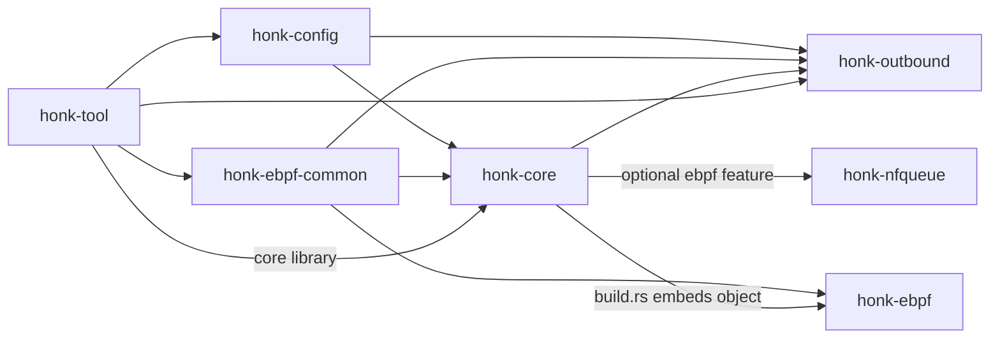
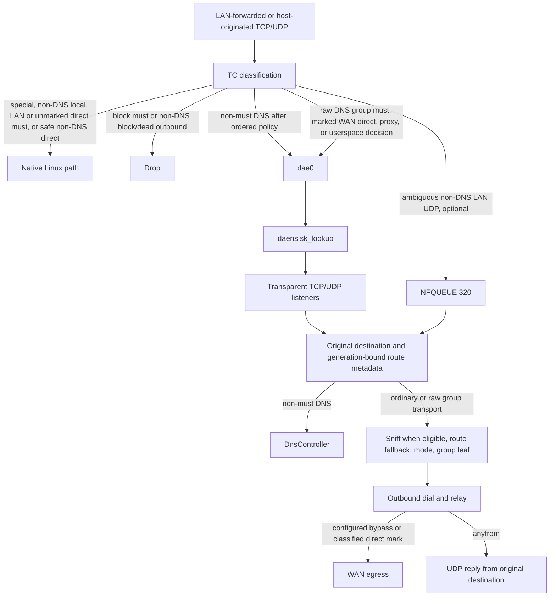

# 架构概览

`honk` 是面向网关与本机流量的 Linux eBPF 透明代理引擎；本页说明其架构及关键运行时规则。项目当前为实验性 alpha `v0.0.1-alpha`，采用 `GPL-3.0-only` 许可证，仓库为 `daeuniverse/honk`。

其配置语法和 TC 数据路径源自 dae，并在文档声明的范围内保持 dae 兼容；出站 Handler、组与 Clash API 则采用 sing-box 风格的设计。`honk` 是独立实现，现已与两者显著分化。

## 目标与非目标

### 目标

- 通过 eBPF 透明代理数据路径拦截 Linux 上的 LAN 转发流量和本机发起流量。
- 以原生 `.dae` 配置语法作为首要且唯一有文档说明的配置格式。
- 提供多协议出站、Selector/URLTest/LoadBalance/Fallback/Score 组、健康检查和 Clash 兼容控制 API。
- 交付单个 `honk-core` 引擎，不另设 GraphQL 服务；可选 `native-ui` 内嵌固定版本 doona 客户端。

### 非目标

- 完整对齐 Clash Meta/mihomo；honk 尤其不提供 FakeIP 引擎，也不追求远程 rule provider/rule-set 对齐。
- 在 Windows 或 macOS 上进行透明代理；数据路径仅支持 Linux。

## Crate 分工

根 workspace 包含六个 crate。`honk-ebpf` 因面向 `bpfel-unknown-none` 而作为独立 Cargo 项目：它被排除在 workspace 外，并维护自己的 `Cargo.lock`。

| Crate | Workspace | 职责 |
| --- | --- | --- |
| `honk-config` | 成员 | 共享配置模型、dae 语法解析器、include 处理、分享链接解析和订阅解码。 |
| `honk-ebpf-common` | 成员 | 内核程序与用户态 map 写入端共享的 `no_std`、`#[repr(C)]` 常量和 ABI 类型。 |
| `honk-nfqueue` | 成员 | raw `NETLINK_NETFILTER` 队列 `320`、verdict 所有权和自有 nftables 事务。 |
| `honk-outbound` | 成员 | 协议 Handler、逐节点 runtime、出站组、健康状态、URLTest 探测和始终编译的 Score 评分器。 |
| `honk-core` | 成员 | 引擎库与二进制：eBPF/NFQUEUE runtime、控制面、DNS、路由、中继和 Clash API。 |
| `honk-tool` | 成员 | 用于订阅/节点探测、数据路径诊断、已固定 map 检查和 geo 资源查询的 CLI 工具箱。 |
| `honk-ebpf` | 排除 | TC、`sk_lookup` 和 cgroup eBPF 程序；单独构建，并在启用真实 eBPF 时嵌入 `honk-core`。 |

```mermaid
flowchart LR
  CFG[honk-config] --> CORE[honk-core]
  CFG --> OUT[honk-outbound]
  COMMON[honk-ebpf-common] --> CORE
  COMMON --> OUT
  COMMON --> EBPF[honk-ebpf]
  CORE --> OUT
  CORE -->|optional ebpf feature| NFQ[honk-nfqueue]
  CORE -->|build.rs embeds object| EBPF
  TOOL[honk-tool] --> CFG
  TOOL --> COMMON
  TOOL --> OUT
  TOOL -->|core library| CORE
```

修改共享 map 键、值、常量或布局时，必须同步修改 `honk-ebpf-common`、`honk-ebpf` 和 `honk-core` 的 map 写入逻辑。

`honk-config` 提供共享配置模型与解析器。纯 Rust 依赖包括 serde、regex、url、base64、chrono、uuid；`libc` 的 `getifaddrs` 枚举接口地址，不调用 `ip` 子进程。

- `from_file` 按扩展名选择格式。已知 `.json`/`.yaml`/`.toml` 先尝试对应格式，再仅回退 TOML/YAML/JSON，不尝试 dae。未知或缺失扩展名时，依次尝试支持 `include` 的文件级 dae → TOML → YAML → JSON。serde loader 属于未在文档中说明的兼容接口，dae 是主格式。

独立 Node 反序列化会报告忽略的协议不兼容字段；后续转换失败也不会丢失这些警告，每条只记录一次。诊断只包含配置字段名，不包含节点名称或字段值。`node::NodeSeed` 将警告写入调用方提供的列表，不自行记录日志；`FlatNode` 仍是唯一的扁平格式适配器。

`ConfigSeed` 对节点数组中的每个原始条目使用 Node 适配器。结构化输入失败时，诊断保留节点、组和订阅的原始序号、安全的配置字段路径及解码器提供的行列号，不保留解码器的原始错误文本；映射和按字段声明顺序排列的序列均保留序号。详细文件和 JSON 加载接口在失败时保留调用方已有的诊断；格式回退成功时，只移除已放弃尝试的诊断。所有格式均失败时，按尝试顺序保留诊断，并附上一个终止错误。dae 语义错误会终止加载，除非完整文档能按 YAML、TOML 或 JSON 解码为至少含一个已知 Config 顶层键的映射；此时交由结构化格式加载器处理并报告结果。包含文件错误和不受支持的策略错误仍会终止加载。

解析器和分享链接的数据接口保留安全诊断，不自行记录日志。标量值、名称、链接和原始错误内容不对外输出，但保留固定错误原因和 `dns.hosts_file` → `dns.use_host` 等迁移说明。组、过滤器、订阅和条目使用原始序号定位。详细 dae 诊断共用只含元数据的来源表，保留 include 父来源关联及可取得的物理行号；只有最外层加载尝试追加终止错误。

`src/node/validation.rs` 负责集合准入与共享检查；`src/node/vless.rs` 独占规范 `VlessConfig` 的 normalization、path selection 与组合校验；`src/node/protocol.rs` 持有其他协议配置及共享 TLS/stream/QUIC options。详细 loader 保留类型化 cause 与原始 one-based 节点坐标。

`src/parser/mod.rs` 负责文件级 `include` 和有序顶层分派。`lexer.rs` 与 `cursor.rs` 保留引用源文本的词法单元、注释范围及有界片段，`read.rs` 提供共享的标量与表达式读取接口；各节由 `scalars.rs`、`entries.rs`、`groups.rs`、`dns.rs` 和 `routing.rs` 读取。包含文件的 glob 模式以入口文件所在目录为基准解析；匹配文件的规范化路径不得超出入口目录。重复包含和循环包含均被拒绝。允许忽略未知内容的读取器整块跳过未知嵌套块，不应用其子项；节点和订阅的兼容包装块仍会遍历，`experimental` 外层和 NFQUEUE 错误仍会终止解析。

各读取器直接返回类型化错误；只有最外层尝试发布终止诊断。诊断提示在尝试结束时借助按来源区分的前缀最大值索引统一排序，保留原有追加顺序和调用方已有诊断，避免反复插入向量。

片段明确区分已接纳或已忽略的语句、紧凑块和普通花括号块，读取器不再根据末尾词法单元猜测结构。语句准入先于紧凑块切分和续接状态更新；组的动态块头与条目值分开处理，条目值开始后不再提前切分声明。结构注释花括号诊断使用游标当前作用域判定，在 EOF 检查前统一发出。过滤器诊断保留原始词法单元的错误来源；遍历节点、订阅和组的同级声明时重置语义诊断归属。

遍历语法区分单行条目和多行表达式；括号保护状态仅随实际返回的表达式语句跨越同源分段，在来源边界重置。已建立索引的起始花括号保留其块头和子树归属。订阅原始字段独立于结构块头视图保留完整起始词法单元的字节。

`src/share_link.rs` 是唯一的 `Node::from_share_link` 解析器；`src/share_link/options.rs` 把 URI 报文编码与独立的多路复用控制项归入规范协议模型，先执行规范化与校验，再派生身份，不保留第二套 VLESS mode 模型。`src/node/wire.rs` 是唯一的 flat serde adapter；VLESS 输入只要含有已移除的旧字段，即使值为 `null`，也会被拒绝。同一字段在非 VLESS 输入上仅为兼容 artifact 而保留。`VlessConfig.network`、`udp_encoding` 与 `multiplex` 参与 identity 派生，因此规范 cutover 可以改变 VLESS `Node.id`，但不改变 VMess 行为或 identity。行为概要见[出站设计](./outbound.md#vless-wire-契约)，字段语法见[节点参考](../reference/nodes.md)。

- `src/experimental.rs` — `ExperimentalConfig` { `clash_api: ClashApiConfig`, `cache_file: CacheFileConfig` }。dae parser 显式允许当前两个嵌套节，旧 `udp_nfqueue` 仅作为迁移输入：发出告警，仅在未配置 `global.nfqueue_enable` 时将 `enabled` 复制到 `GlobalConfig::nfqueue_enable`。
- `src/subscription.rs`、`src/types.rs`（`NodeProtocol` 有 11 个变体，Direct/Block 留给内建节点；`DialMode` 为 ip/domain/domain+/domain++；另有 `SubscriptionType`、`DnsProtocol` 与共享 `default_true`/`parse_duration_secs` helper）、`src/error.rs`（`ConfigError`）。

`src/experimental.rs` 的 `ExperimentalConfig` 持有 `clash_api`、`native_api` 与 `cache_file`。原生设置严格校验、独立启用且均需重启。需显式编译的 `native-api`（以 `--features native-api` 或 `native-ui` 构建；发布产物包含）提供用户态观测、有界历史、由源文件管理的组 PATCH/主文件条目管理，以及已验证 geodata 激活；listener 仍默认关闭。`.dae` 仍是唯一配置权威，原文披露与写入权限独立。凭据源只读，返回正文时遮蔽 listener secret 值，而非省略正文。自动策略已支持按网络 pin/clear 成员，pin 属于当前 GroupManager，激活后失效；原生 mode 与完整内核透明仍未开放。默认关闭的 `native-ui` 在打包时通过 `ci/fetch-doona.sh` 与 `.github/ci/pins.env` 获取带许可及版本记录的 doona 发行资产。`build.rs` 读取绝对路径 `HONK_DOONA_DIR`，不在运行时获取资产或构建前端。弃用的 `udp_nfqueue` 块仅将 `enabled` 迁移到 `GlobalConfig::nfqueue_enable` 并告警。

## 高层数据路径

```mermaid
flowchart TB
  PACKET[LAN-forwarded or host-originated TCP/UDP] --> TC[TC classification]
  TC -->|special, non-DNS local, LAN or unmarked direct must, or safe non-DNS direct| NATIVE[Native Linux path]
  TC -->|block must or non-DNS block/dead outbound| DROP[Drop]
  TC -->|non-must DNS after ordered policy| DAE0[dae0]
  TC -->|raw DNS group must, marked WAN direct, proxy, or userspace decision| DAE0
  TC -->|ambiguous non-DNS LAN UDP, optional| NFQ[NFQUEUE 320]
  DAE0 --> SK[daens sk_lookup]
  SK --> LISTEN[Transparent TCP/UDP listeners]
  LISTEN --> CP[Original destination and generation-bound route metadata]
  NFQ --> CP
  CP -->|non-must DNS| DNS[DnsController]
  CP -->|ordinary or raw group transport| DECIDE[Sniff when eligible, route fallback, mode, group leaf]
  DECIDE --> DIAL[Outbound dial and relay]
  DIAL -->|configured bypass or classified direct mark| WAN[WAN egress]
  DIAL -->|anyfrom| REPLY[UDP reply from original destination]
```

### 报文路径

1. [数据路径](./datapath.md)在 LAN TC 分类 LAN 转发流量，并在 WAN TC 分类本机发起的 TCP/UDP。既有入口与控制平面排除先执行；普通 LAN 端口 53 不能因本地 socket 而跳过策略，非 DNS 本地探测行为不变。LAN `direct(must)` 与非 DNS 路由时已安全的 direct 决策留在 Linux 原生路径；非零 mark 的 WAN 直连改用用户态套接字，重新执行带 mark 的路由查找。
2. [流量规则所有权](../reference/routing.md#出站目标与-must)决定哪些端口 53 查询进入[DNS 管线](./dns.md)。已准入的透明查询、可选 host-netns `dns.bind` 与流关联 reality/目标查询共用按代固定的 DNS 策略、缓存/singleflight、上游池和路由投影。
3. [数据路径](./datapath.md)将普通 proxy 和用户态决策经 `dae0` 重定向；在 `daens` 内，`sk_lookup` 将其指派给[控制面](./control-plane.md)的透明 TCP 或 UDP 监听器。
4. [NFQUEUE 暂存](./nfqueue.md)默认由 `global.nfqueue_enable` 开启，但只有启动前置条件通过时才激活；它仅在 LAN TC 之后、conntrack/NAT 之前保留仍有歧义的 LAN 转发 UDP。每个暂存流分配持久化唯一决策 token，并在进入固定队列 `320` 前发布绑定该 token 的 Pending 状态；本机发起的 WAN 流量继续走规范 TPROXY 路径。Direct/proxy/block 完成由 `honk-core` 的 `control/nfqueue/` 处理；direct 不创建用户态套接字、复制或重传路径、`Ready` endpoint 或连接条目。
5. [控制面](./control-plane.md)恢复原始目的地址（TCP 使用 `SO_ORIGINAL_DST` / `IP6T_SO_ORIGINAL_DST`，回退到透明套接字的 `local_addr`；UDP 使用 IPv4 `IP_ORIGDSTADDR` / IPv6 `IPV6_ORIGDSTADDR` cmsg）；普通流消费 eBPF 路由 handoff，缺失或结果为 `ControlPlaneRouting` 时进入用户态路由。端口 53 流量遵循不同的[TCP handoff 与 UDP 逐报文准入规则](./control-plane.md#透明代理入口)。
6. [路由路径](./routing.md)可嗅探 TLS SNI、HTTP Host 或 QUIC Initial SNI，并在内核结果尚未终结时运行用户态 `Router`。匹配 must 规则、配置 `dial_mode: ip` 或命中负缓存时跳过嗅探；`dial_mode: domain` 执行 DNS reality check。
7. [组层](./groups.md)应用 Clash 模式覆盖但不改写最终 `must`/`block` 结果，再由 `SharedGroupManager` 将权威策略选择解析为叶节点。Score 只用逐目标 TCP/UDP 证据在健康合格成员中排名。TCP/UDP 通常只采用一个权威叶节点；只有冷启动顶层 URLTest 会先错开候选的启动时间，且只有胜出候选提交 endpoint 或 source transport。
8. [出站层](./outbound.md)通过 `TcpOutbound` 或 fallible prepared UDP commit 拨号该叶节点。普通 packet path 为 endpoint 绑定一条 `PacketTransport`；XUDP/Mux.Cool 可以改为提交由 core 所有、供多个规范五元组 endpoint view 共用的 source session。嗅探得到的 TCP 字节先于后续流量转发；普通 TCP 使用 splice，包装流使用 copy；未启用 Encryption 的 Vision TLS/REALITY carrier 在两个方向都进入 Direct 后可把 socket 借给 splice。
9. 控制面出口使用 `global.so_mark_from_dae`（零值选择默认 `0x100`）；带 mark 的直连使用规则 mark 加 `CLASSIFIED_MARK`。WAN TC 识别这两类标记，不再额外叠加默认旁路位。代理 UDP 与透明 53 端口回包使用绑定原始目的地址的 [anyfrom 套接字](./control-plane.md)，使[返回数据路径](./datapath.md)保持源地址。

## 运行时不变量

- **旁路标记纪律：** 拨号、探测、DNS 上游、HTTP 下载、QUIC endpoint 和透明监听器携带进程配置的旁路 mark。非零直连规则 mark 替换其低 30 位，并携带 `CLASSIFIED_MARK`；策略路由须使用 `0x3fffffff` 掩码。接受后的 TCP 套接字会清除监听器标记；普通 host-netns `dns.bind` 入口套接字则有意保持无标记。
- **Anyfrom UDP 回包：** 代理 UDP 与透明 53 端口 DNS 回包使用在 `daens` 中创建、并绑定到流量原始目的地址的透明套接字。直接从 TPROXY 监听器回包会暴露 `dae0` 源地址，并在返回路径失败。来自其他 full-cone 来源的回复通过仅含客户端的 `CLIENT_REPLY_TRACK` 帧信息返回，而不经过主机转发，也不会让数据路径为客户端随后发往该来源的包学到原生反向方向。
- **DNS 来源边界：** 透明入口与 `dns.bind` adapter 从 socket peer 得到逻辑客户端来源；流关联查询使用已准入流的来源。缓存仅在路由确定所选、与来源无关的 scope 后复用，而每个 policy generation 的域名谓词投影仍为全局且不区分来源。
- **VLESS source 边界：** 共享 XUDP/Mux.Cool 按 reused runtime、规范化 client、UDP path 与 actual-peer/original-destination reply projection 复用。完整五元组 endpoint map 仍持有 route、token/generation 与逐 flow Score；source session 持有唯一 receiver 与 transport health。
- **网络命名空间纪律：** 进程常驻 host netns。它只通过有作用域且完全同步的 `with_daens_netns` 调用进入 `daens`；`setns` 跨度内不得出现 `.await`，恢复原命名空间失败时进程必须中止。
- **数据路径准入：** `DATAPATH_STATE_MAP[0]` 在全部监听 FD 已发布且全部接收循环已运行前保持关闭，并在拆除监听器前关闭。gate 关闭期间，TC 原样放行流量。
- **NFQUEUE 就绪与所有权：** 启用但尚未 ready 时，只丢弃需要暂存的新流。honk 独占队列 `320` 和 nftables `inet honk_nfqueue` / `udp_decision`；ready 变更必须经过 fence，生命周期歧义为致命错误，同一 netns 的防火墙管理器不得修改这些对象。
- **Token 校验终态：** 暂存 UDP token 必须在 skb mark、内核状态、handoff、redirect track、用户态 verdict 状态、lease/endpoint 和后端转换间一致。Direct 遵循 Arm → 全部带标记 verdict → Activate；proxy 在唯一的规范拨号/发送路径之前发布最终状态。
- **`must`/`block` 终结性：** Clash 模式覆盖永远不会替换 `block` 结果或 dae `(must)` 结果。
- **失活出站 fail-closed：** `lan_ingress` 丢弃路由到失活出站的新流。未配置 `final` 且只有一个唯一叶节点的 TCP 组会让同一代理继续作为用户态最后尝试；UDP 和全部叶节点失活的多叶节点组仍保持 fail-closed；但含有 `direct`/`block` 内建成员的组永不失活：内建节点永远不会被判定死亡，因此 group-OR 槽保持开放。TCP 与 UDP 端口 `53` 豁免该健康检查丢包，但仍遵循用户的终局 `must` 结果。
- **显式本地路由：** 网关管理访问由用户[显式配置](../reference/routing.md#显式本地路由)，不会自动生成接口规则。WAN egress 仍旁路目的地址匹配 `PARAM.local_ip` 的流量，但不保证一般管理访问可达；接口观察仍用于拓扑/ECS/健康，非 DNS TCP 纯 SYN 的现有本地探测跳过策略不变。
- **组 OR 连通性：** 一个组的 eBPF alive slot 是全部叶子成员状态的 OR，并包含上述单叶 TCP 最后尝试例外。多叶节点组中的单个成员失活不得使整个组 fail-closed。
- **Score 隔离与原因：** 健康过滤与业务目标地址族保持独立。首次选择的 utility 仍为启发式；健康晋升比较有界、按需求确定大小的评估集内所有合格挑战者与固定现任，依据共同目标／时间证据，而非无关聚合／setup 均值。可选试用共享保留的组／网络／地址族预算，由原始业务开始赚取，时间流逝不产生额度；试用不取得已提交现任身份。真实连败保留退避和三连败排除。精确与聚合证据各有 4,096 项 LRU；比较存储最多 512 个 cell、1 MiB 逻辑分配，不是进程 RSS。重叠计数不相加。reload 保留已准入业务结果，同时撤销近期可用性与探测基线。公开摘要和计数始终限定范围，不导出原始目标键，详见[组设计](./groups.md#score-评分与生命周期)。
- **Score 按需反馈：** setup/首响应与有界分方向进展可在终态前发布，不增加 Beta 完成。业务、配置健康与预热分别承担不同作用；任意手动 delay 测量不变成业务可靠性或配置基线。Score TCP 建立失败可在原 deadline 内通过不同的合格叶节点恢复一次，不打开新 final、不越过 Selector、不重放负载。
- **条件性验证接口：** Score 代理组发布聚合临时／可用状态、新鲜的成对挑战者响应关系、证据问题和等待原因，并与同一次只读选择的成员一致；不存在全组比较结论。`/stats` 增加固定组／网络验证及预算／成本字段，以及嵌套去重的根业务计数；实际试用失败不是因果额外失败。两者都不导出原始目标键或最优概率。详见 [API 验证](../reference/api.md#score-验证信息)。
- **内部与特殊流量：** honk 的内部链路地址范围 `169.254.0.0/16` 和 `fd00:686f:6e6b::/64` 永不代理。L2 广播/组播、IPv4 广播/组播/未指定目的地址以及 IPv6 组播会在路由或 conntrack 前直通。

## 构建 feature 与 mock 模式

`honk-core` 默认启用 `clash-api`、`mimalloc` 和 `rprx`；真实 eBPF 需显式启用。

| Feature | 默认 | 作用 |
| --- | --- | --- |
| `ebpf` | 否 | 引入 `aya`、`aya-obj`、`aya-log` 和可选 `honk-nfqueue`；`build.rs` 嵌入静态 `honk-ebpf` 对象，用户态在运行时编译 policy extension。运行时要求 Linux kernel 6.12+。 |
| `clash-api` | 是 | 引入可选 `axum` 与 `tower-http`，提供 Clash 兼容 REST/WebSocket 服务。 |
| `native-api` | 否 | 独立的 HTTP/1.1 原生观测、可选历史、受控源管理/reload API 与本地目录 UI；持有有界连接并负责其生命周期，严格校验 bearer/Host/Origin，不依赖 Clash。 |
| `native-ui` | 否 | 隐含 `native-api`，为 `ui: embedded` 内嵌固定版本的 doona 发行资产；运行时不解压、不下载、不构建前端。 |
| `mimalloc` | 是 | 引入 `mimalloc` 与 `libmimalloc-sys`，并将 mimalloc 安装为 `honk-core` 二进制的 allocator。在 Linux 上，程序会在启动 Tokio 前为当前进程禁用透明大页，并把 mimalloc 的 purge 延迟设为 100 ms（除非 `MIMALLOC_PURGE_DELAY` 另有设置）。 |
| `rprx` | 是 | 启用 `honk-outbound/rprx`，注册 VLESS 与 VMess Handler，包括受支持的 VLESS Encryption 和 `xtls-rprx-vision` 路径。 |

`mock-ebpf` 不是 Cargo feature。不带 `ebpf` 的构建使用 `MockEbpfBackend`，`--mock-ebpf` 则显式选择无特权开发路径。若请求 `global.nfqueue_enable = true`，启动会记录 warning，仅在本进程关闭 NFQUEUE 暂存，配置文件保持不变。

嵌入 eBPF 时，`build.rs` 使用内核 crate 固定的编译器及独立 release 策略重建，不继承 host 的 `RUSTFLAGS`、`CARGO_ENCODED_RUSTFLAGS` 或 `CARGO_PROFILE_*` 性能分析覆盖。编译器 sidecar 还必须不早于嵌入构建脚本，因此修改嵌入策略会使既有对象失效。显式 `--bpf-object` 资产及手动内核构建仍由调用方负责。

## 作者与分工说明

- 项目维护者主要负责 eBPF 数据路径的人工设计、实现 review 与验证，包括 `honk-ebpf`、`honk-ebpf-common` 以及 `honk-core` 中的挂载/map 路径。
- 其余多数用户态子系统主要由 AI 辅助编写，包括配置解析器、出站 Handler、组与健康检查、用户态 DNS、Clash API 及大量控制面衔接代码。维护者做了部分代码 review，并非逐行负责。

## 相关文档

- [配置指南](../configuration.md)
- [数据路径设计](./datapath.md)
- [Global 配置参考](../reference/global.md)
